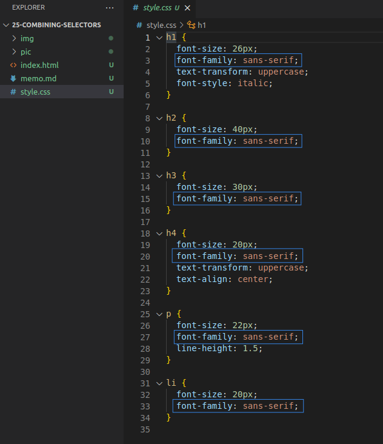
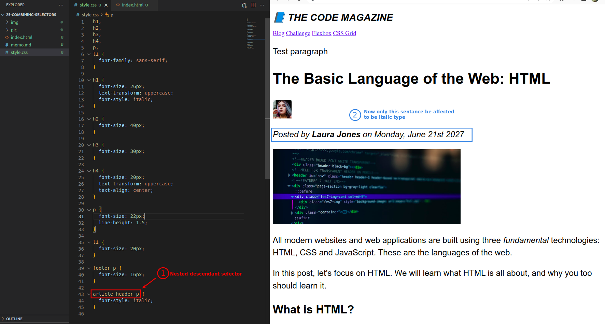

# **_Combining Selectors_**

## **List Selector**

### _repeat same style in multiple elements_

- When a style appears repeatedly in multiple elements, you can use the **list selector**.

### _list selector_

### _chang style for multiple elements at once_

## **Descendant Selector**

### _missing one_

- You can find that only the footer font on the web page has not been changed.
  - We should wrap its text with element paragraph.

### _fix it with element paragraph_

- But this creates another problem, the text in the footer becomes the same size as the other parts.

### _Descendant selector_

- We use the **descendant selector** to define the font size specifically for the text in the footer.
  - This concept of selector is based on the **element structure** of html. But this method is prone to problems.

## **Nested Descendant Selector**

### _then, the problem happen..._

- The above three images are mainly intended to explain the problems that arise when using the html structure concept of selector.

### _fixtit, but bad method_

- In the above picture we use the **Nested descendant selector** to solve the problem.
  - However, this is still based on the **html structure of the selector** method, so there is still a chance that the same problem will occur again.
    - We will learn better way in next lecture.
