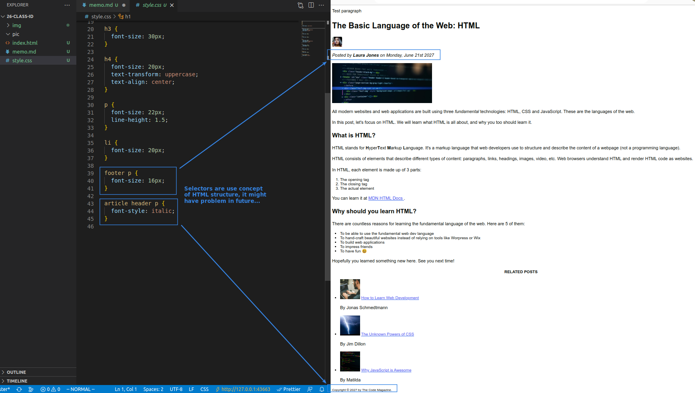
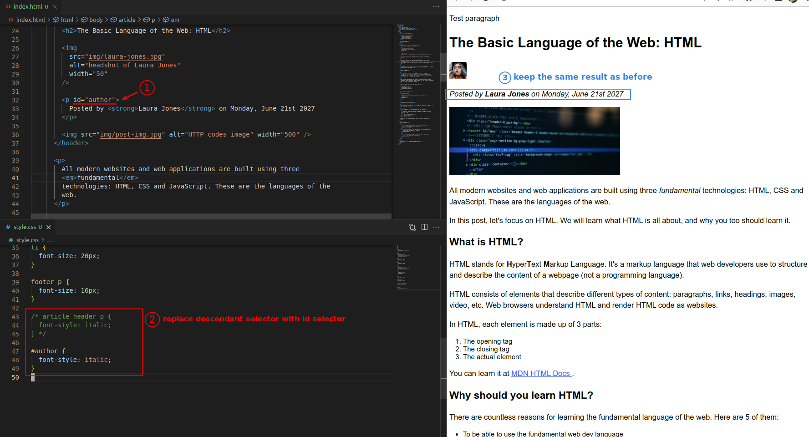
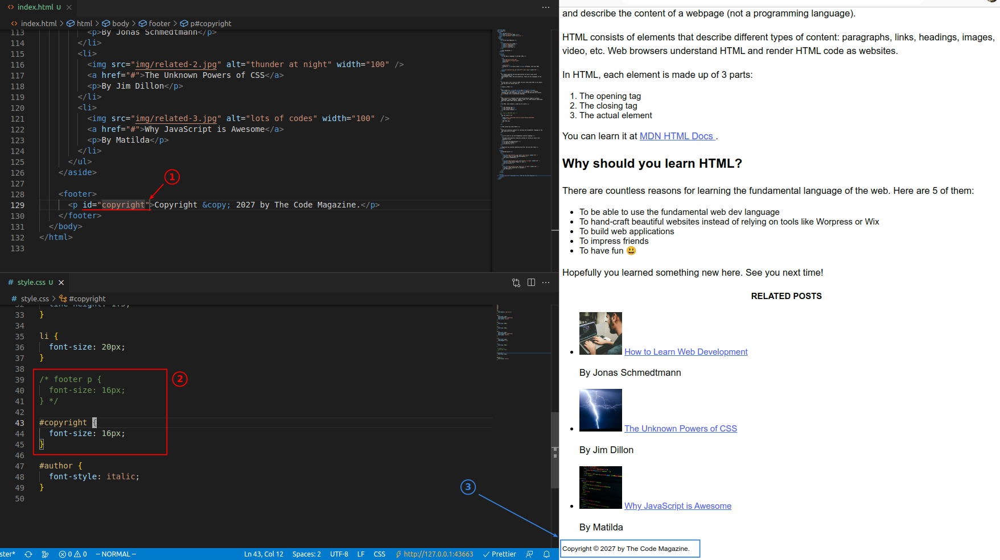
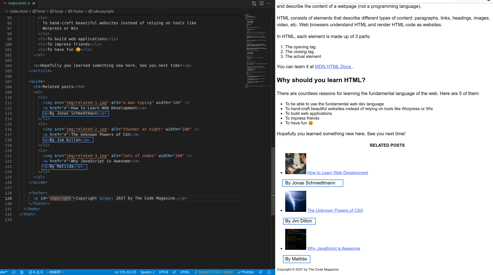
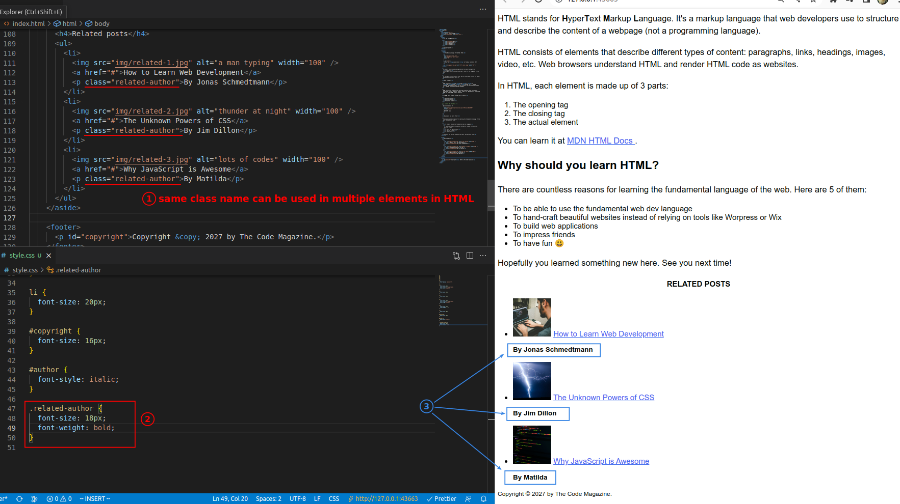
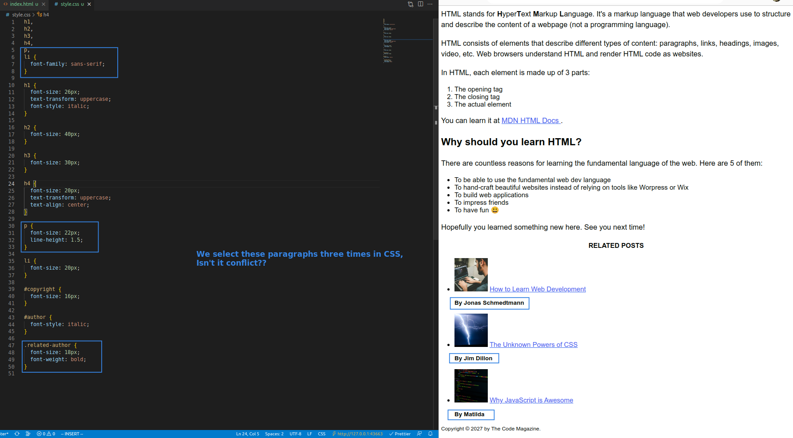
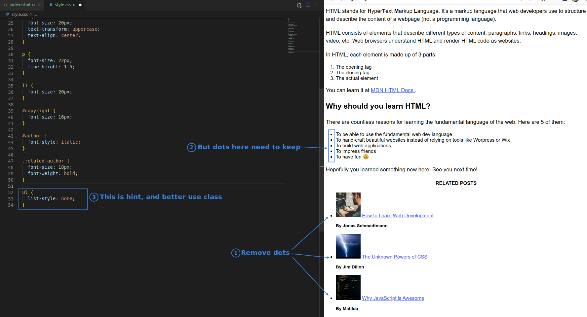
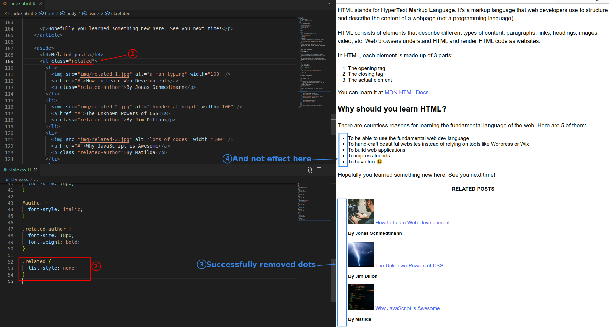

## **HTML Structure Selector from last lecture**

## **ID**

## **CLASS**

## **Multiple selectors effect same element, isn't it conflict?**

- The elements on the right are all specified by three different selectors on the left, so won't there be conflicts?
  - This is in fact an important topic for CSS expertise, and there will be a special lecture on this matter.

## **Challenge**

- There is only one element ul used in this class, why does the lecturer suggest that we use class instead of id?
  - The main purpose is to prevent the need for future additions of other list elements to take away the dots, assuming that we are using ids, it is necessary to go back and change to class in order to repeat the use, however, this process may cause a lot of problems.
    - So we usually simply always use class, and never use id.
