# **\*Color**

## **Concept**

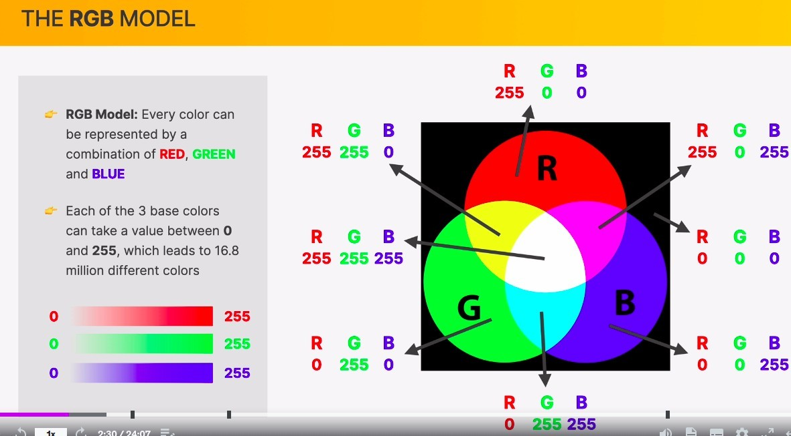

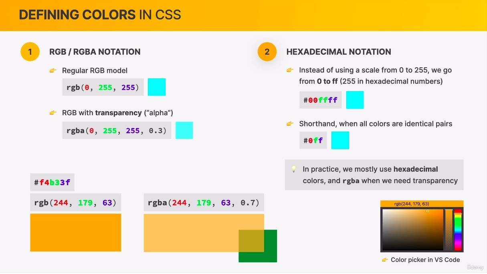

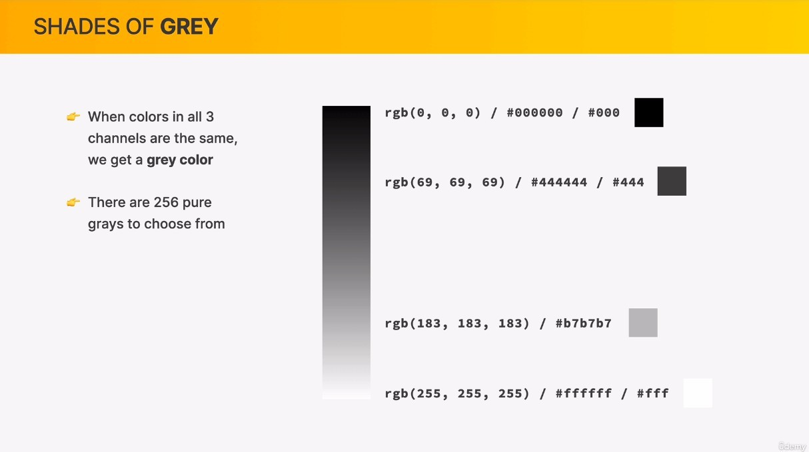

## **Color for Single Element**

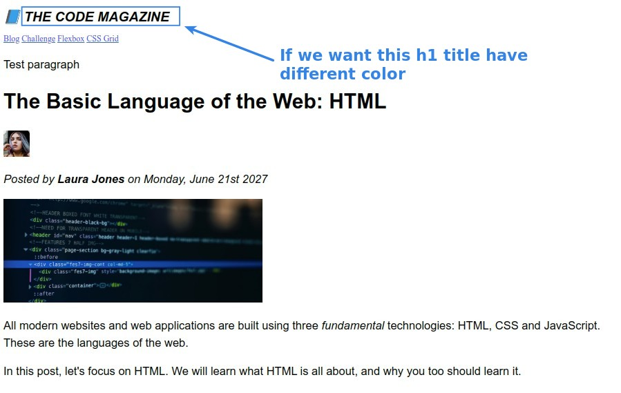

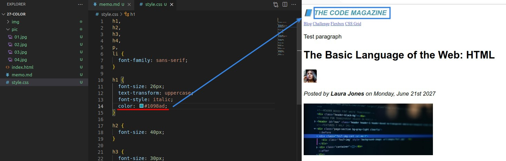

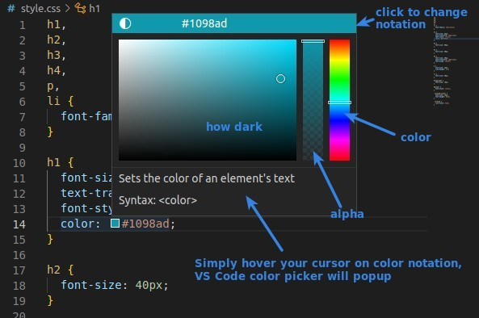

## **Color for Multiple Elements**

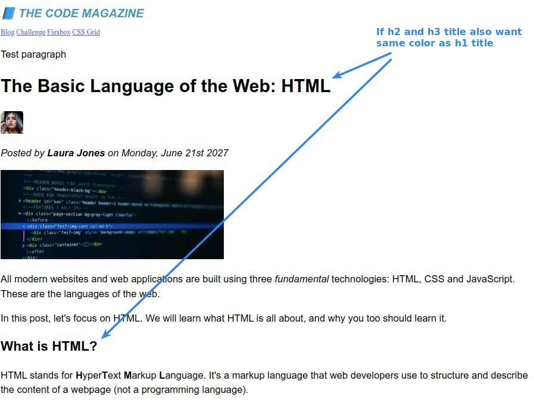

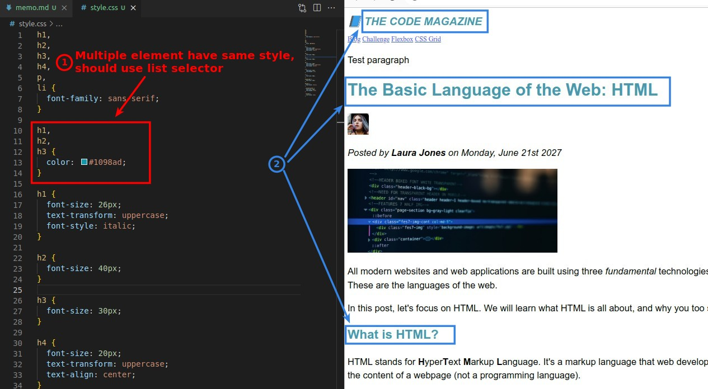

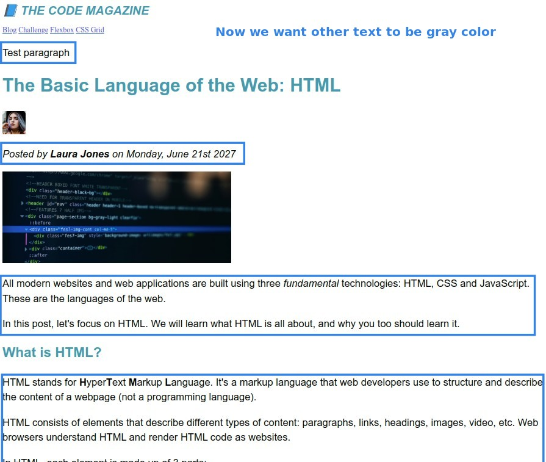

## **Color for other text**

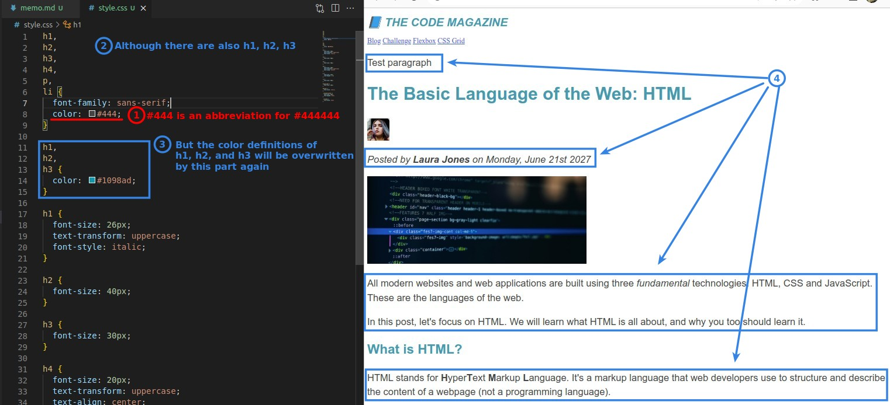

## **Background Color Only for Main Header**

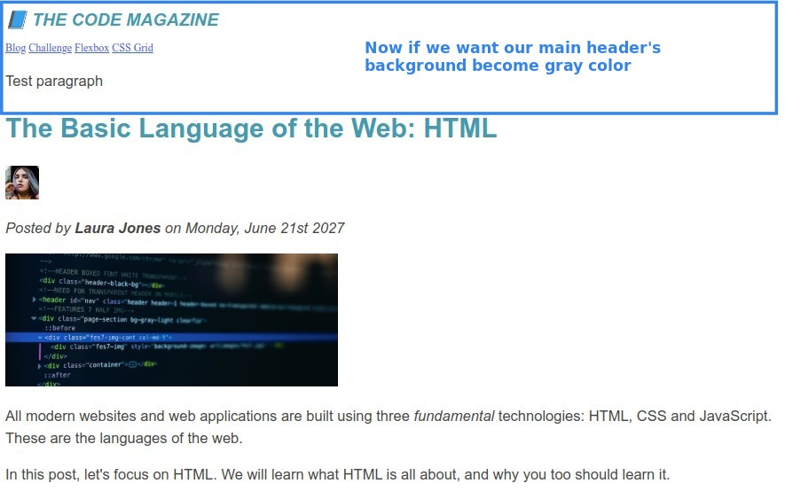

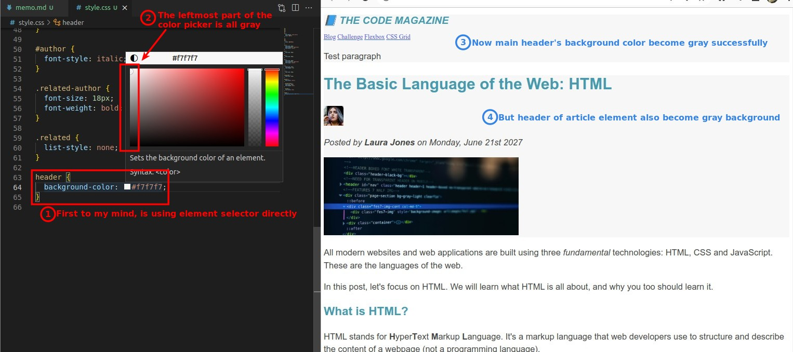

## **Top/Bottom Border for Related Posts Section**

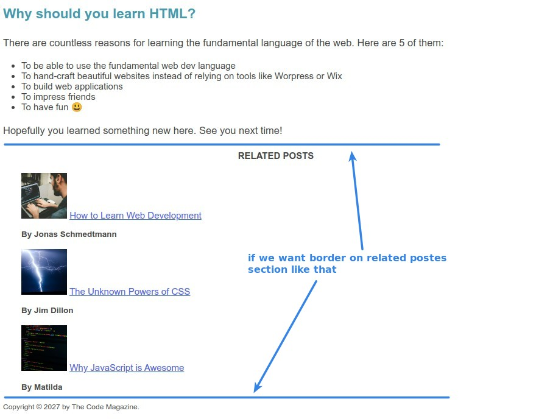

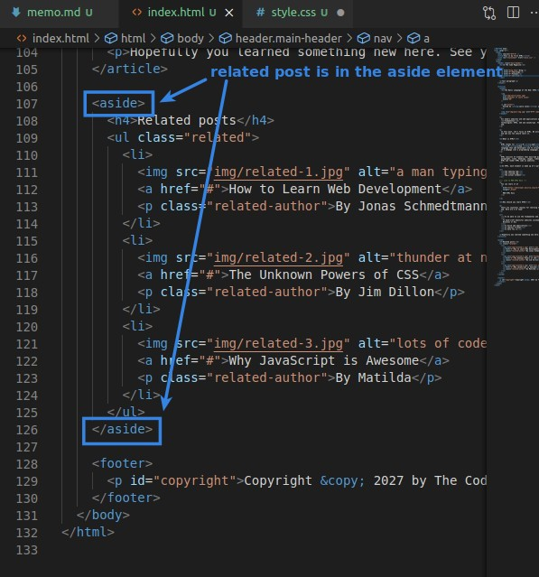

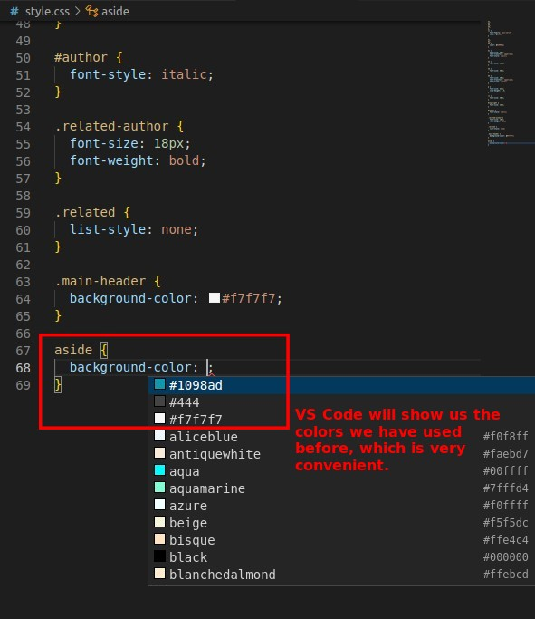

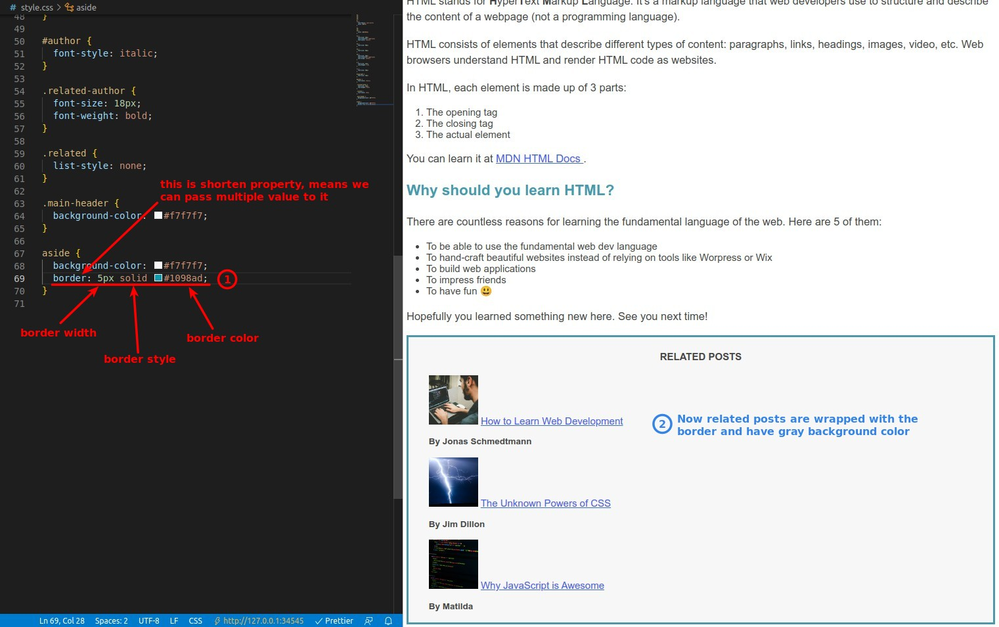

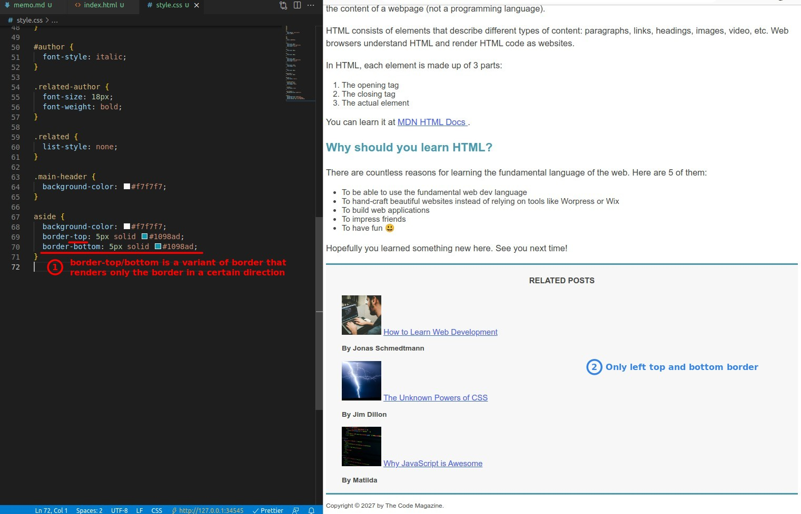

## **Color for Whole Page**

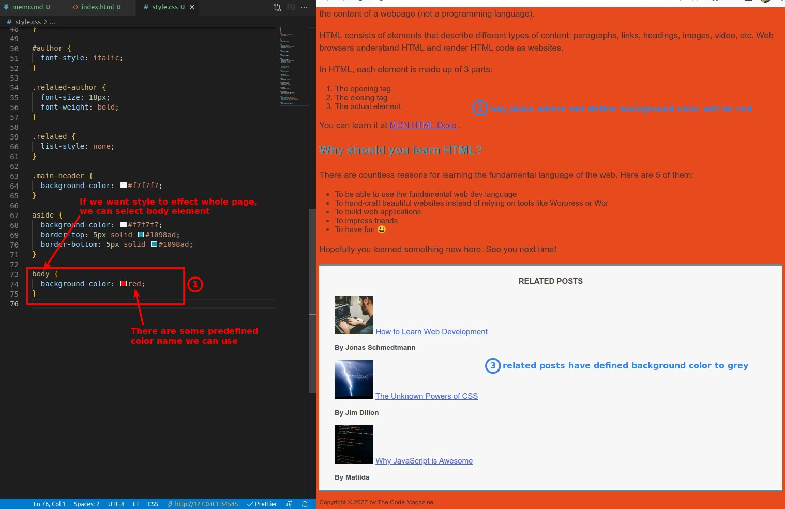
