## **1st li element style with old stupy way**

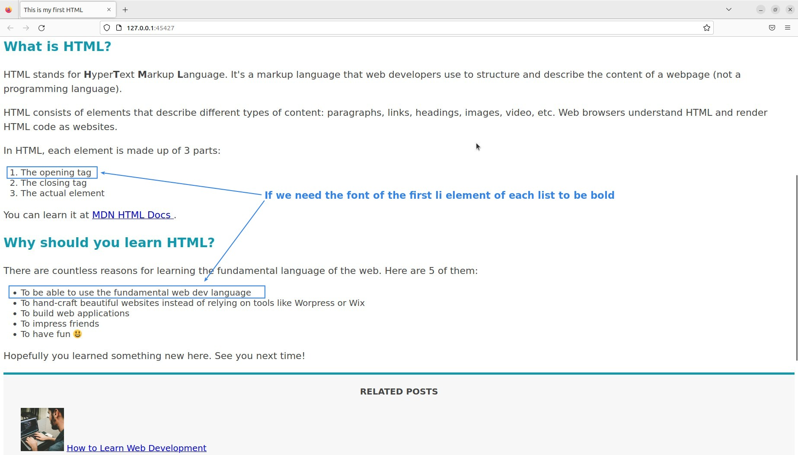

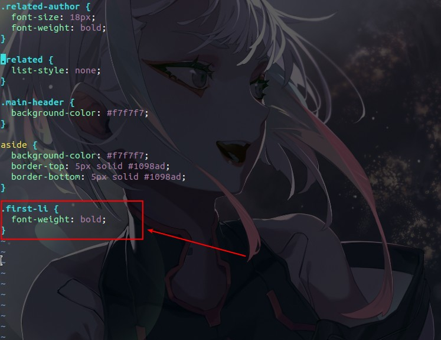

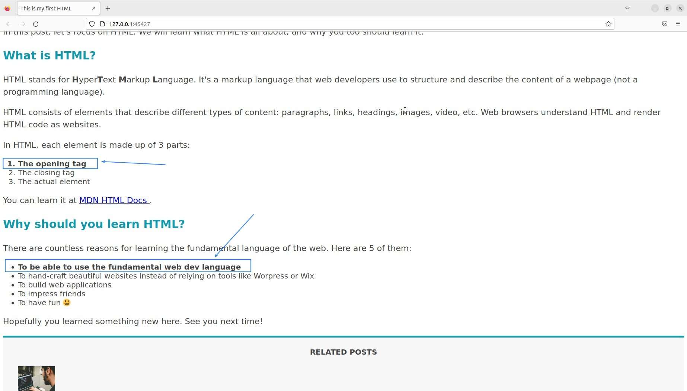

## **1st li element style with psuedo class**

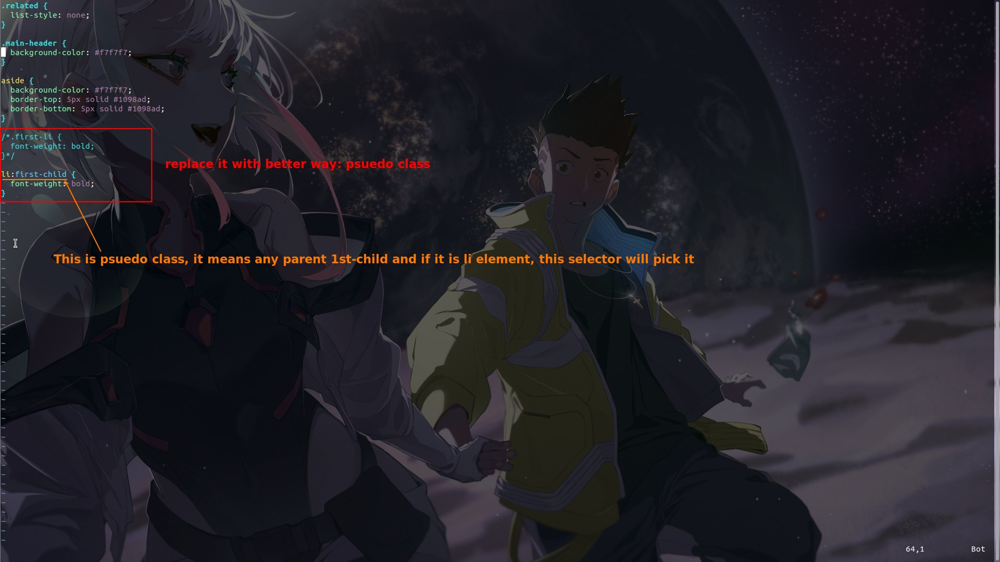

## **other psuedo class**

### _last-child_

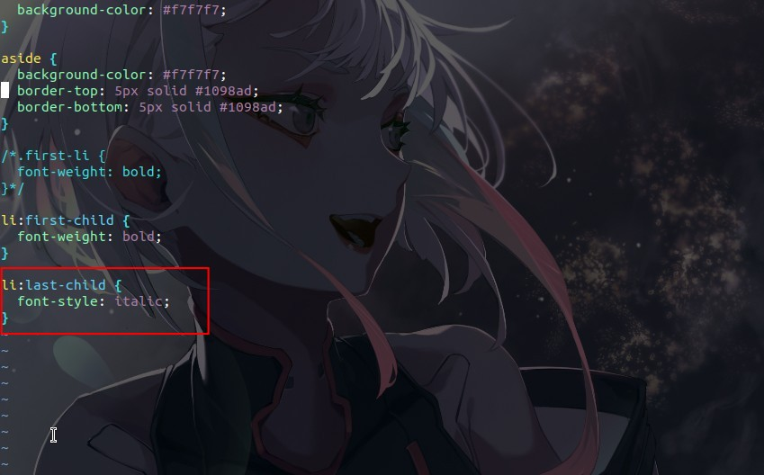

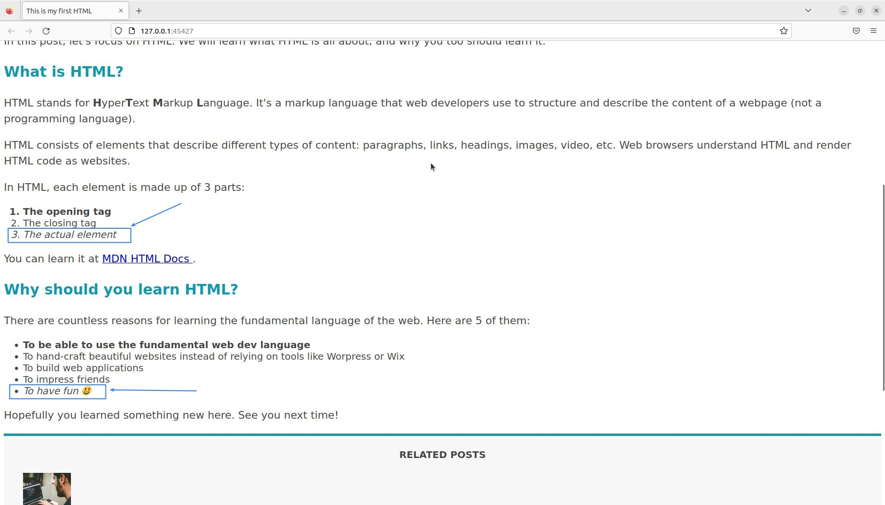

- We can find that we don't need to set the class in HTML at all, we can directly use the psuedo class to catch the element we want, it save lots of time.

### _nth-child_

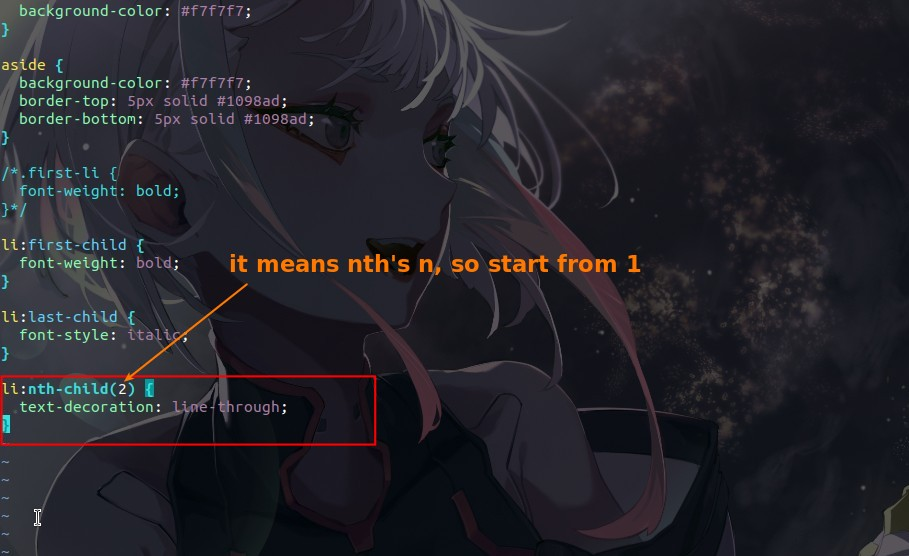

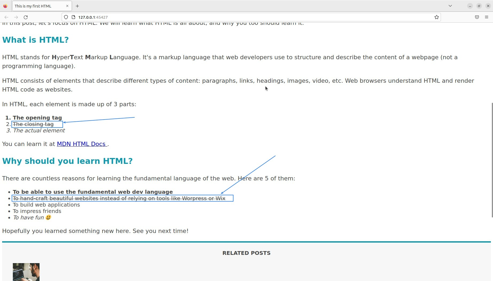

### _nth-child with keyword_

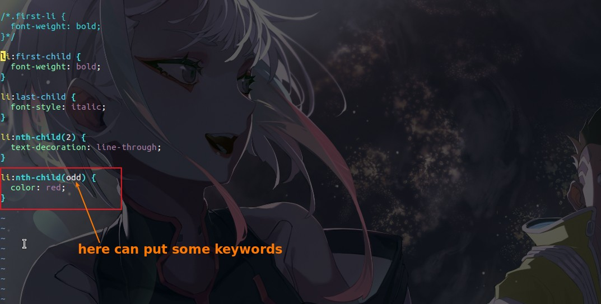

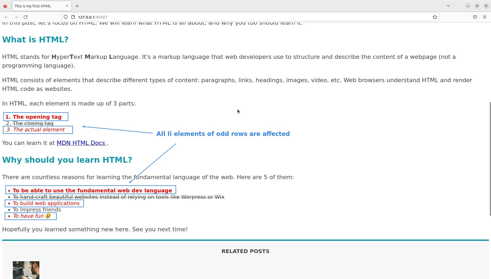

- This is a very good function, often seen in the form many people use it.

## **misunderstand about usage of psuedo class**

> Here are the parts that most people misuse when using the previous psuedo classes.

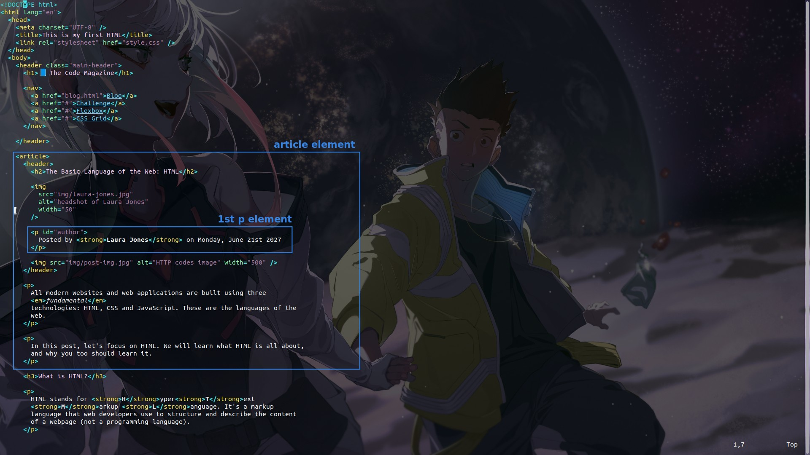

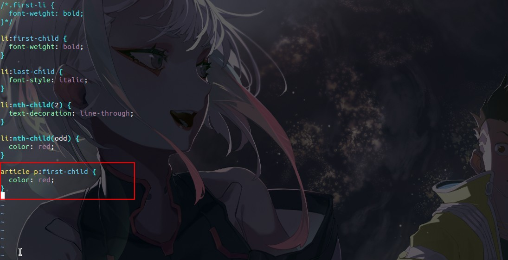

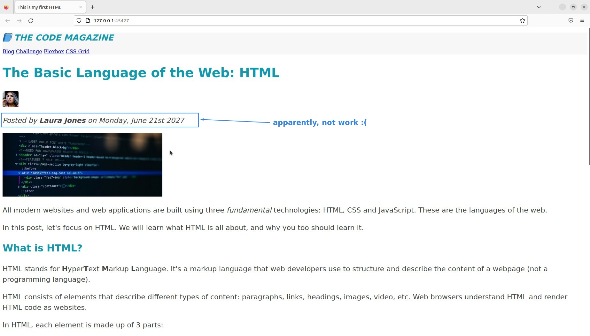

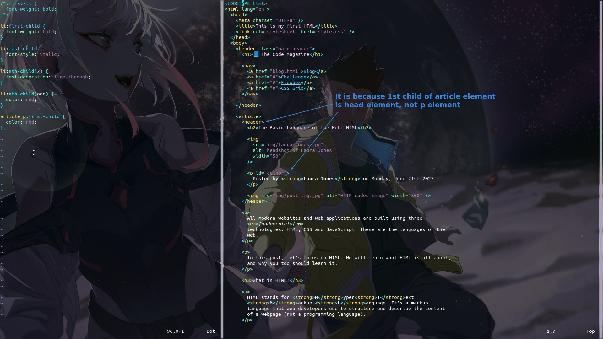

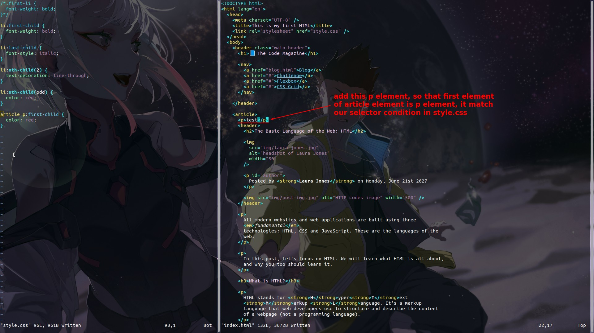

## **concern of psuedo class above**

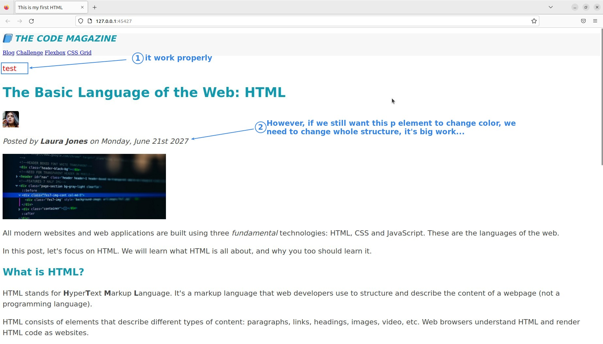

- The above psuedo class of \*-child type is only suitable for use in cases where the child element type is very simple.
  - Because the selector is defined using the HTML structure, it is easy to cause bugs if there are various child element types.
