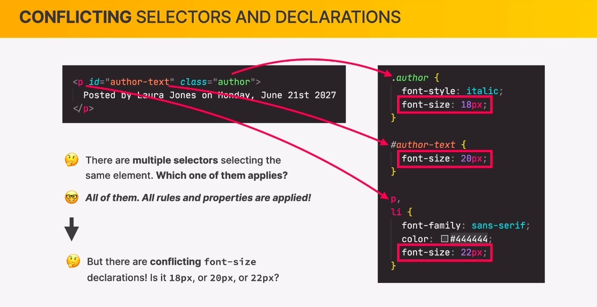
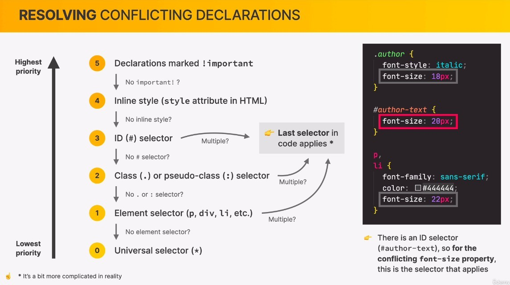
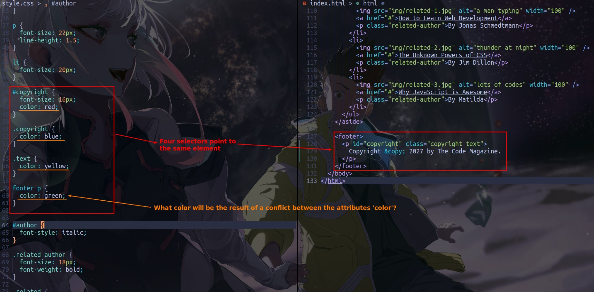
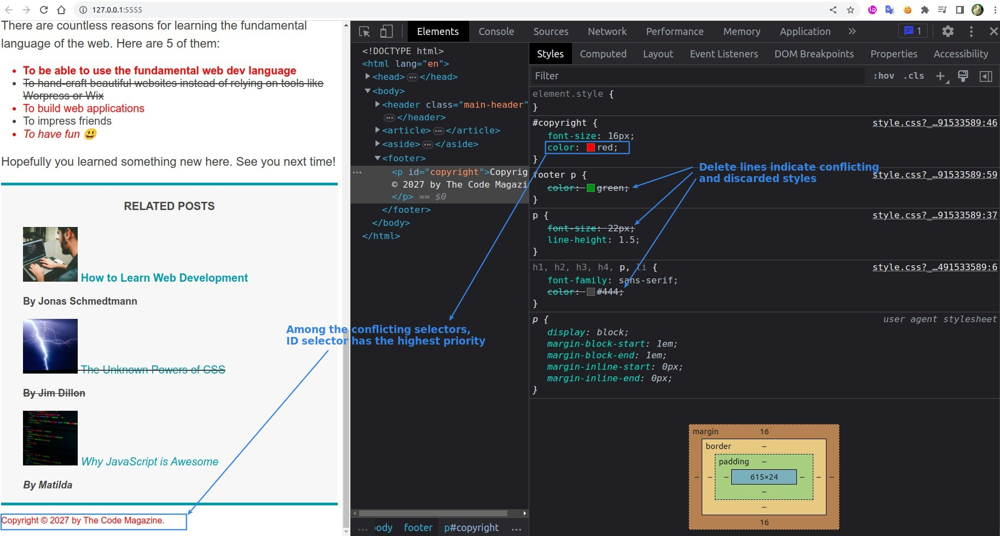
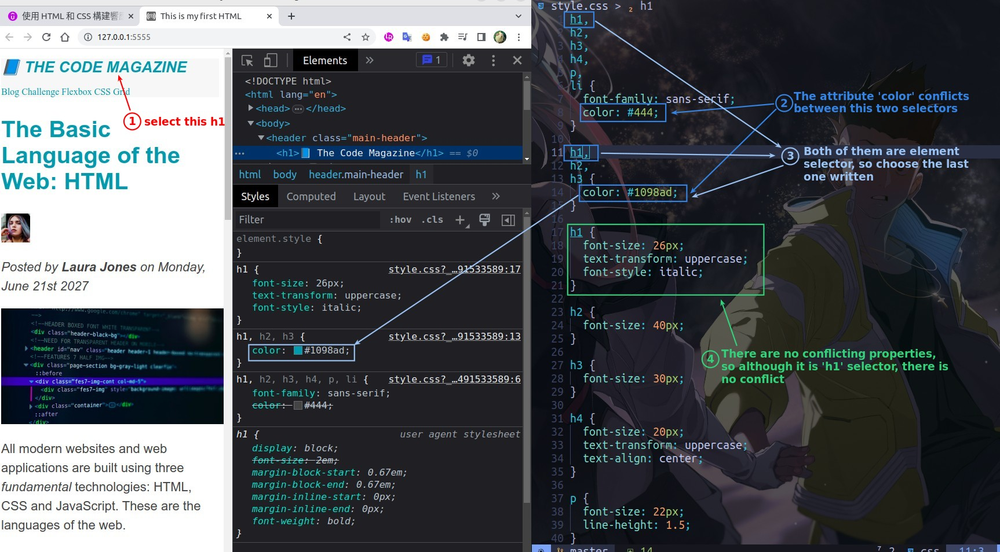
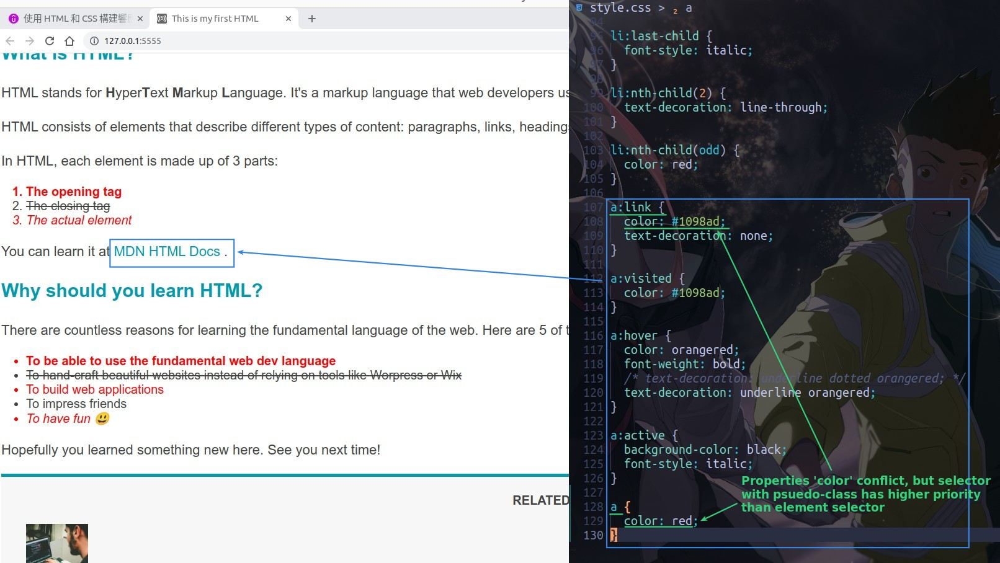
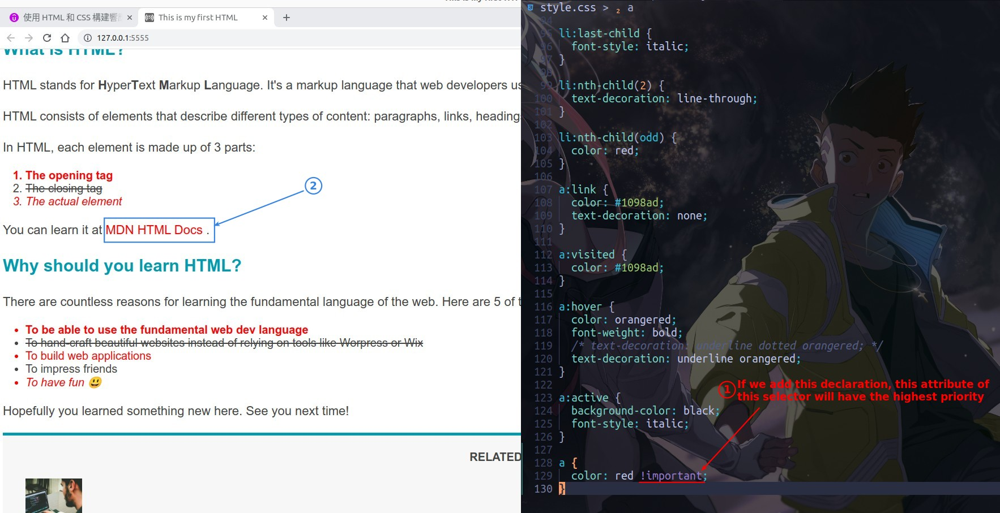

## **Concept**

### _Multiple selectors point to the same element_

### _Priority of conflict property_

- Avoid using No.5 and No.4 as much as possible.

- This priority only works if there is a conflict, basically all styling to the element will be applied if there is no conflict.

## **Examples**

### _Footer: various kind of selectors_

### _h1 example: same kind of selectors_

- The conflict is for a single property, not the entire selector.

### _anchor example: psuedo-calss & !important_

- Only use it if you are completely confused about why it is so styling...
  - We need to simplify CSS styling codes as much as possible
    - Fewer nests
    - Fewer ID selectors
