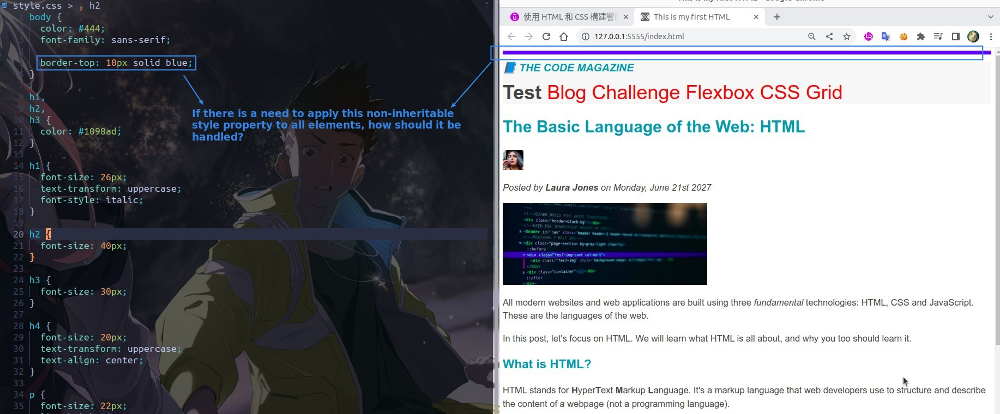

## **Body inheritance**

### _The inherited style property is easily overwritten_

- The override here is not the same as the conflict introduced earlier.

### _practical use_

### _non-inheritance style properties_

> Only style properties related to text will be inherited.

## **Concept of inheritance**

## **Inheritance in small scale**

> The style property inheritance is not only used for the body, but also for the smaller scale of style handling.

## **Universal selector**

- Universal selector and the use of Body inheritance are somewhat similar in result, but the mechanism of action is completely different, the former is completely without inheritance, the latter is completely dependent on inheritance.
