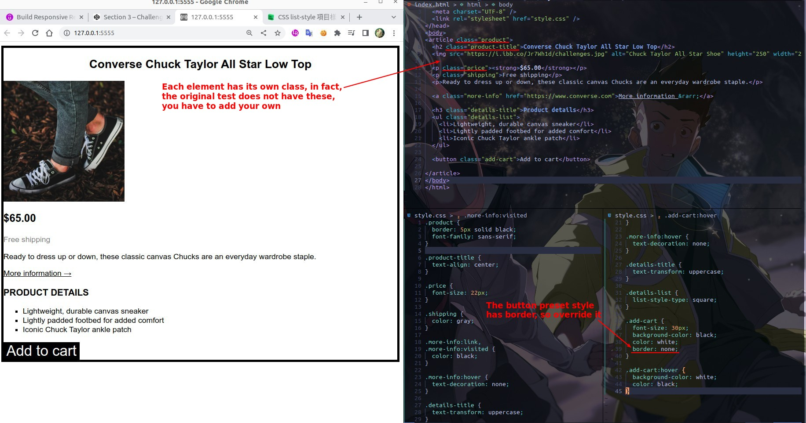

# **_Challenge #1_**

> value does not matter, the important thing is to achieve all the effect.

## **My solution**

- Use class on each element to reduce the complexity of CSS codes.

## **Answer**

- only body don't need the class.
