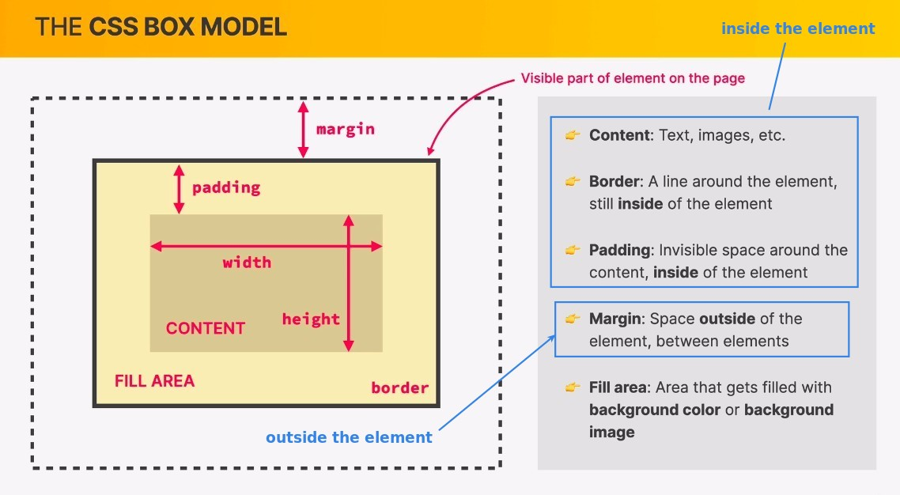
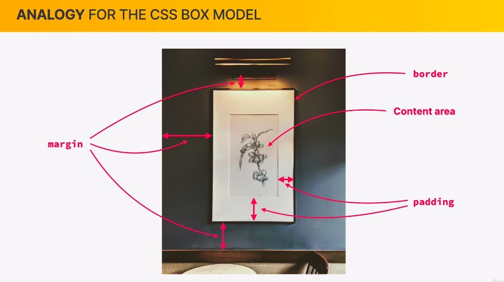
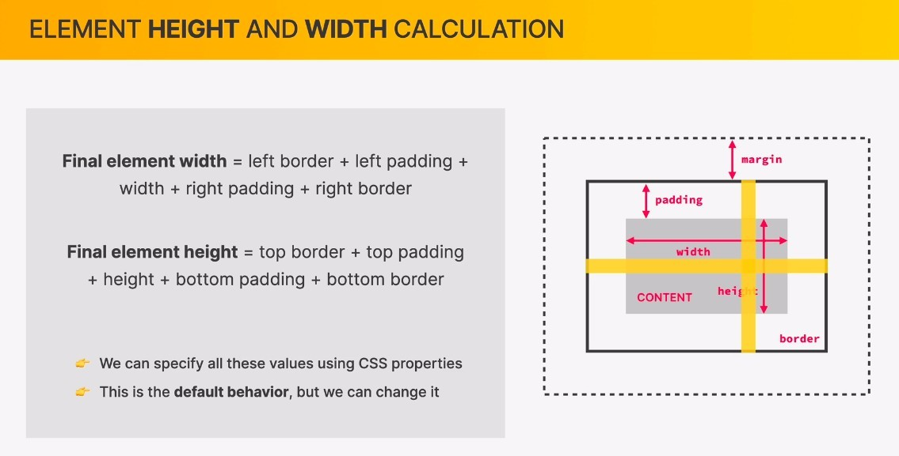

## **CSS Box model**

> Each element can be treated as a rectangular box.

## **Analogy**

## **Height/Width of the element**

> We can define the height and width of content, but they do not equal to the height and width of the element.

