## **Fill color block area**

### _color block_

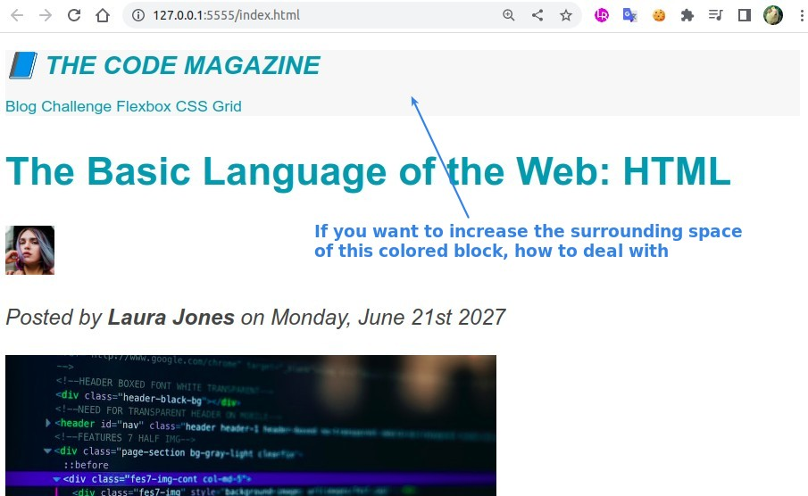

### _padding_

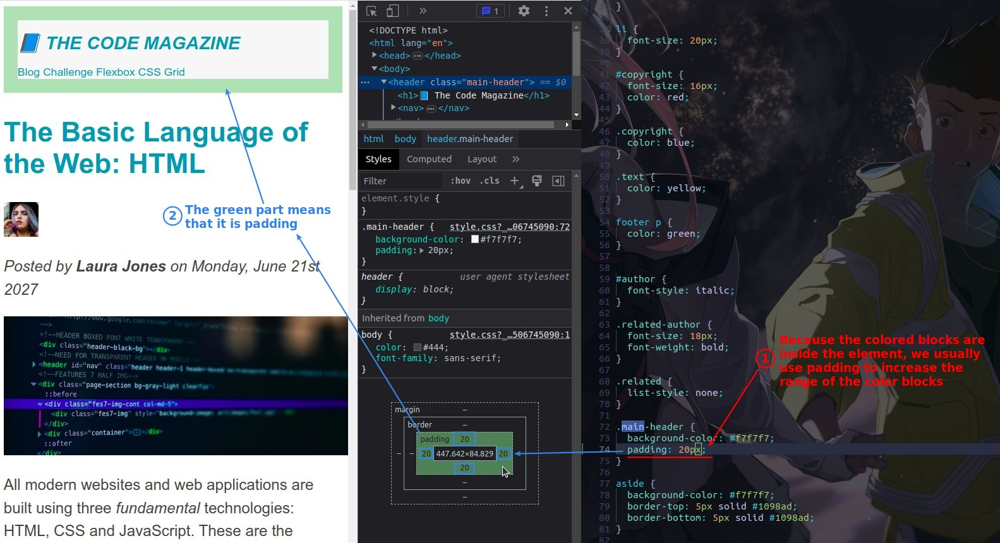

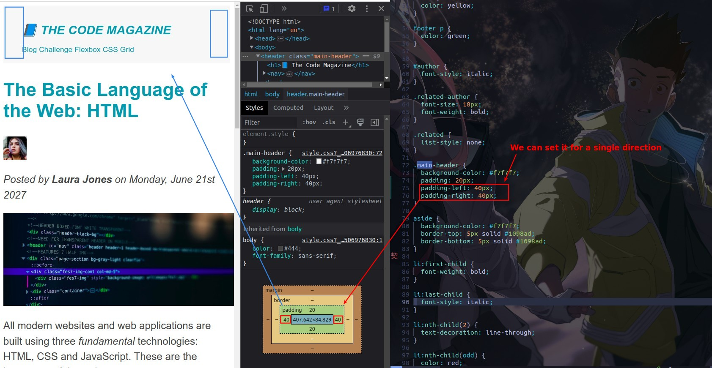

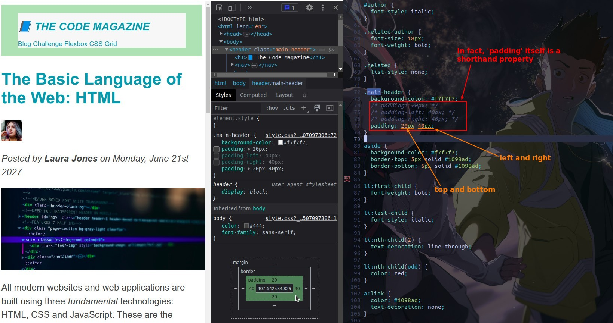

## **Redesign elements vertical distance**

### _default margin and padding of elements_

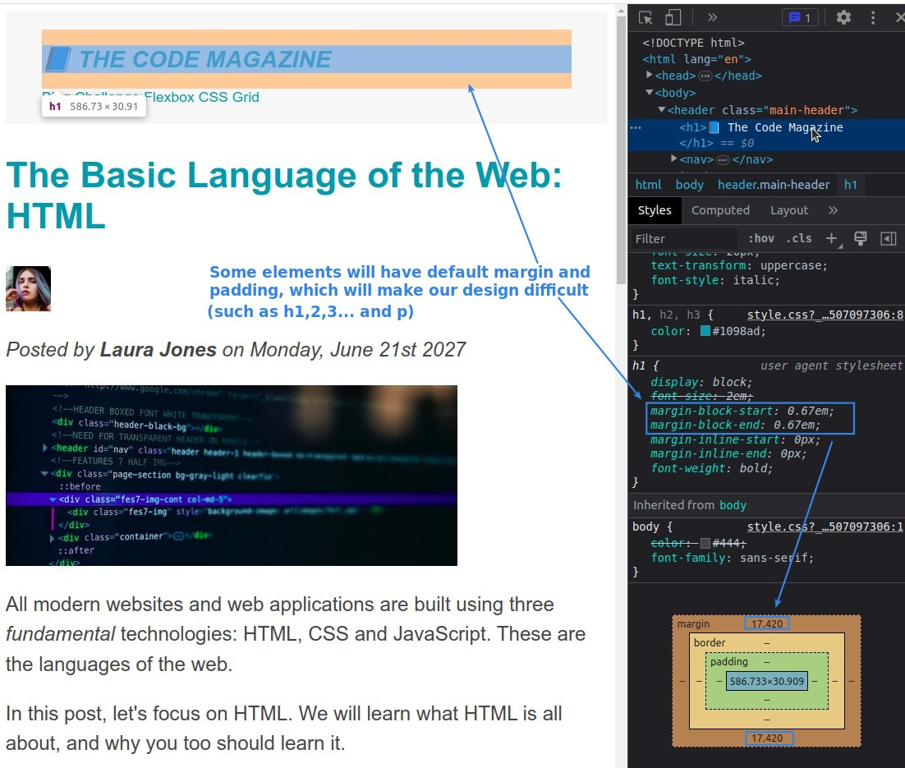

### _remove default margin and padding with universal selector_

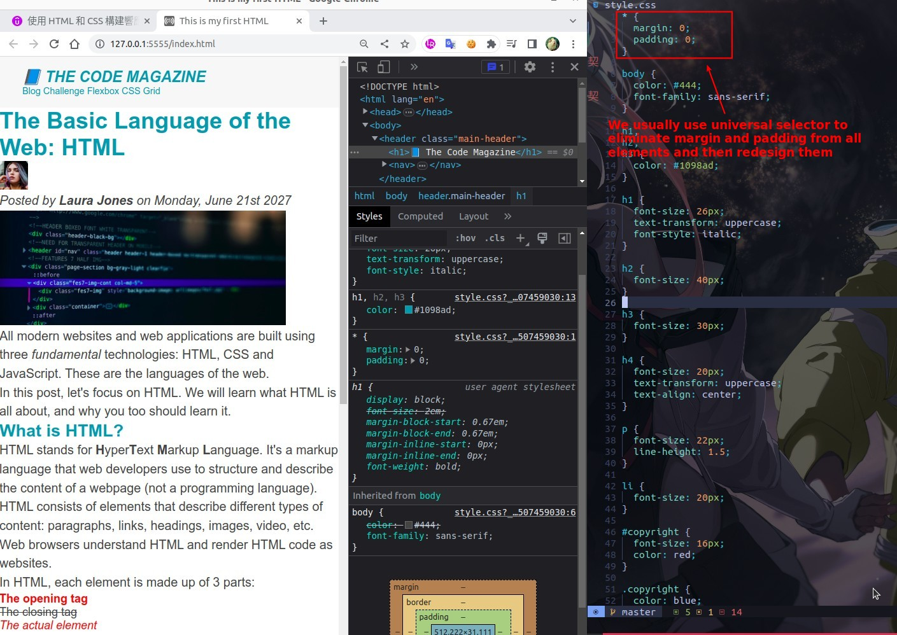

### _reset vertical distance with margin-bottom_

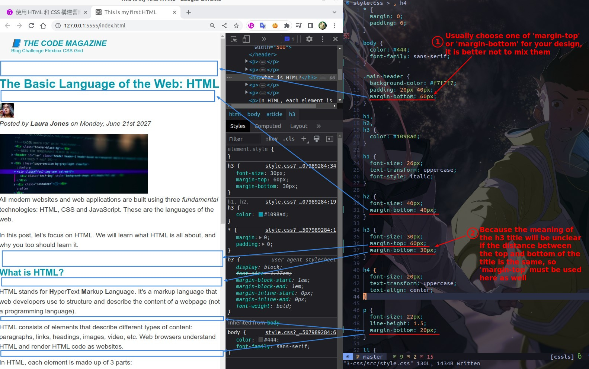

### _collapsing margin_

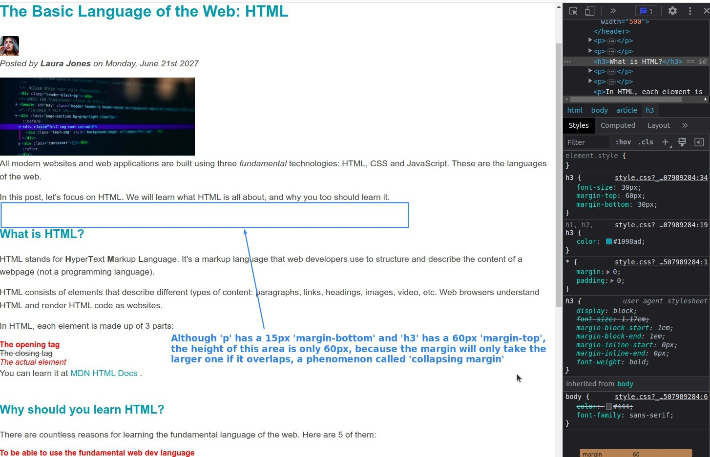

## **List problems**

### _left symbol of list gone?_

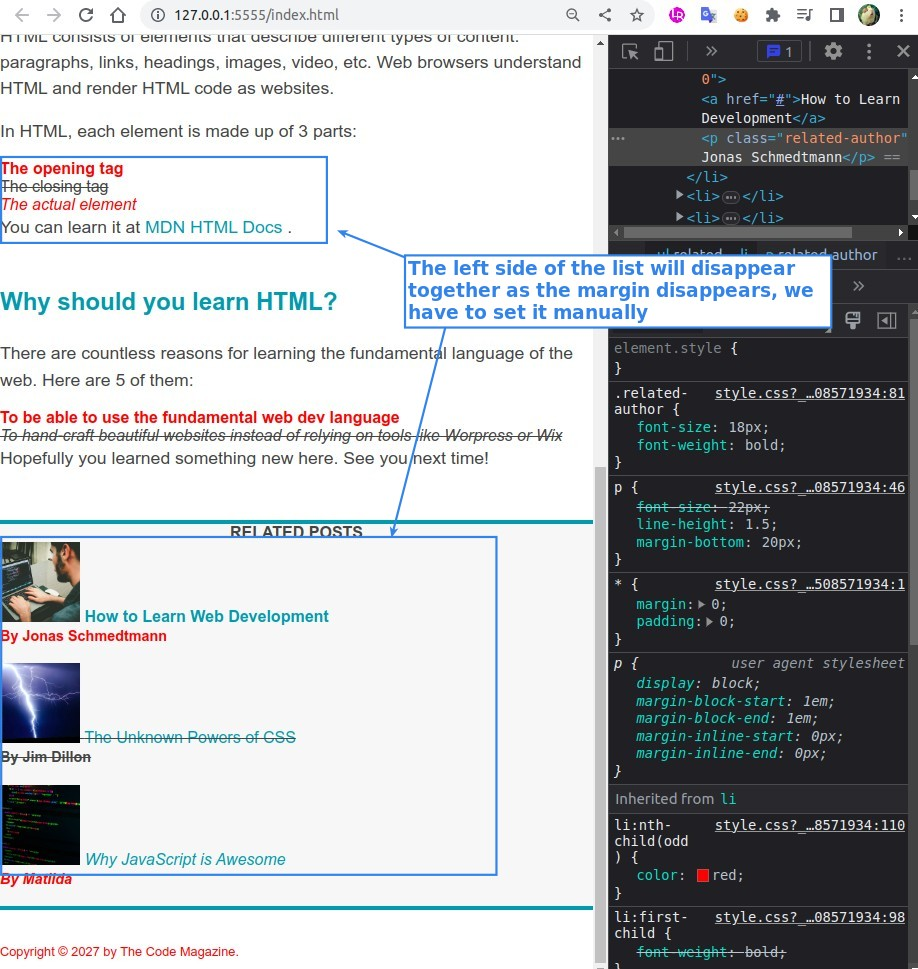

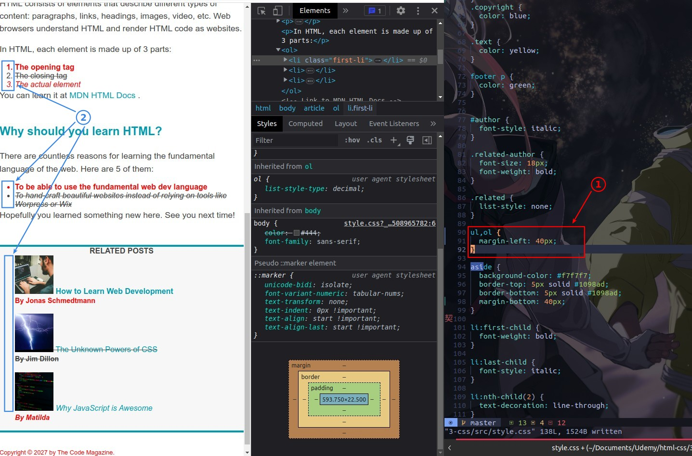

### _distance between list elements_

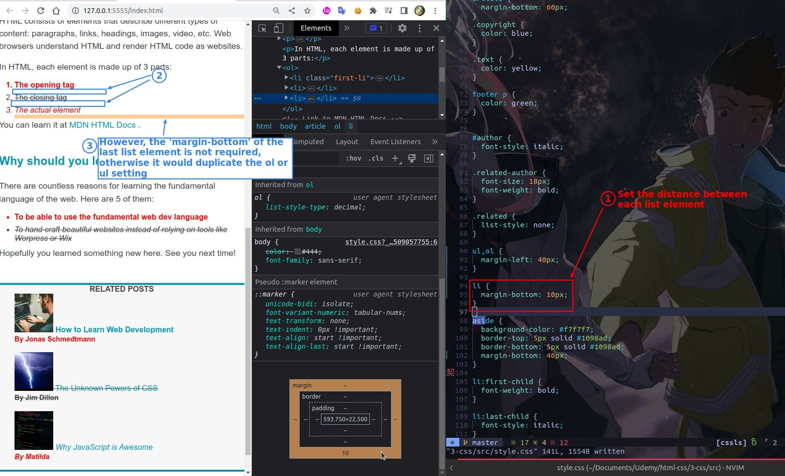

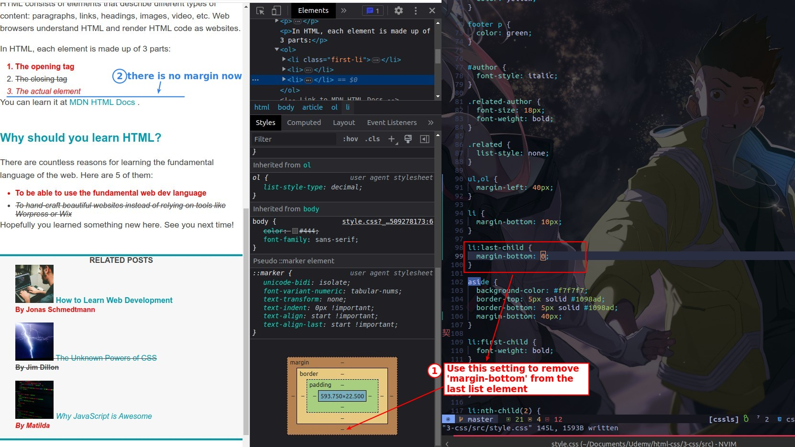
