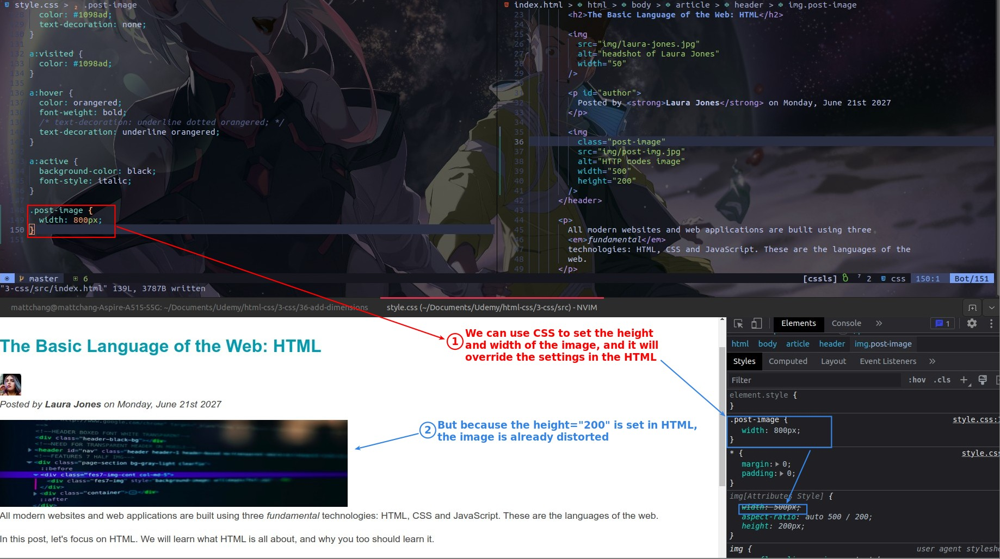

## **Width of content**

> Normally the width of the content will be adjusted to the width of the browser, if you want to narrow it, you have to set it yourself.

## **Height of content**

> The height of the content will be adjusted by default according to the actual content height.

## **Content width and height of image**

- We've said before that inline styles have a higher priority than CSS styles, but in the case of the image the situation is reversed because the width and height attr of the img element are not considered inline styles.

## **Use percentage unit %**

> Using % unit is very important for responsive web pages.

- Because the content width of the header element will be adjusted with the browser width, and the img element depends on the header to adjust the width, so that the img will also be adjusted according to the browser width.

