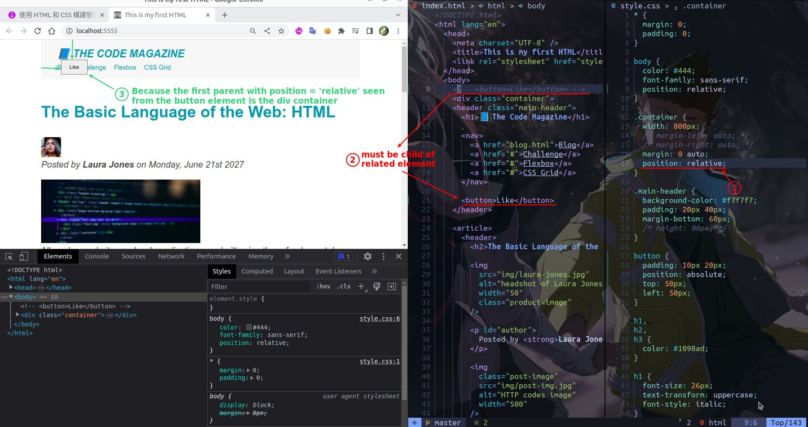

## **Concept of position**

## **In/Out of the flow**

## **Absolute position related to ...**

> Above we have moved the button outside the flow, but its position is relative to the view point, usually we want it to be relative to a parent element.

- So **position: relative** is not only the default position, but it can also define what parent element is used to position the absolute position.

- The **first** relative parent will be used to position the absolute position child element.

## **What we will do with absolute position?**

- It will not be used for layout-related tasks, such as setting the position of the menu.
- It will only be used on small tools, such as buttons and other small parts.
