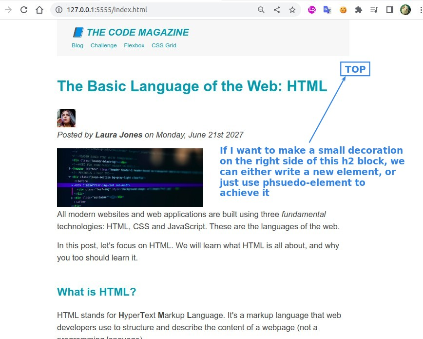

## **Phsuedo-element**

### _::first-letter_

### _::first-line_

## **Requirement: p first line after h3**

### _sibling and adjacent_

### _selector +_

## **Requirement: little decoratedd widget of h2 block**

### _::after_

### _padding_

### _absolute position_

- There is another phsuedo-element ::before, which does much the same thing.
