## **HOw to change cursor icon when hover on button**

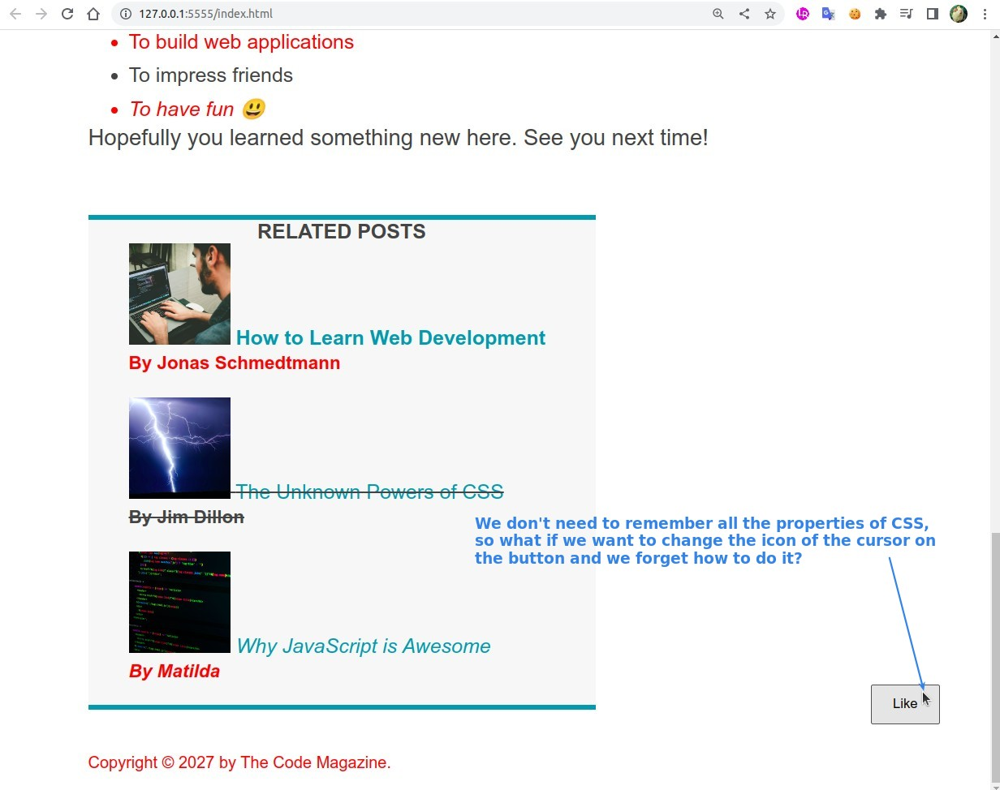

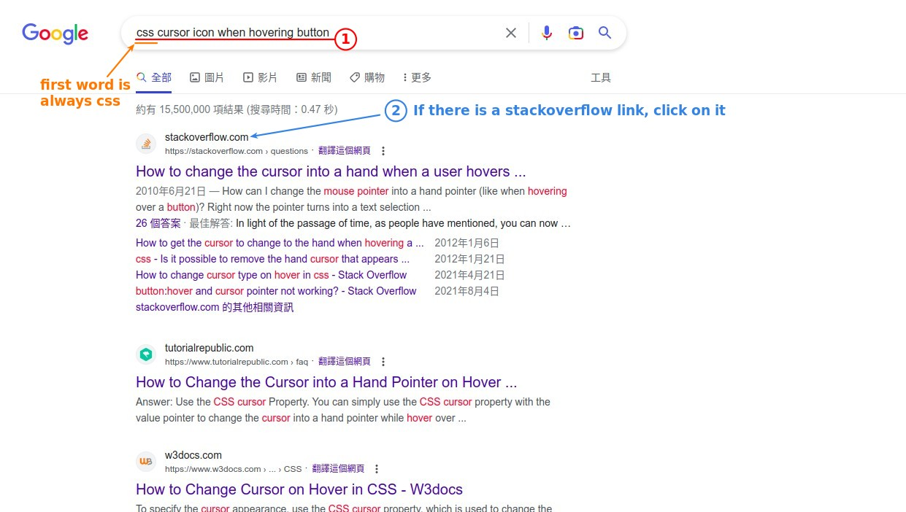

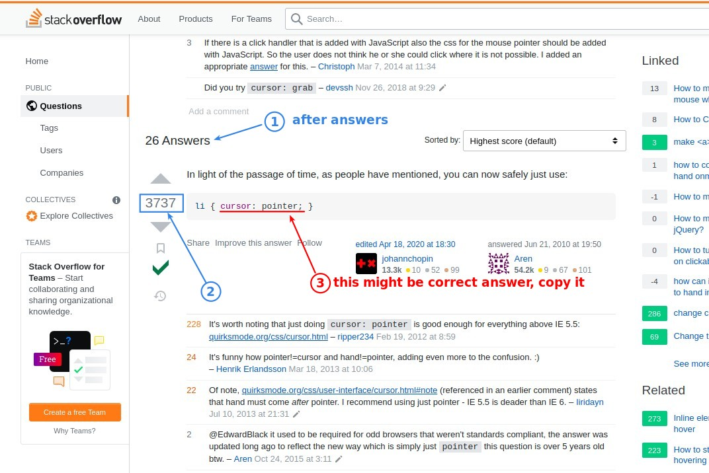

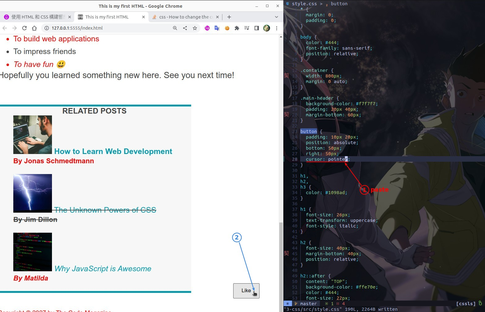

## **How to center nav links**

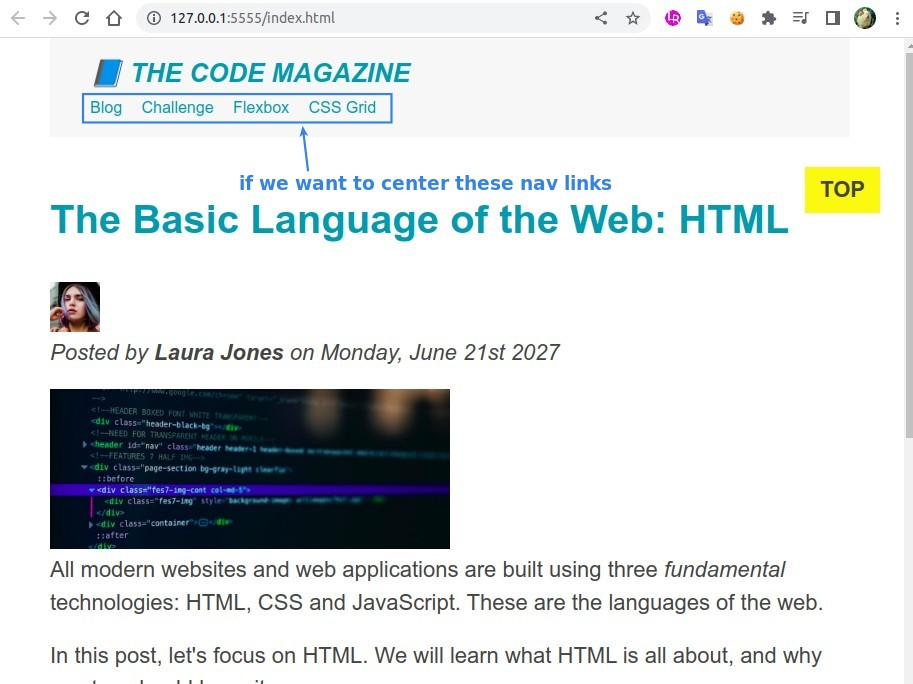

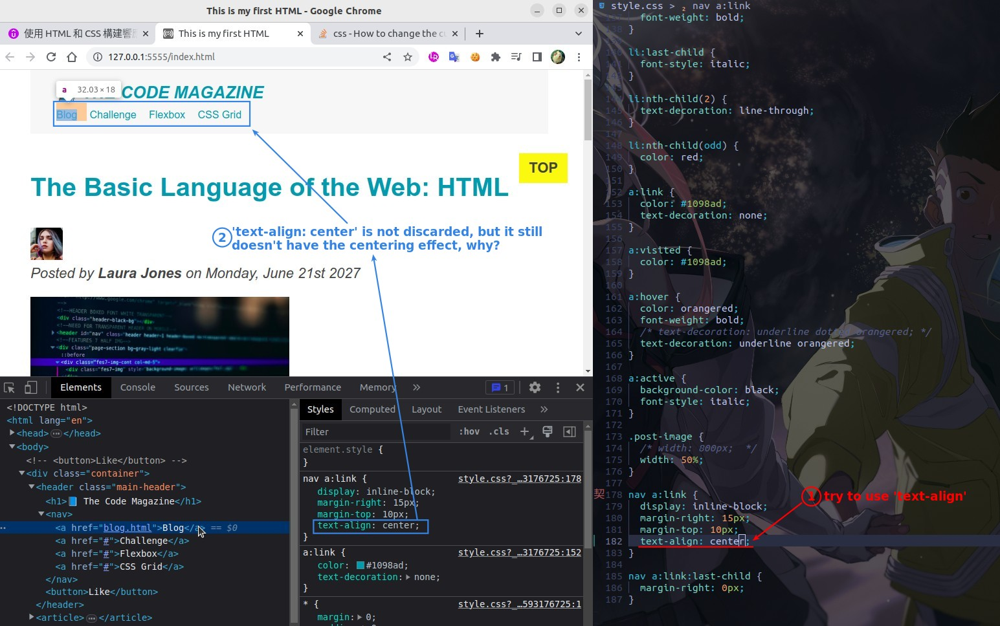

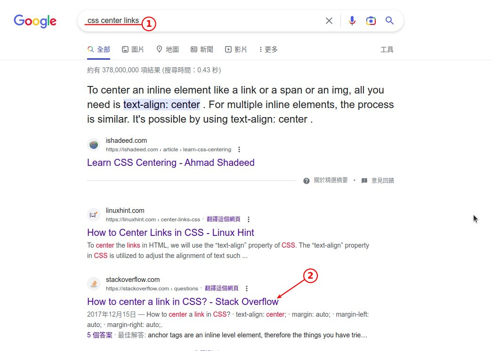

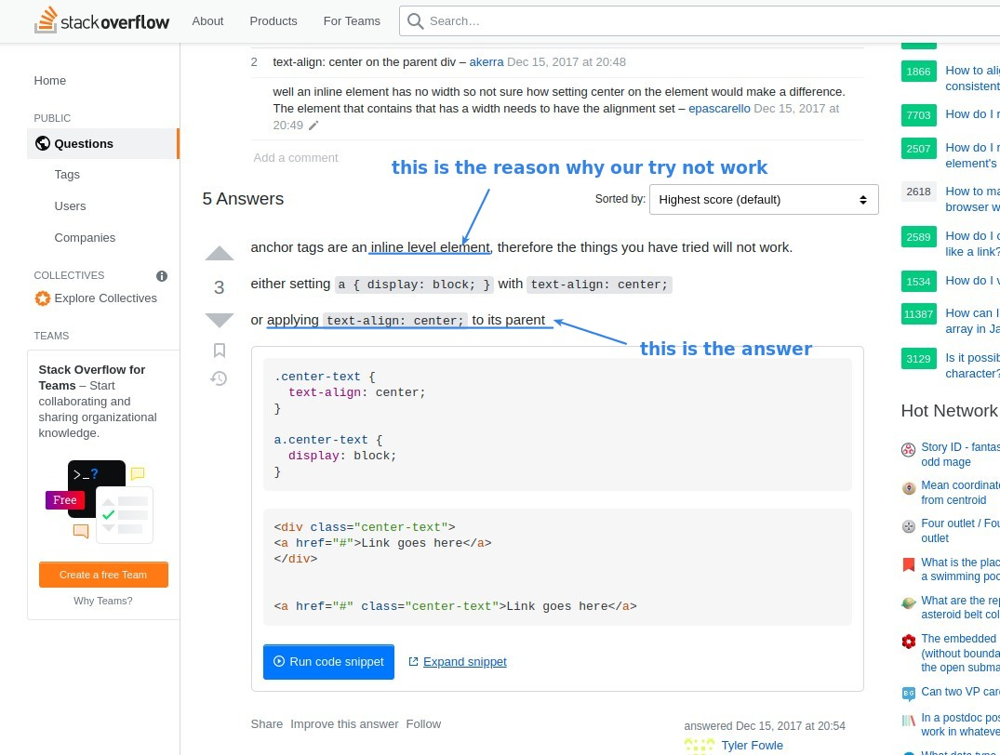

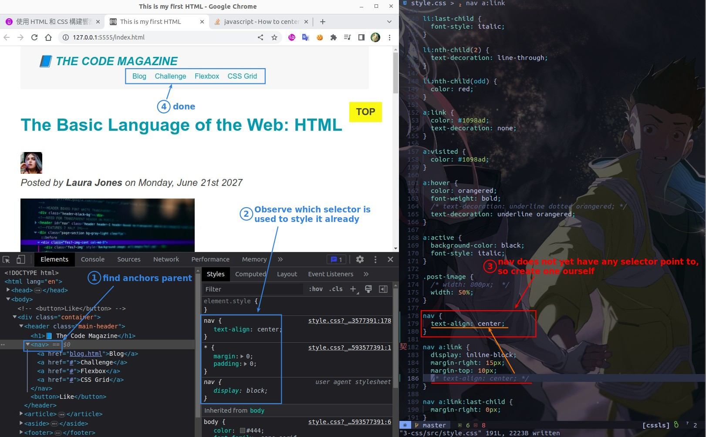

## **MDN documents**

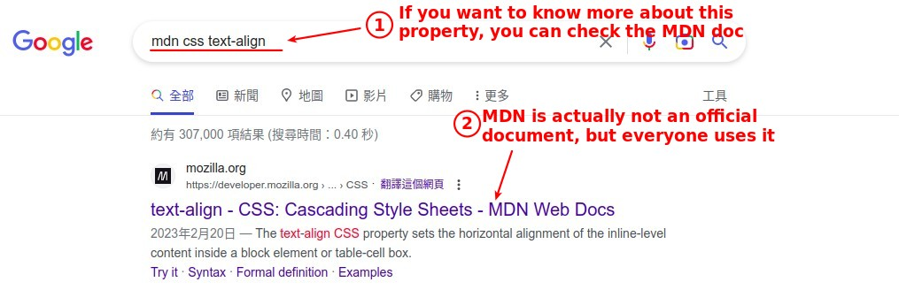

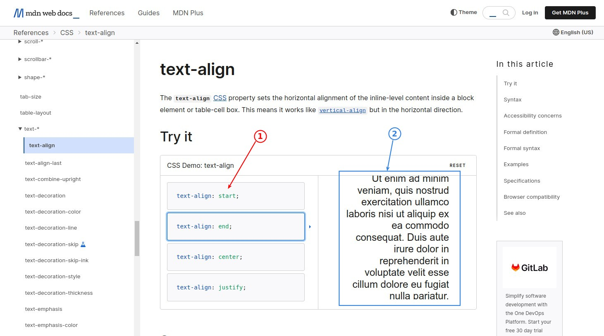

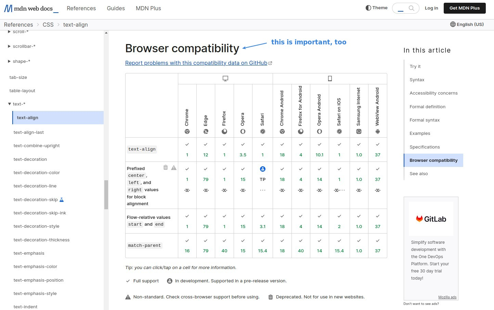

## **Conclusion: we don't need to know every properties to use CSS**

- We need to learn the fundamentals of CSS, and know how it works and what it can do.
- But we don't need to know exactly what properties are available and how to use them, because the answers can be found on the Internet.
