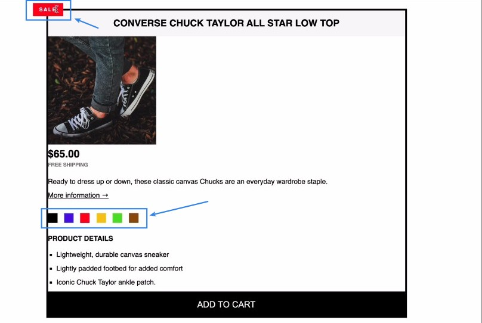
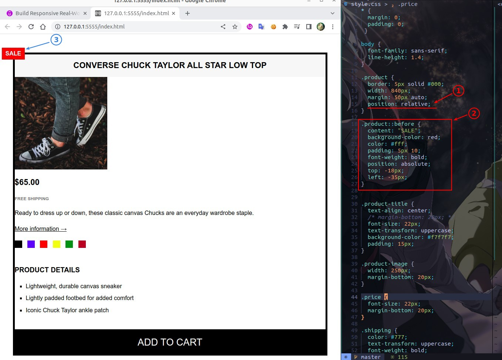
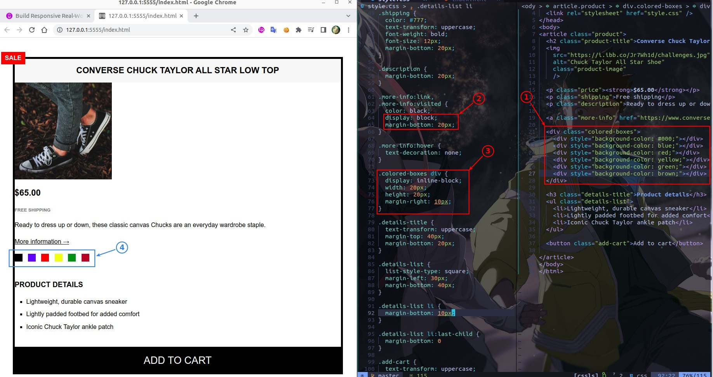
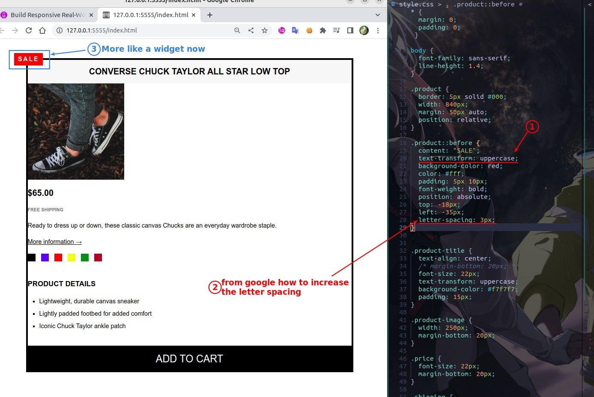
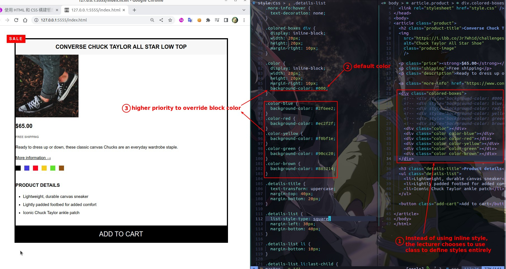

## **Challenge**

## **My solution**

### _widget_

### _colored blocks_

## **Answer of lecturer**

> Lecturers avoid using inline style and nesting, and use class to define the style, even if there is a conflict is acceptable.

### _widget_

### _colored blocks_

