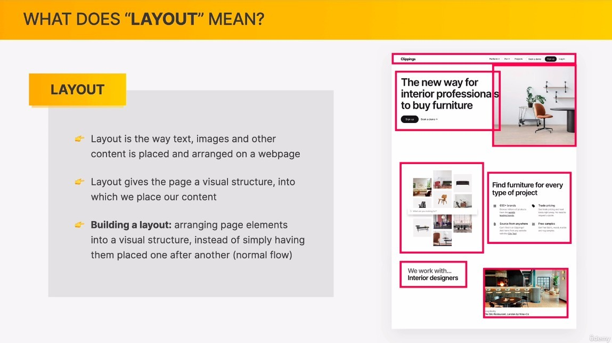
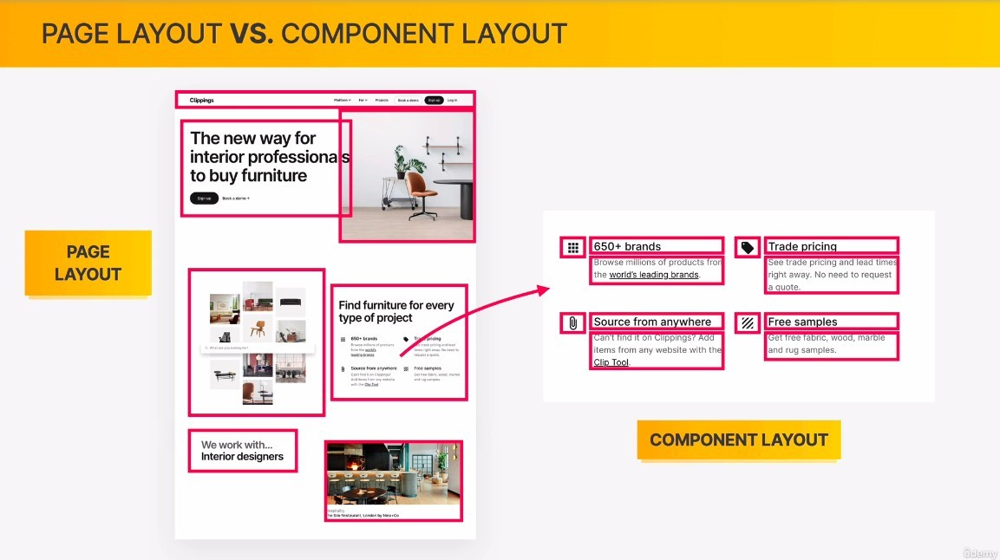
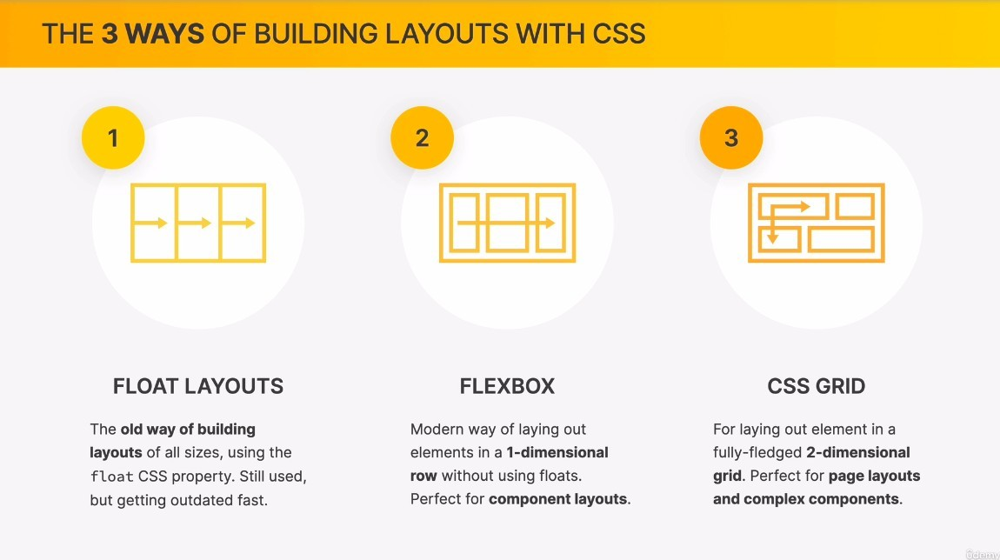

## **What dose LAYOUT mean?**

## **Page LAYOUT vs Component LAYOUT**

- A component is every unit that makes up a page, but it also has its own layout.

## **3 Ways of Building LAYOUT**

- Although we don't use float layout anymore, we may encounter older projects that still use it, so we still need to learn it.
