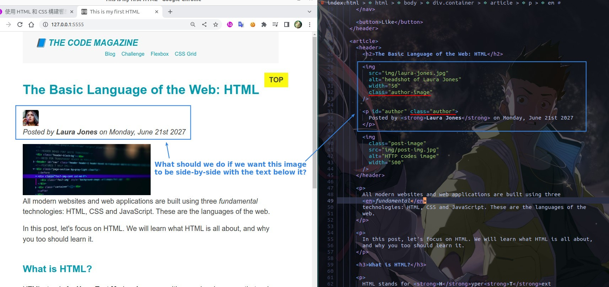
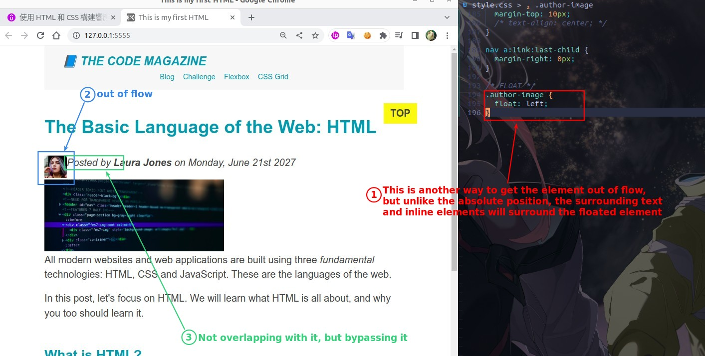
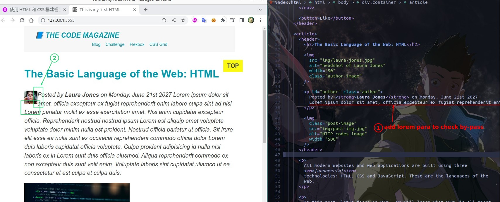
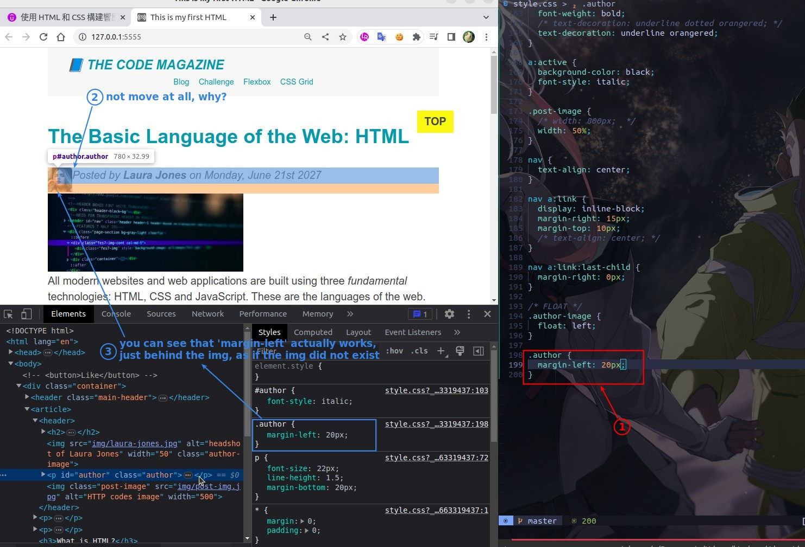
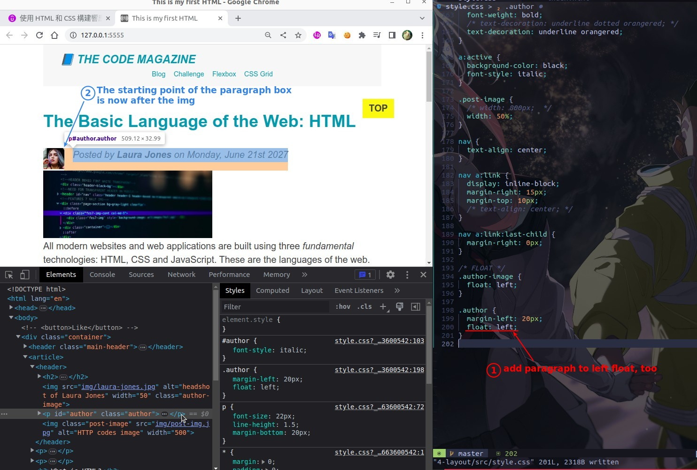
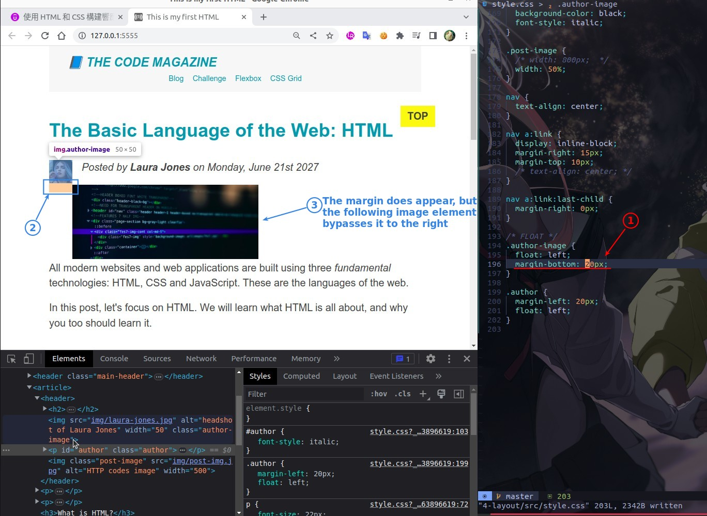
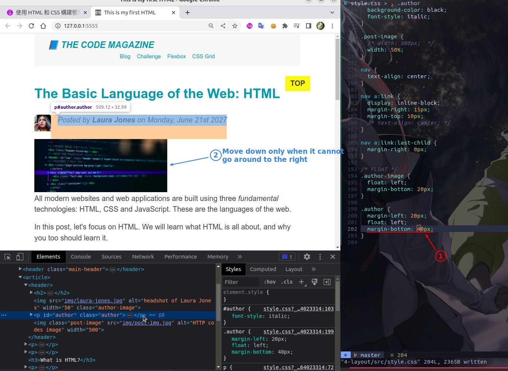
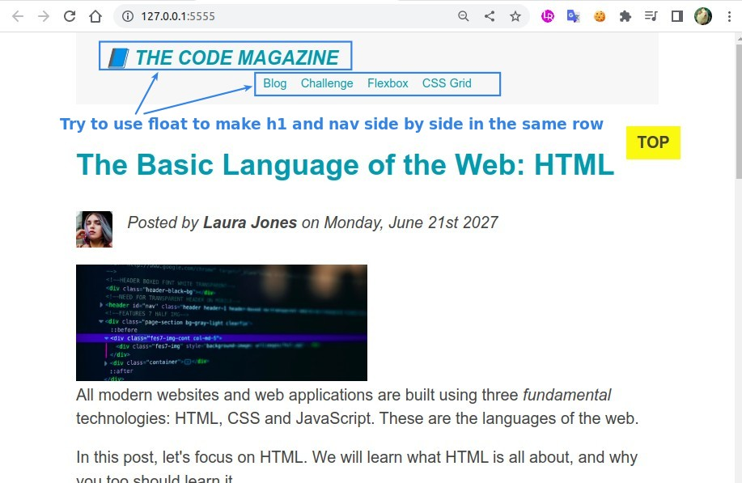
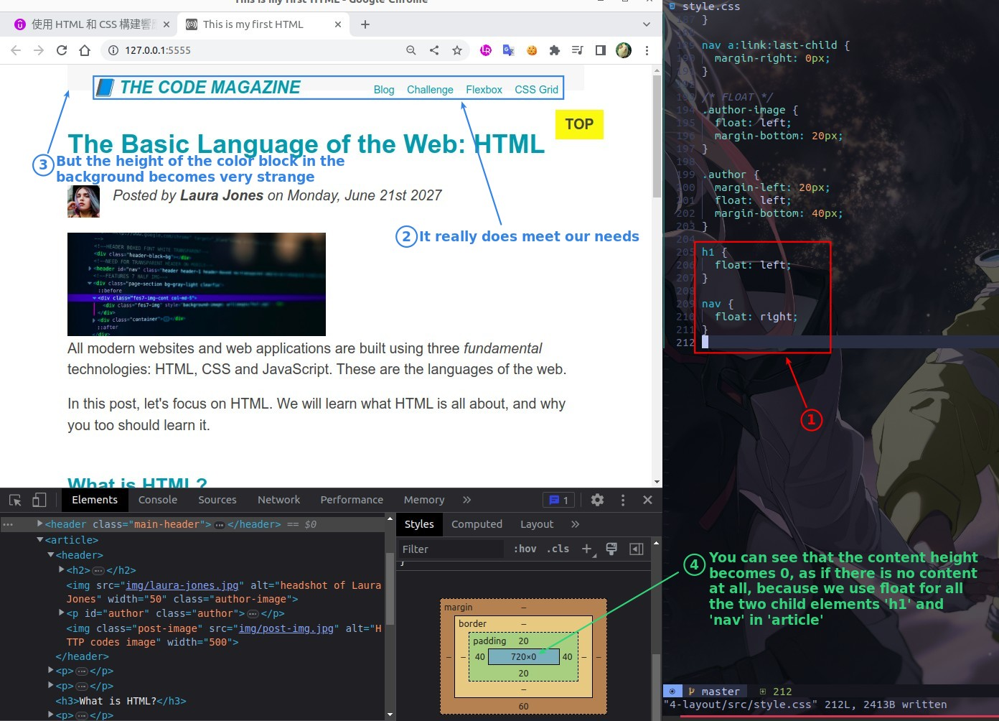
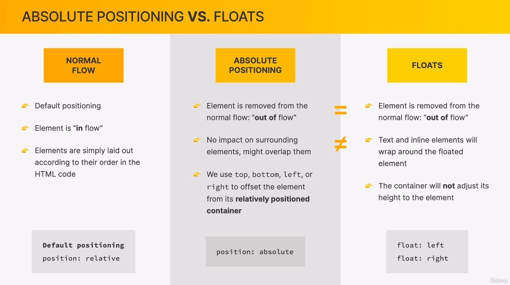

## **Need: Arrange img and p side by side**

> We already know we can use the box concept to accomplish this, but this time we're using a different approach - float.

### _need_

### _Bypassing the phenomenon_

## **Need: add space between img and p**

> Here you will find a very strange phenomenon, as if the img is completely removed.

## **Need: add space bellow**

> Even for the margin part, other elements will try to bypass it.

## **Need: arrange h1 and nav side by side**

> The focus here is on the effect of float on the parent element.

## **Conclusion concept**

> Although position and float are not the same concept at all, both absolute position and float will make the element out of flow, so let's compare them together.

