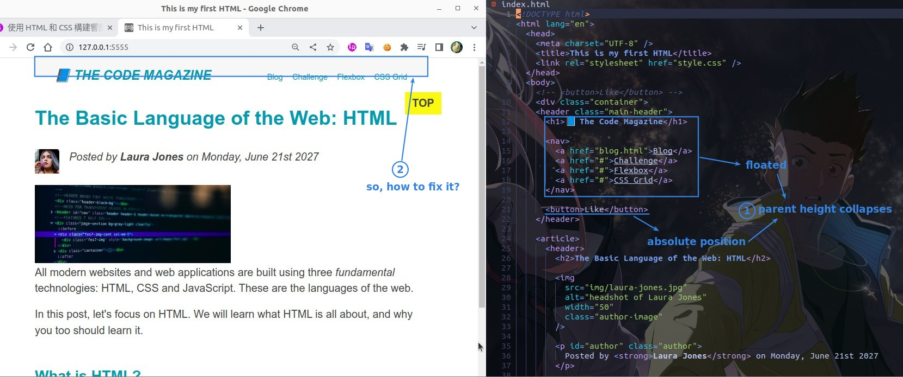
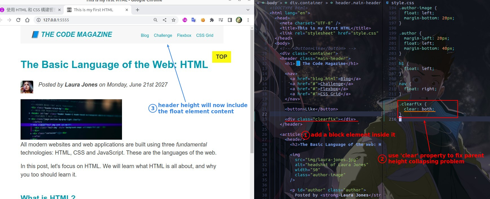
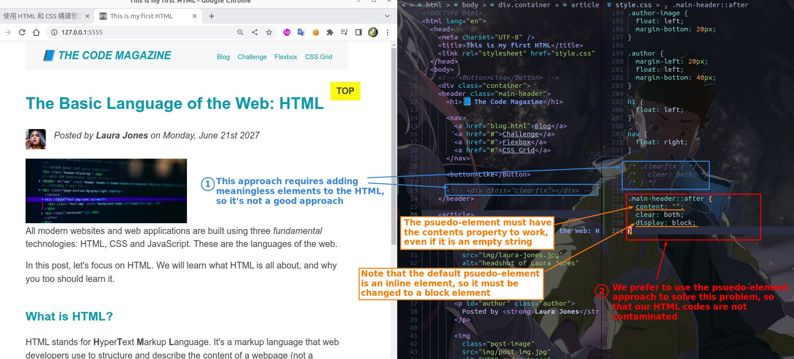
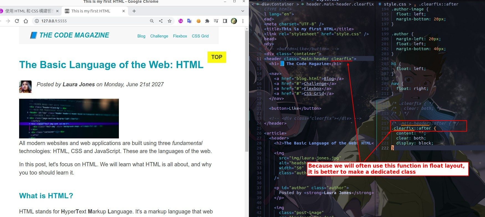

## **Problem: height collapsing**

## **Fix by adding clear element**

## **Fix by phsuedo-element**

> The above approach of adding a meaningless child element to each element where height collapsing occurs is not a good approach, so we have an alternative approach bellow.

### _better set as a dedictated class_

