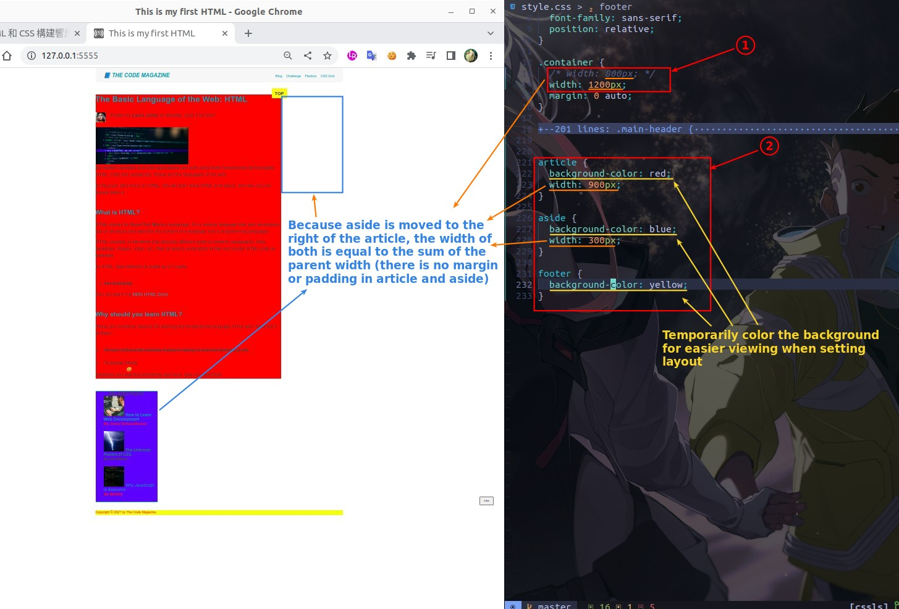
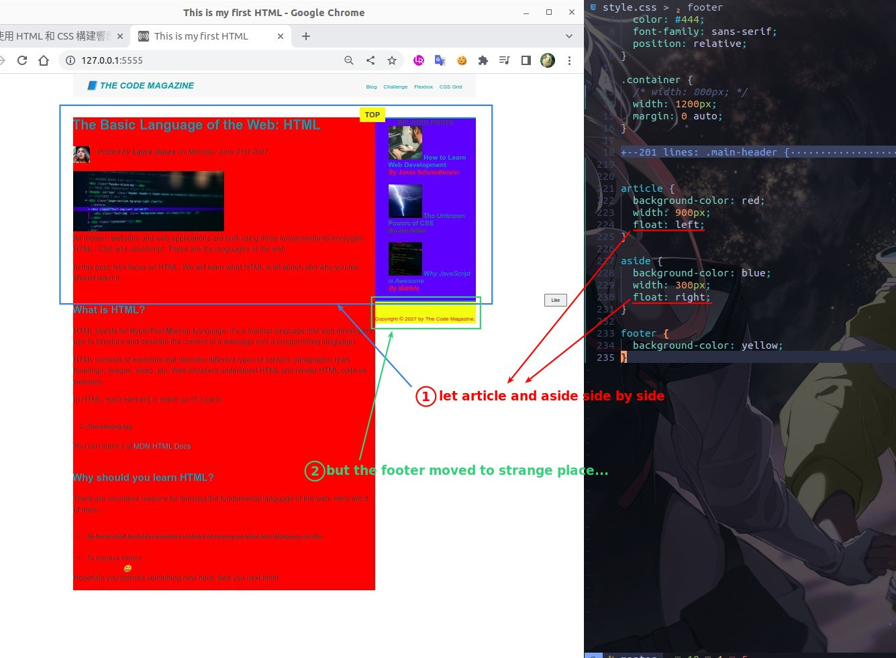
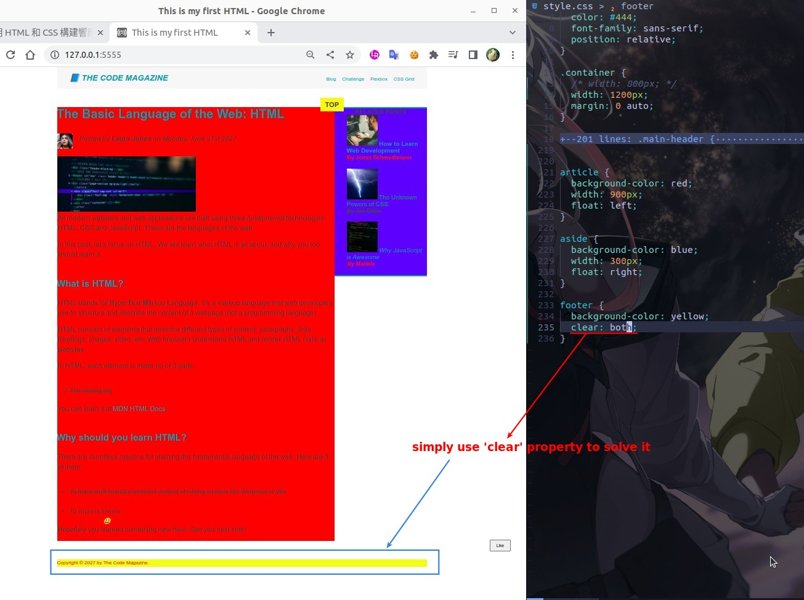
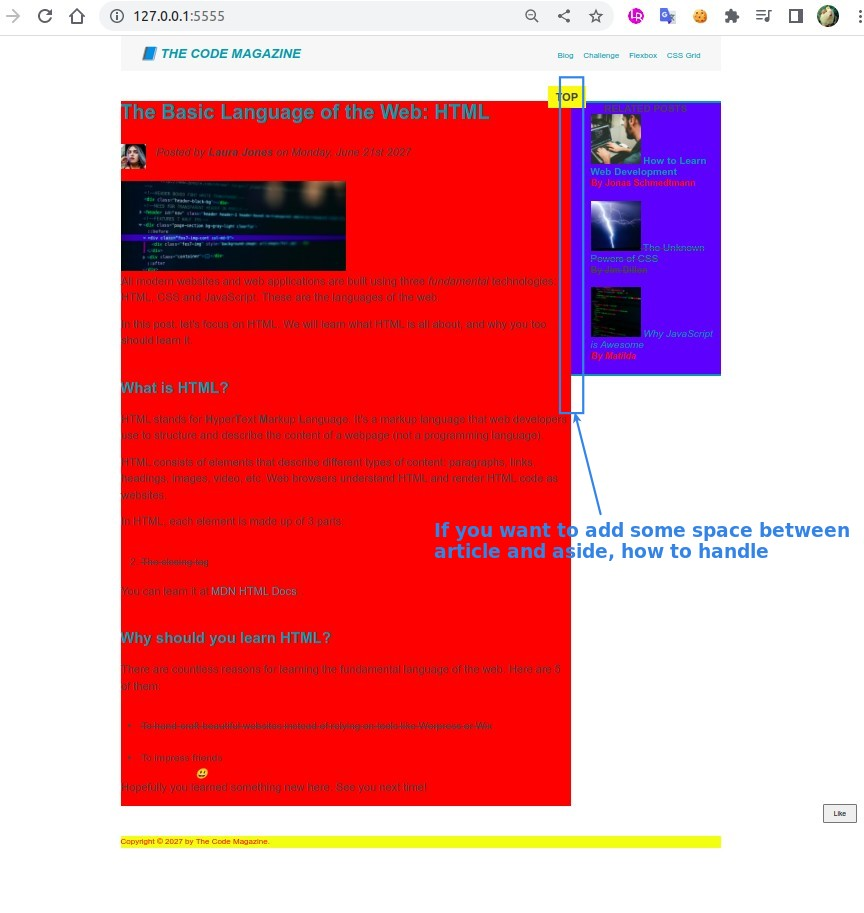
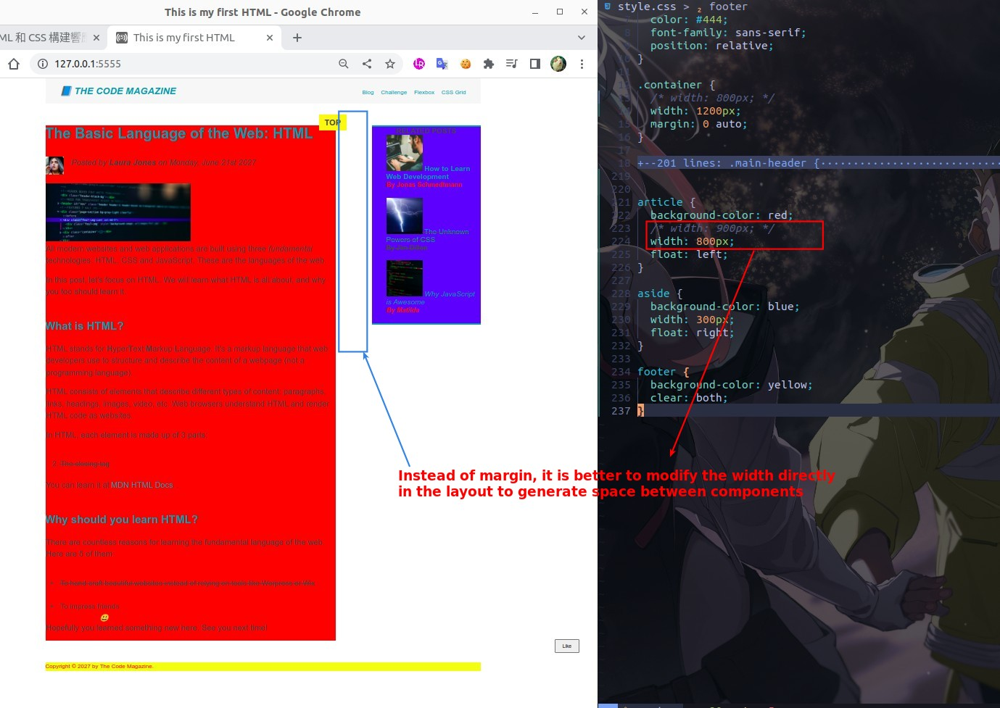
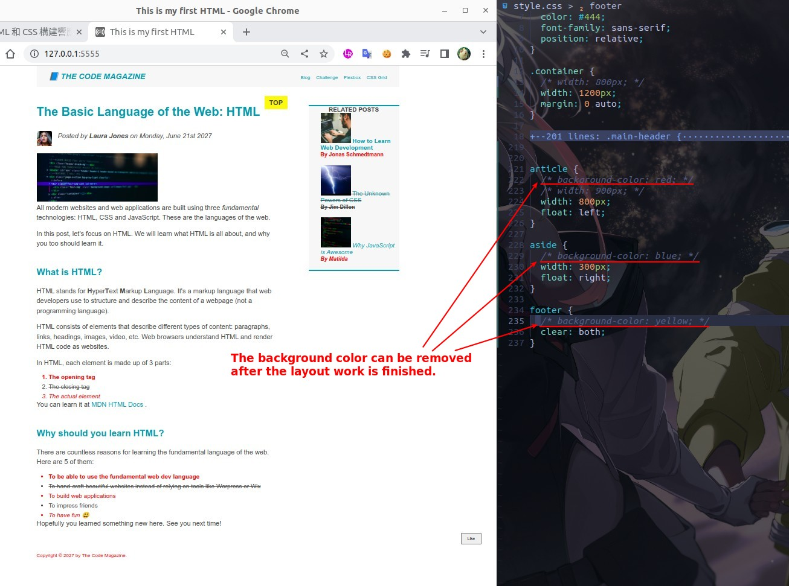

# **_Building Layout with Float_**

## **Prepare: width and background-color**

- elements like article, aside and footer that are used for layout do not use margin and padding to make things responsible.

## **Using float**

> Usually the float property is used when you want to line up components side by side.

## **fix strange with clear**

> The float property produces some strange phenomena, just use the 'clear' property to solve it.

## **Need: space of two parrelled component**

> Unlike the previous approach to elements, we do not use 'margin' to create distances between components.

## **Finally: remove background-color**

