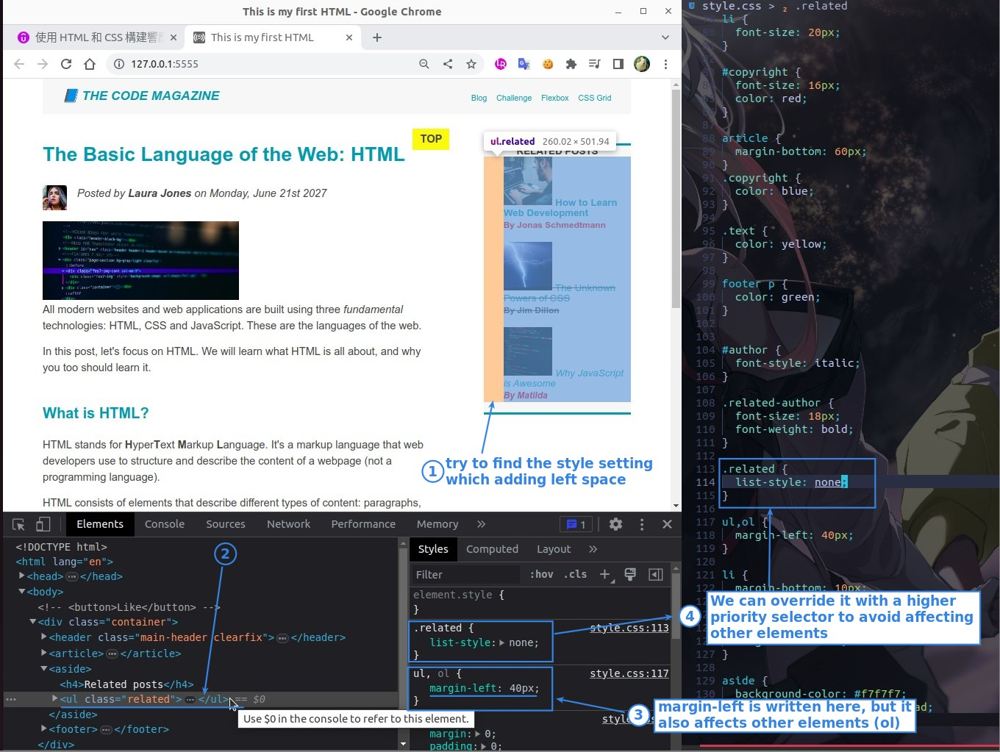
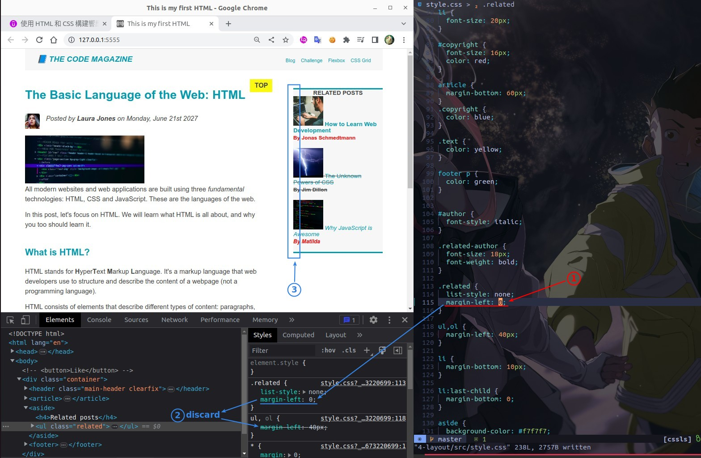
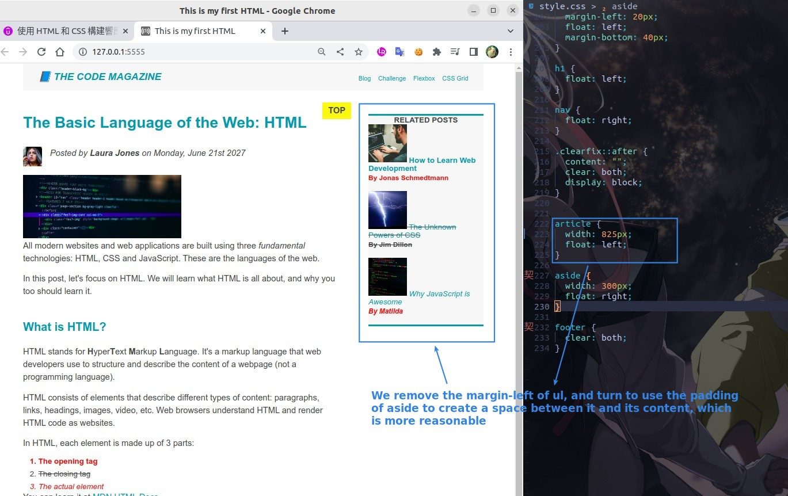
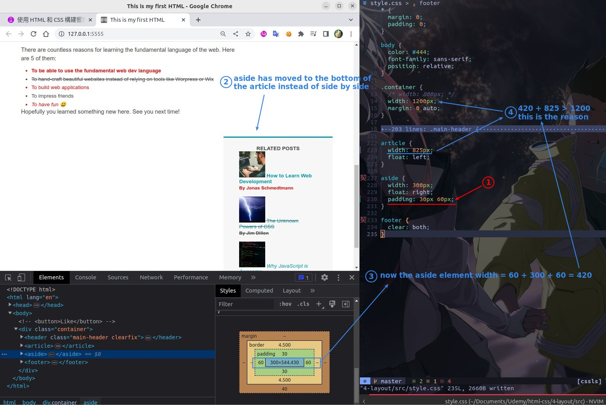
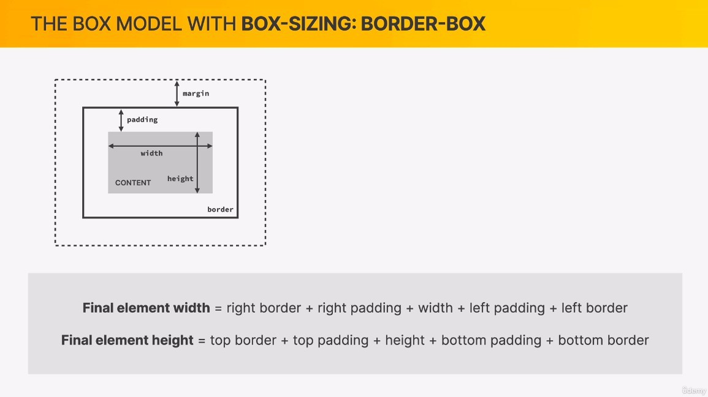
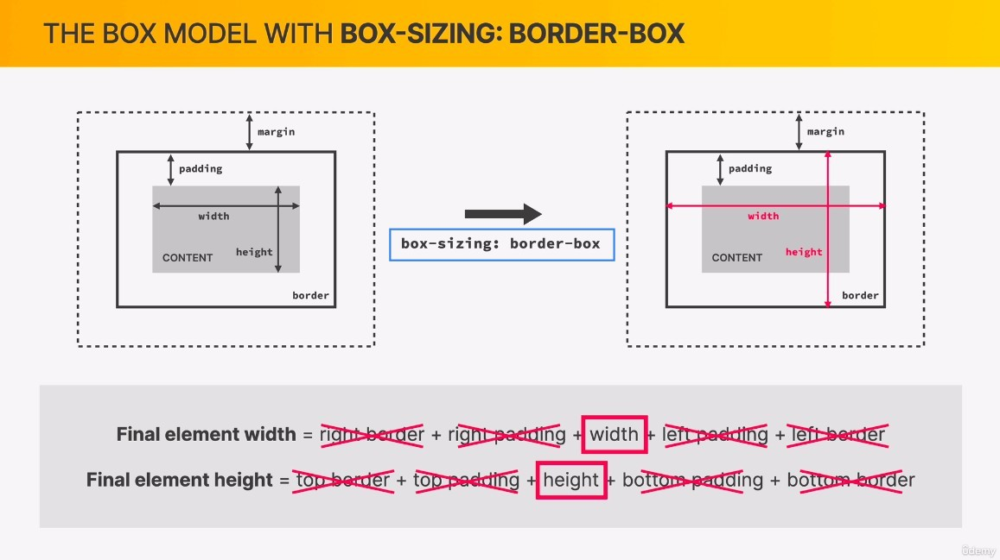
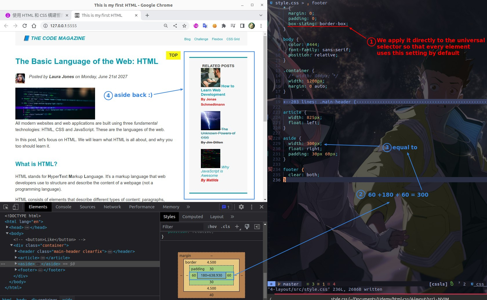
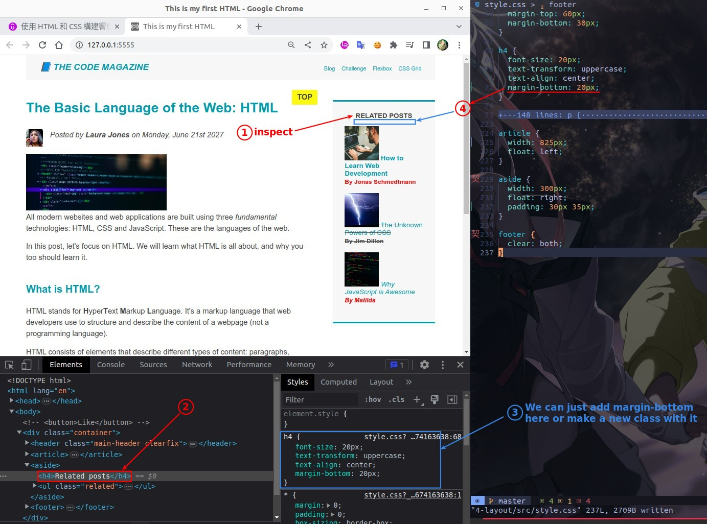

## **Remove where the margin-left style set**

> Because there is better way to increase the space between the edge of the aside and the content, and it is also an good experience to refactor existed stylings.

## **Need: add padding to aside**

## **Concept of box-sizing property**

- The default box-sizing is content-box, but it makes no sense, everyone just uses border-box.

## **Set 'box-sizing: border-box' directly in universal selector**

> Usually the border-box method is used directly, so the universal selector will be used to set it directly.

- This approach turns into using content width to adjust, but this is not a problem at all.

## **Need: add space bellow title of aside**

