## **Challenge**

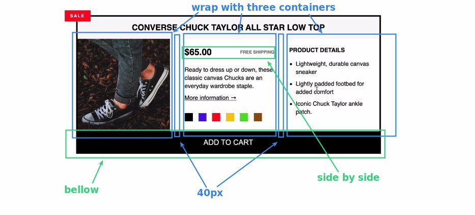

## **My solution**

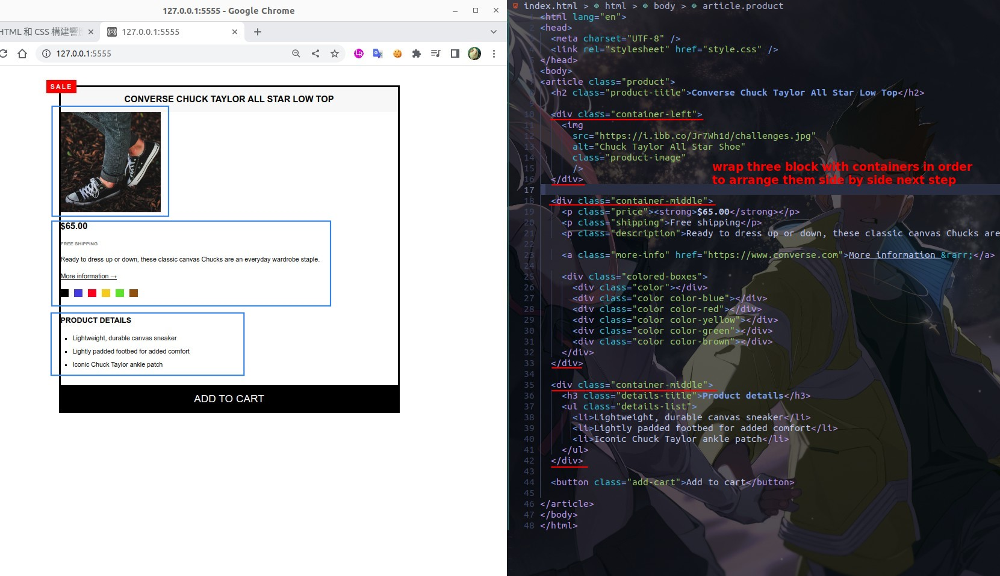

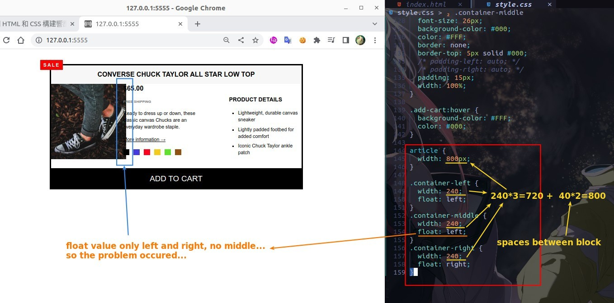

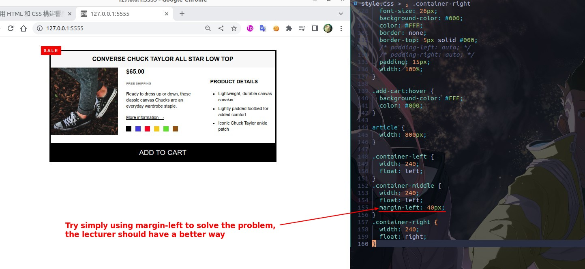

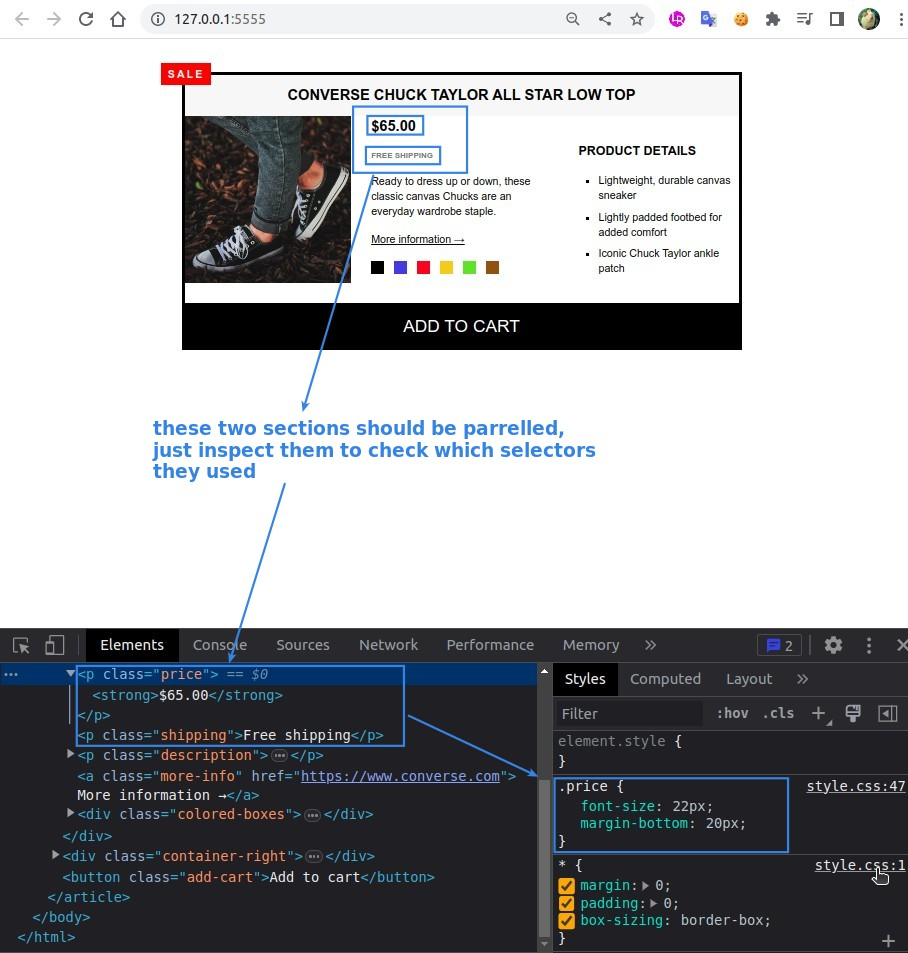

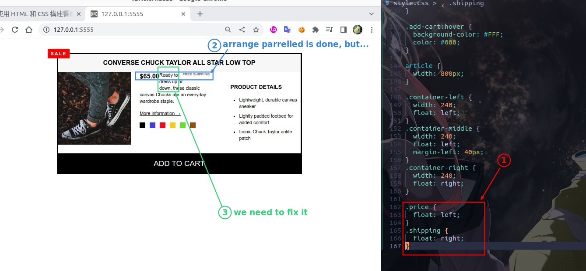

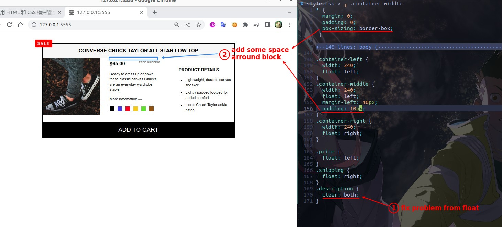

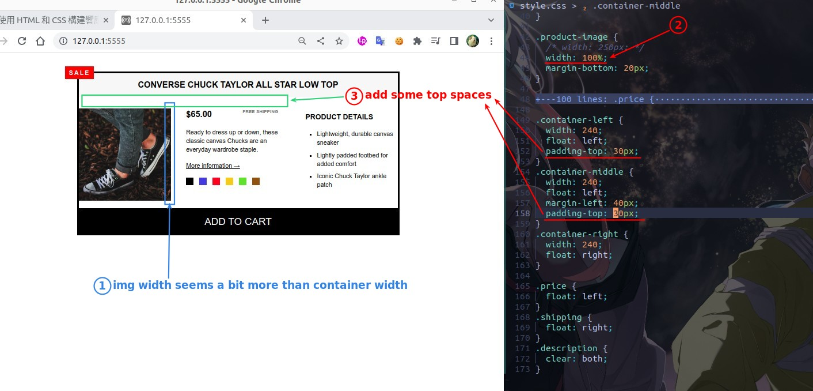

## **Lecturer answer**

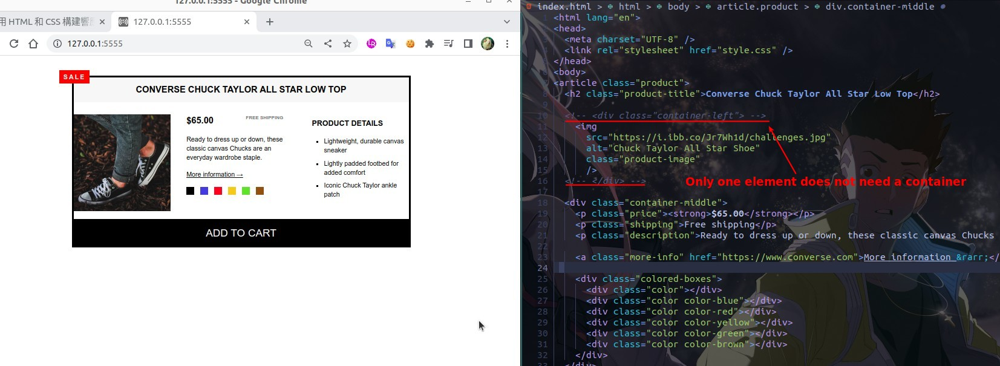

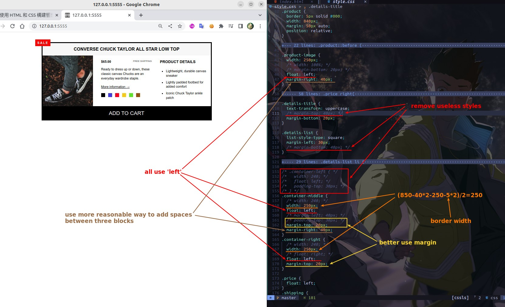

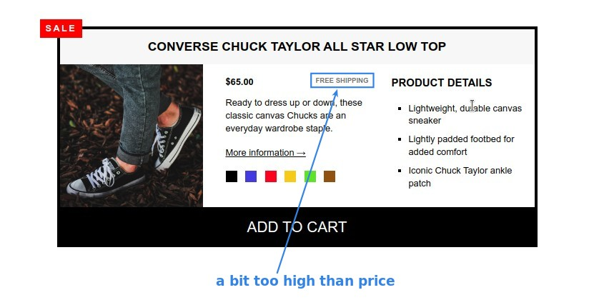

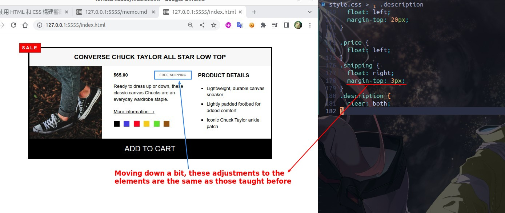

- In fact, if we use flexbox layout, 'FREE SHIPPING' will automatically align the price, so we don't need to adjust it manually, which is one of the reasons why float is obsolete.
