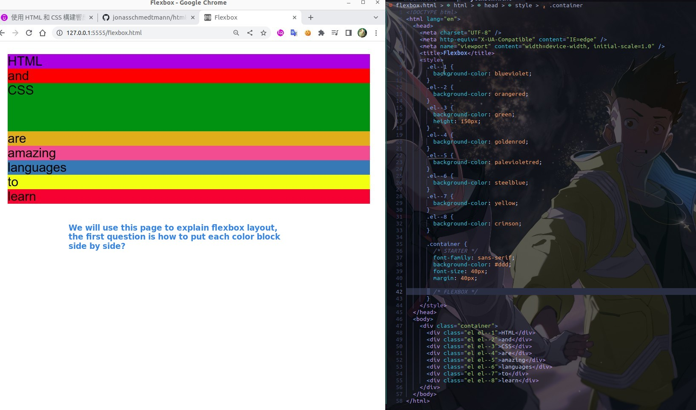

## **Prepare**

> We use another html file provided by the lecturer to illustrate the flexbox layout.

## **Display: flex**

- container element simply refers to an element with several child elements, of course the class name can be something other than 'container'.

- Once a container element is set to display: flex, it is a flex element and its child elements will be called flex item.

## **Vertical**

## **Horizontal**

- Imagine how labor-intensive it would be to do the above with float layout...
