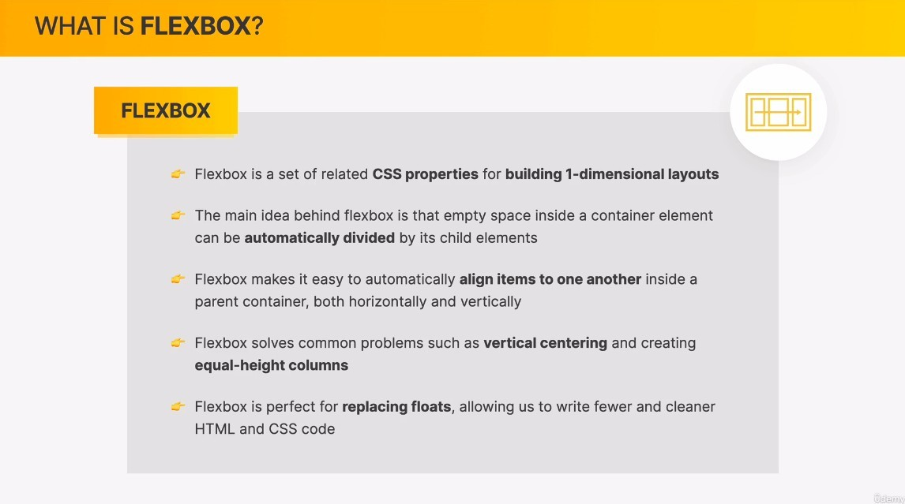
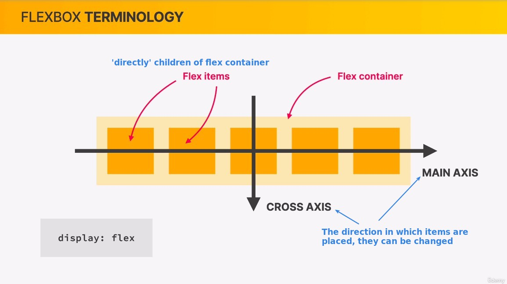
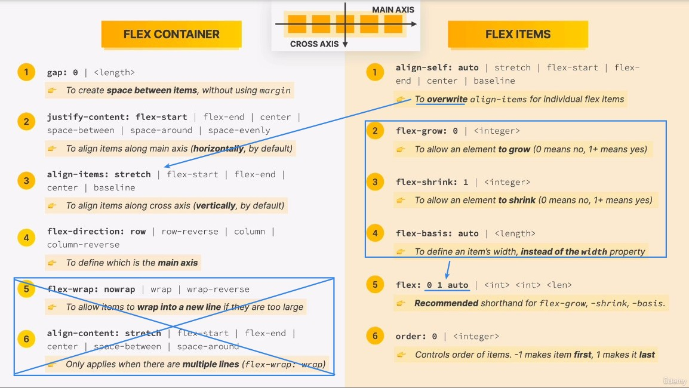

## **What is Flexbox?**

- Compared to float layout, flexbox layout can save us a lot of work, such as keeping each column at the same height, something that took a lot of time to do before flexbox came into existence.

## **Terminology**

## **Overview of properties**

> flex container and flex items have their own propperties, here's an overview.

- There are some parts that we don't teach, because we are a CSS fundamentals course, but basically we can handle 99% of the cases.
