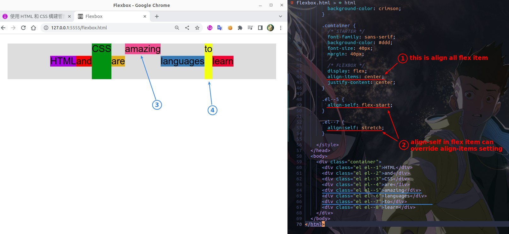
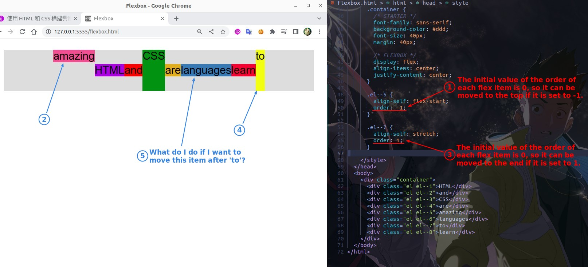
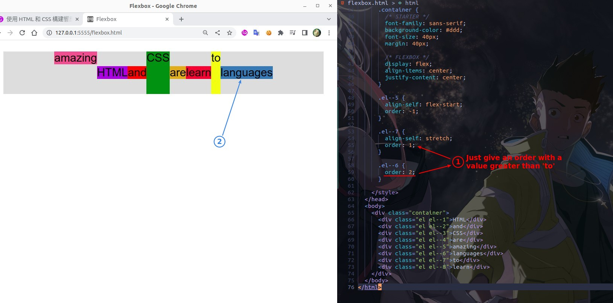
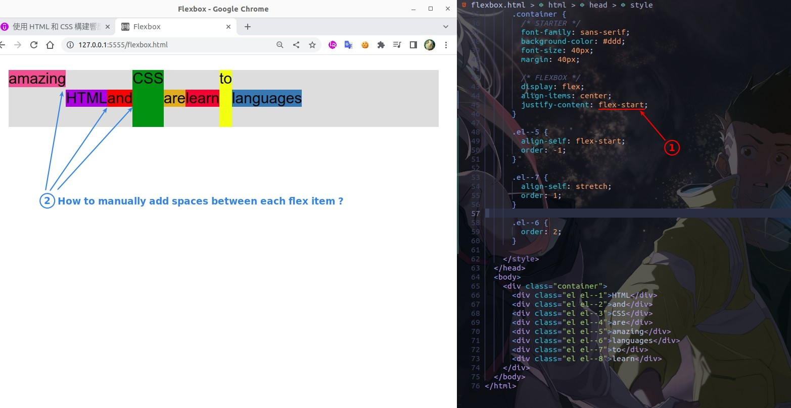
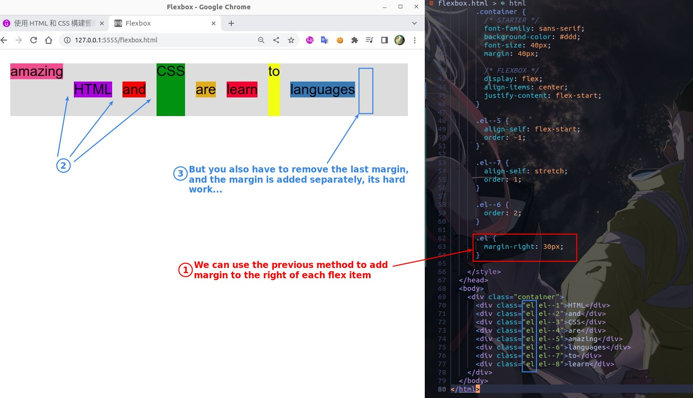
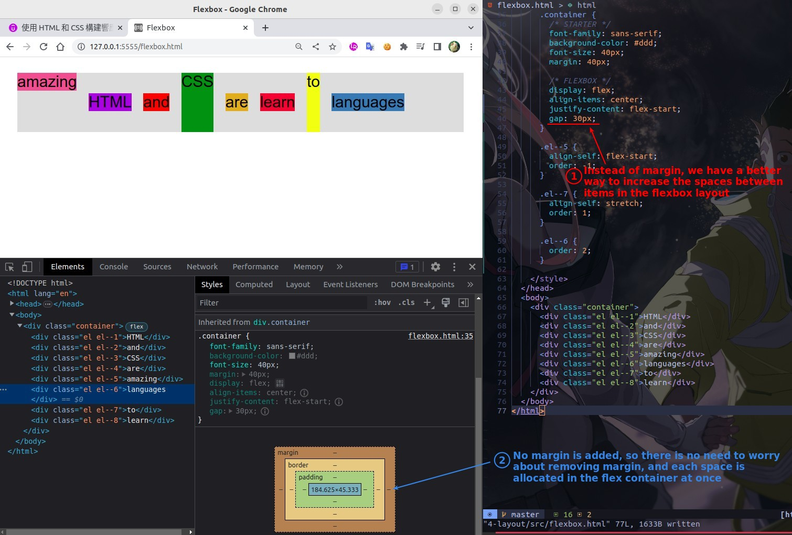

## **align-self**

## **order**

## **Need: add spaces between flex items**

> Our previous lectures have used the automatic allocation of free space between flex items, but sometimes the space has to be allocated manually.

### _Old way: margin-right_

### _Flexbox way: gap_

