## **Prepare**

> Comment out the codes from the previous float layout, and use flexbox instead.

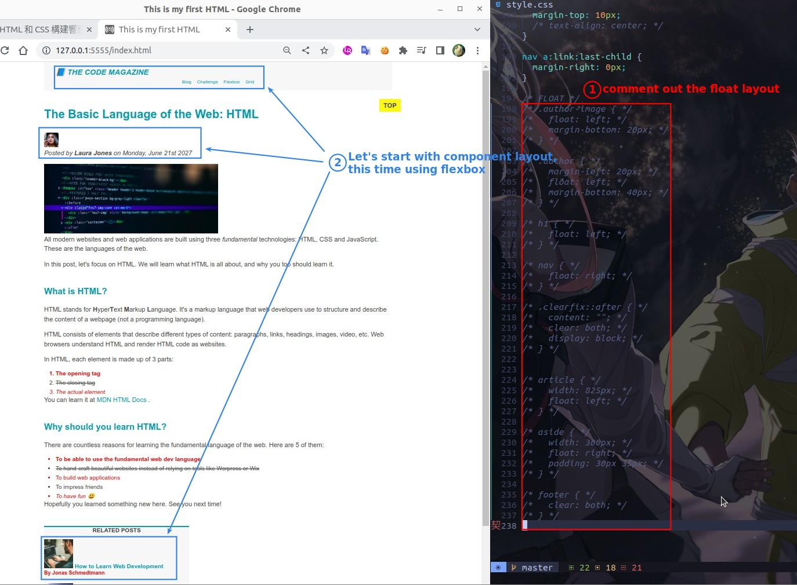

## **Header**

### _set flexbox & its properties_

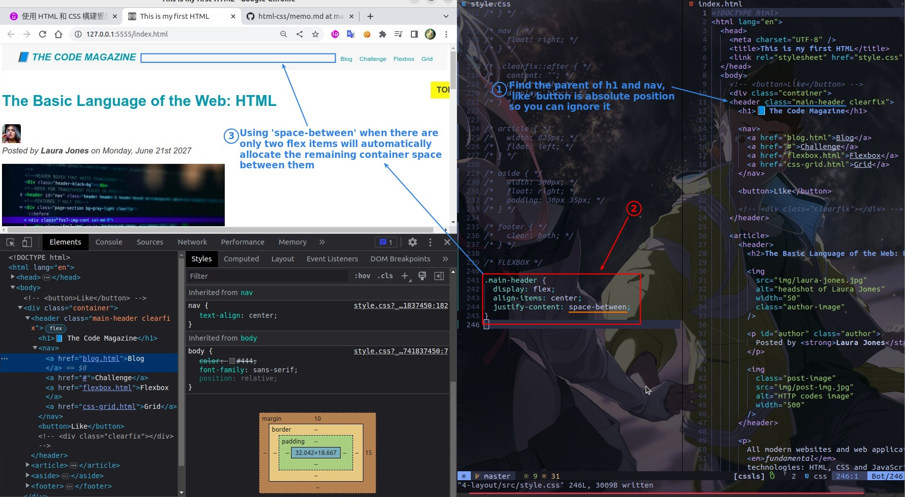

### _Location deviation problem_

> Because we used float before, we used margin everywhere, so now we can't align perfectly.

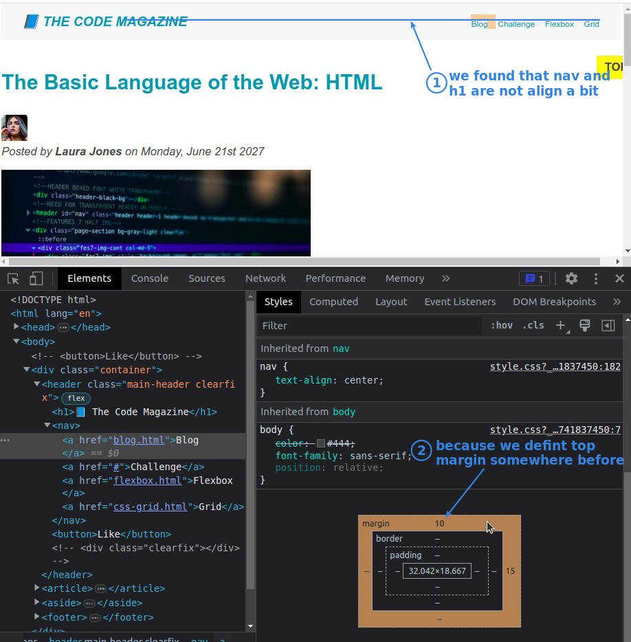

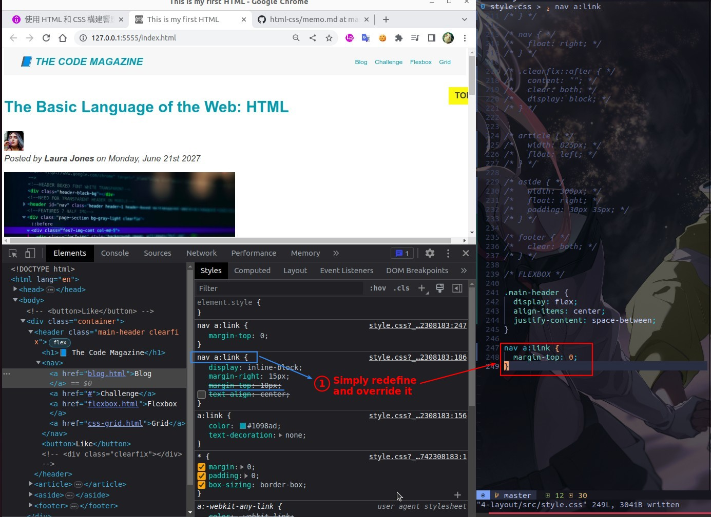

## **Author**

### _wrap targeted elements with elements without semantics_

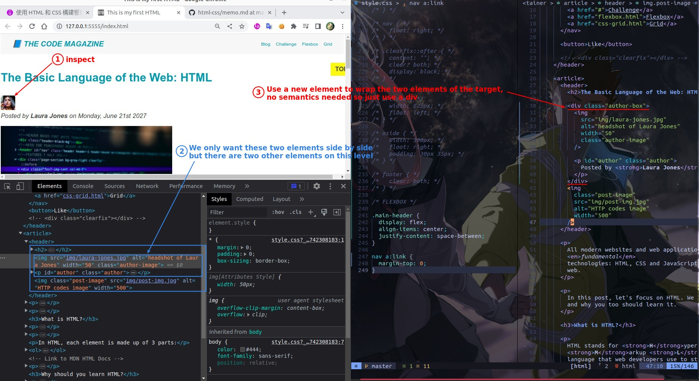

### _set flexbox container & its properties_

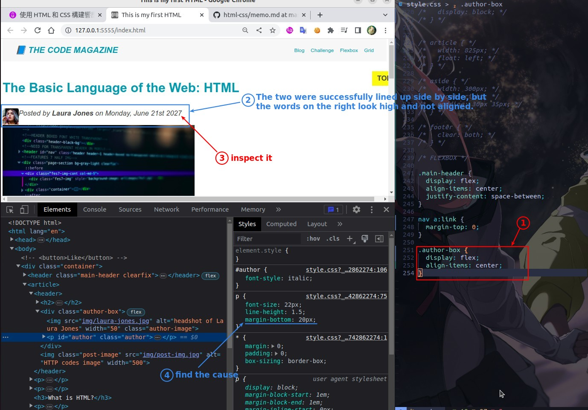

### _fix alignment and add gaps_

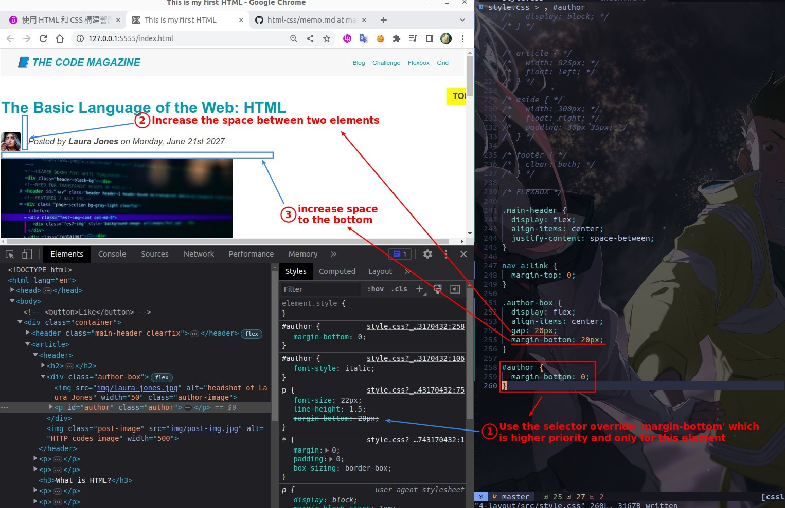

## **Related Posts**

### _need_

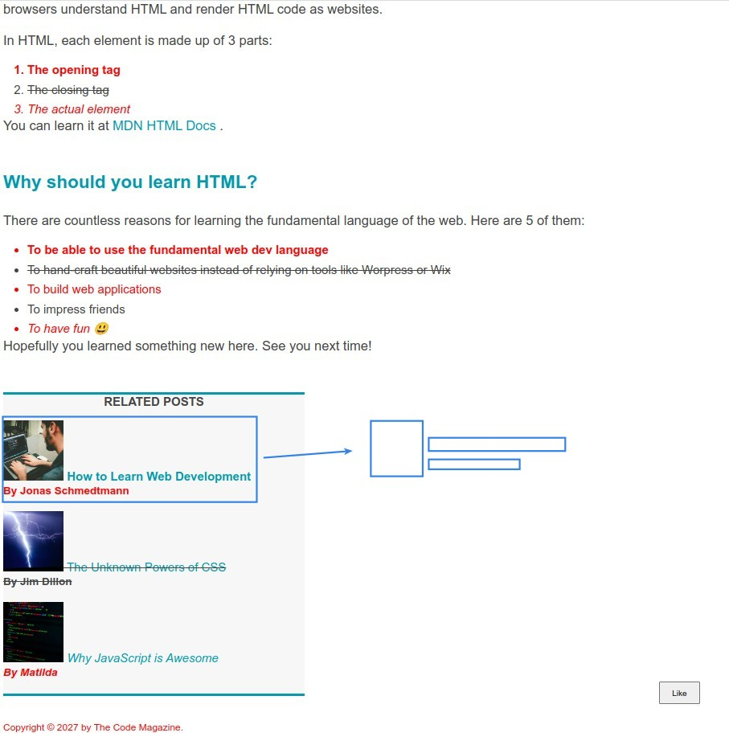

### _set flexbox container and its properties_

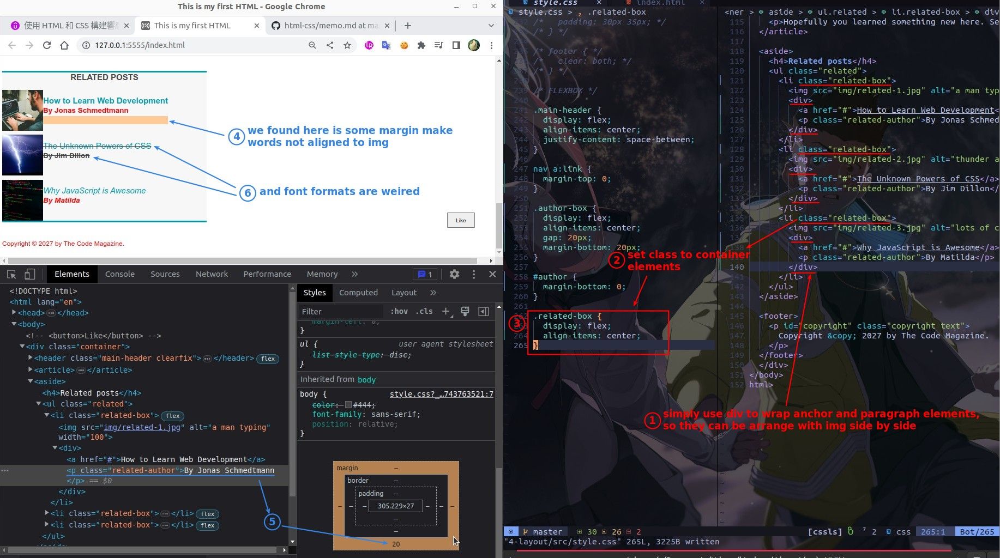

### _redefine font_

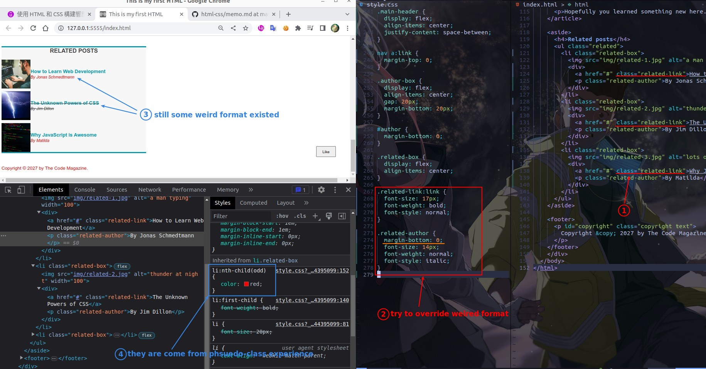

### _comment out previous psuedo-class styling_

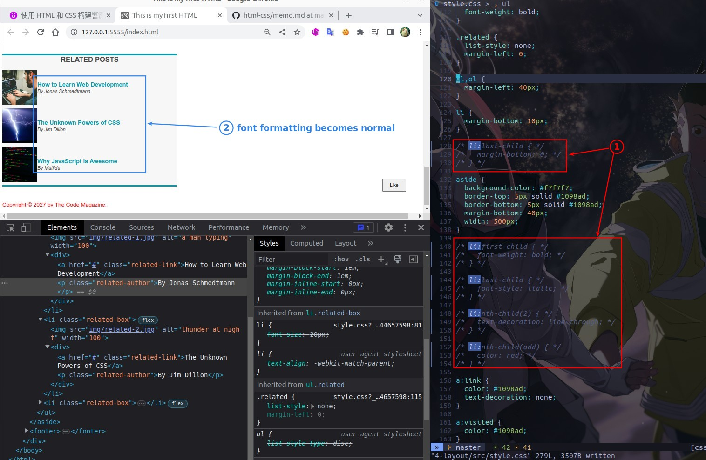

### _add some spaces_

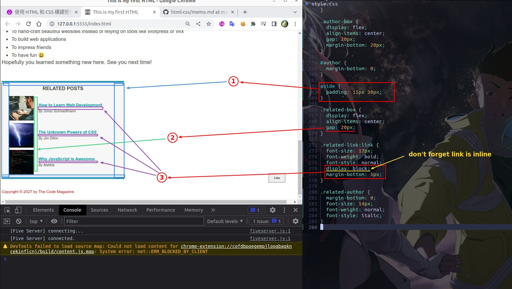
