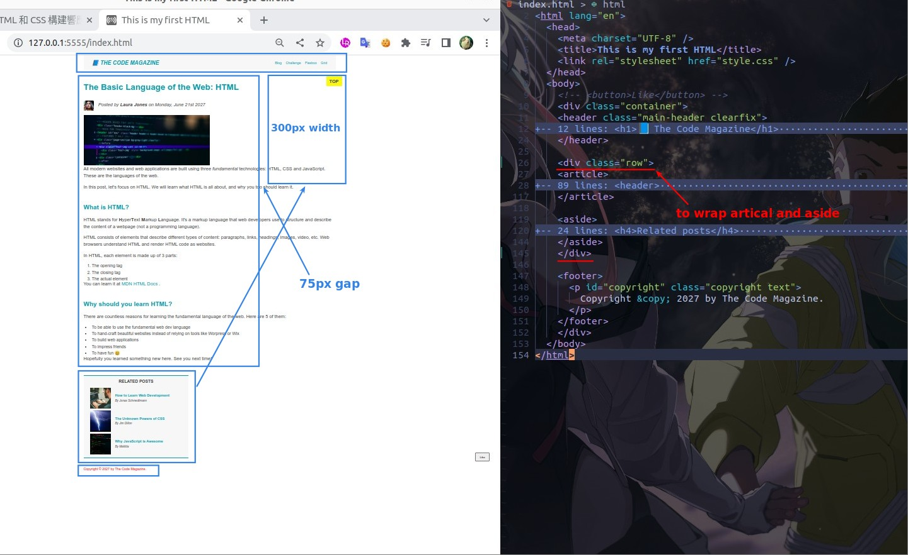
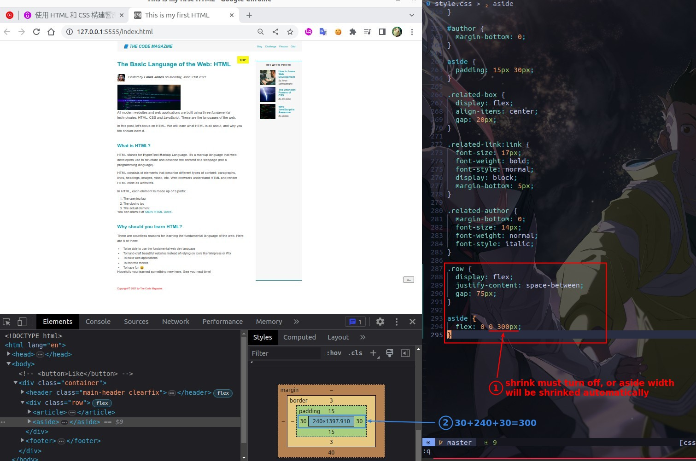
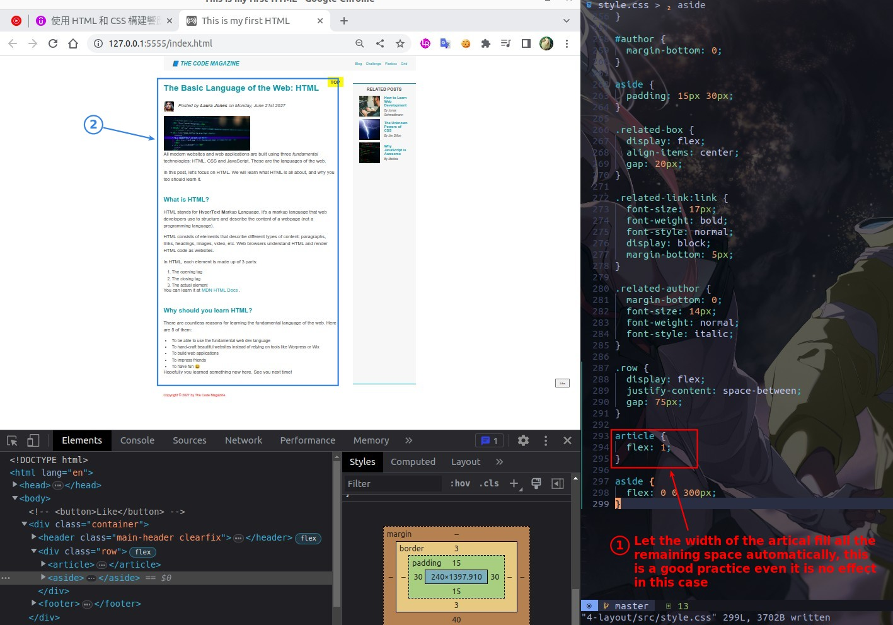
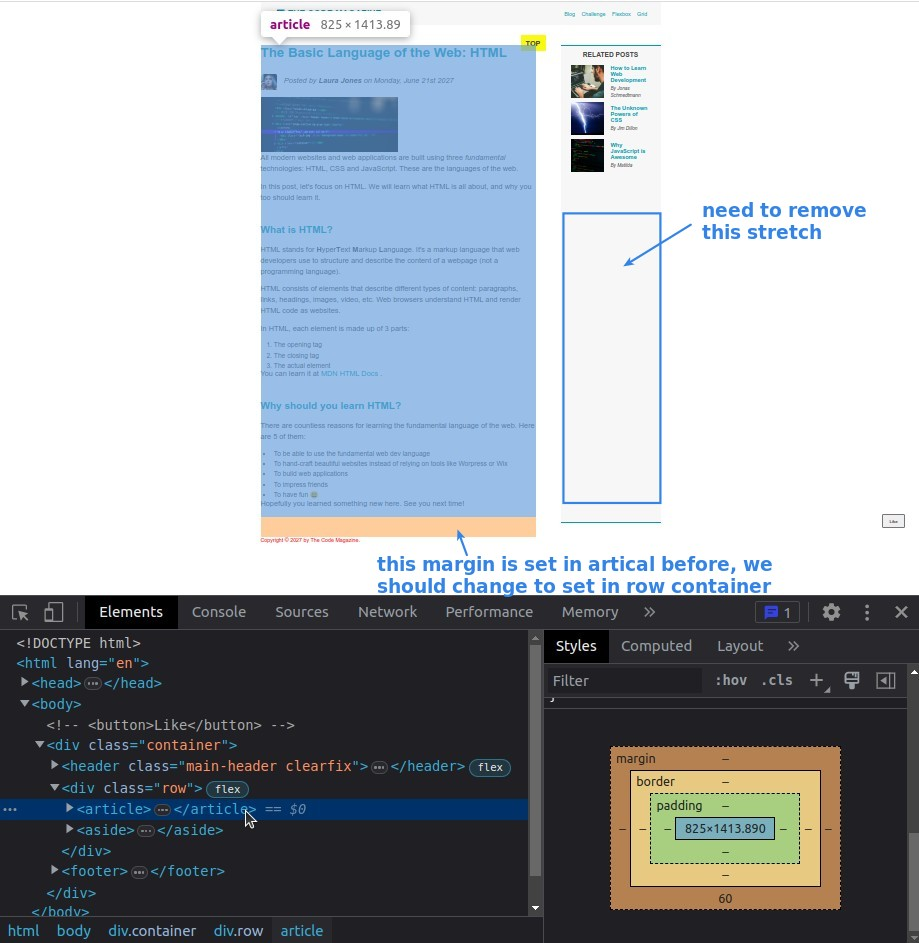
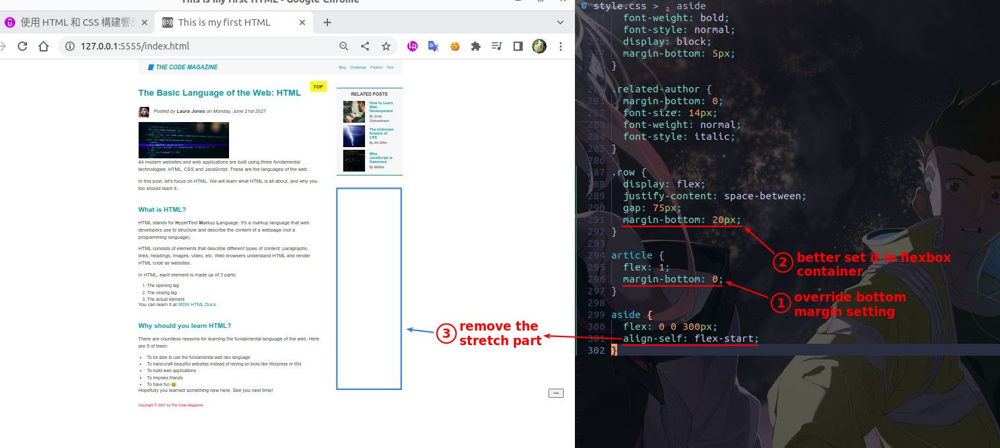

## **Analyze & Create container element**

- Assume that the value on the left is a requirement that must be met.

## **Fit the Need: fixed width of aside and gap**

## **A good practice**

- The point is to set flex-shrink = 0.

## **Problems: previous margin and stretched aside**

- Because 'align-self' of flex items is 'stretch' by default, this is what happens.

