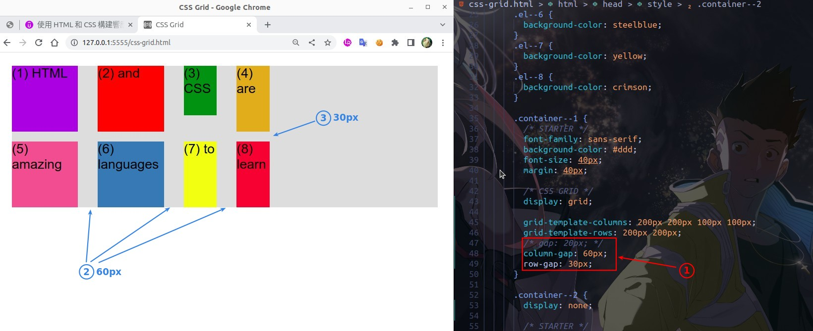

## **Prepare**

> Here are the pages the course prepared for us, there are two grips, let's remove the second one and use the first one for introduction.

## **columns and rows size**

> grid is a two-dimensional layout so there are columns and rows, we can simply set the size of each column and row.

## **gap**

> In flexbox layout we may still use margin or padding to increase the space between items, but in grid layout we can only use the gap property.

