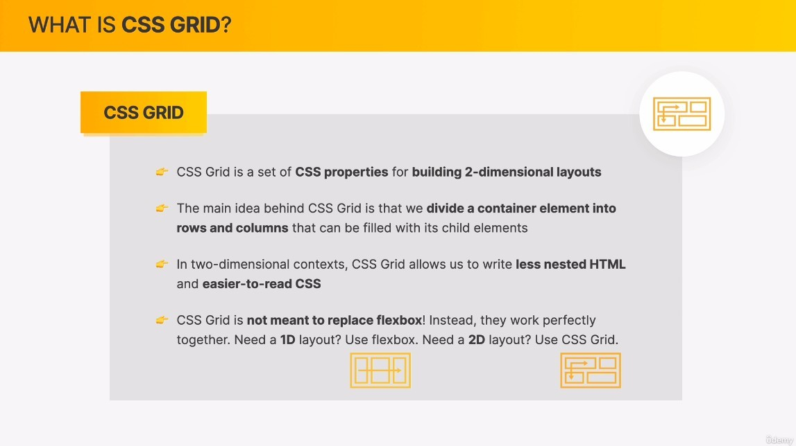
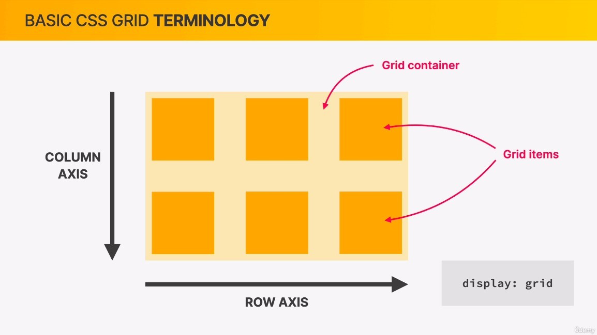
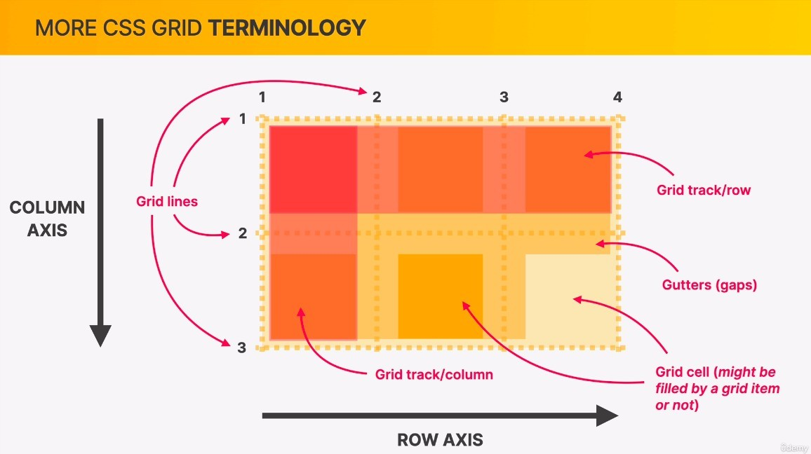
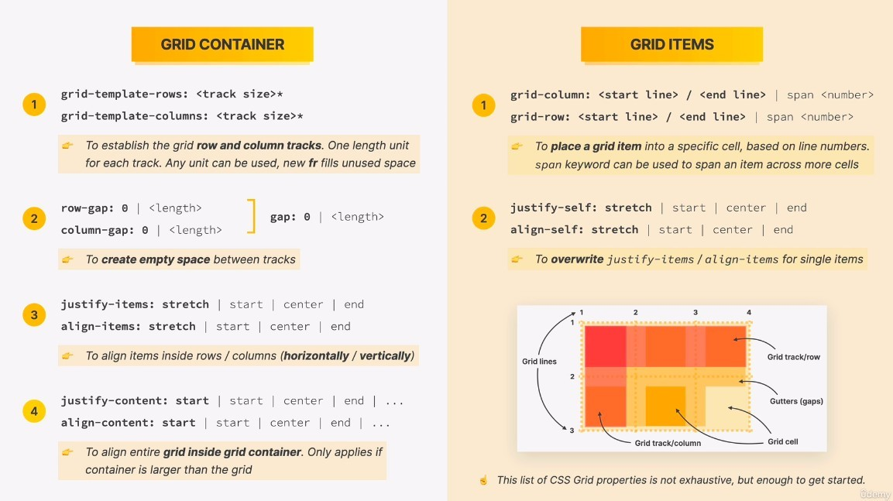

## **What is CSS GRID?**

## **Terminology**

- Unlike flexbox, we cannot change the direction of the grid axis.

- The number of grid lines is the number of columns + 1 and the number of rows + 1.
- The values of grid lines are important, and we use them for positioning.
- A grid cell does not necessarily need to have a grid item present.

## **Overview of properties**

> The following overview does not include all properties, so as not to overcomplicate the course.

- The fourth part of the GRID CONTAINER (justify-content and align-content) is only used when the container has more space than the grid, so it is not often used.
- It is obvious that the third part of GRID CONTAINER and the second part of GRID ITEMS are derived from the concept of flexbox.
