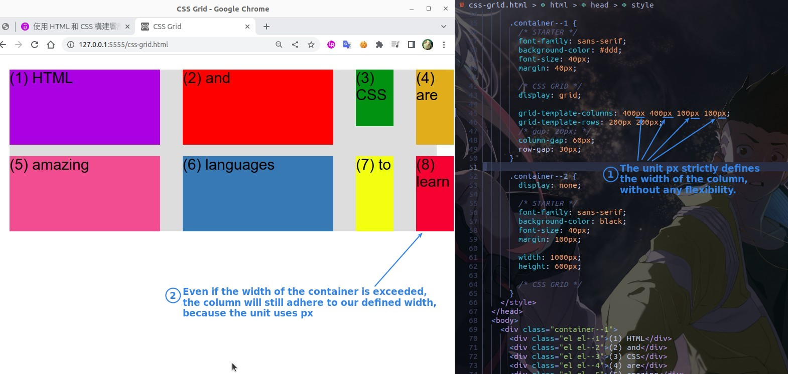
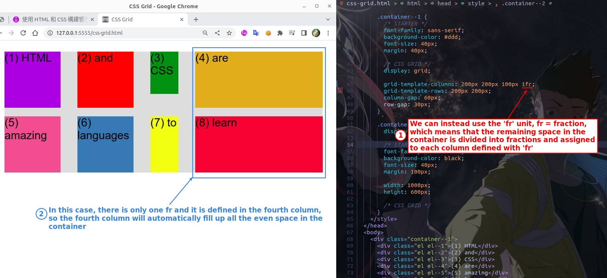
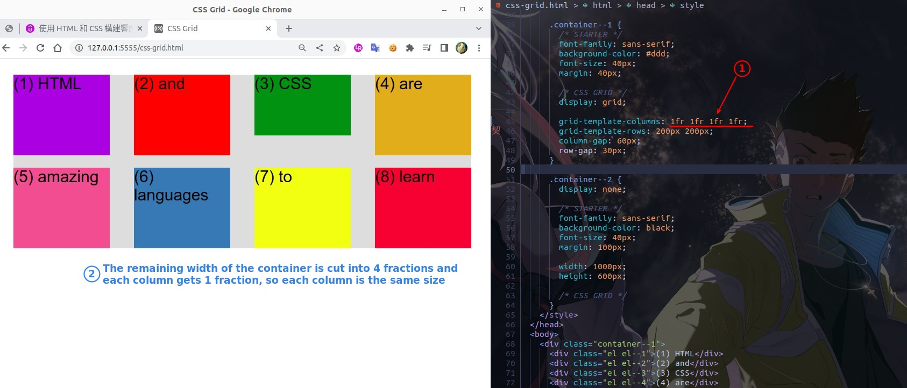
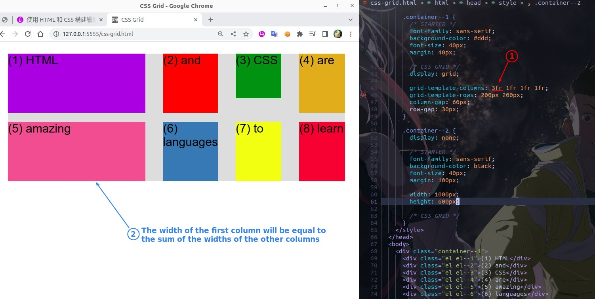
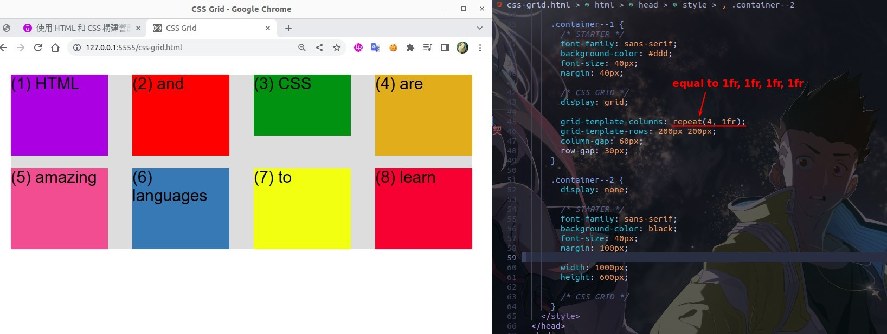
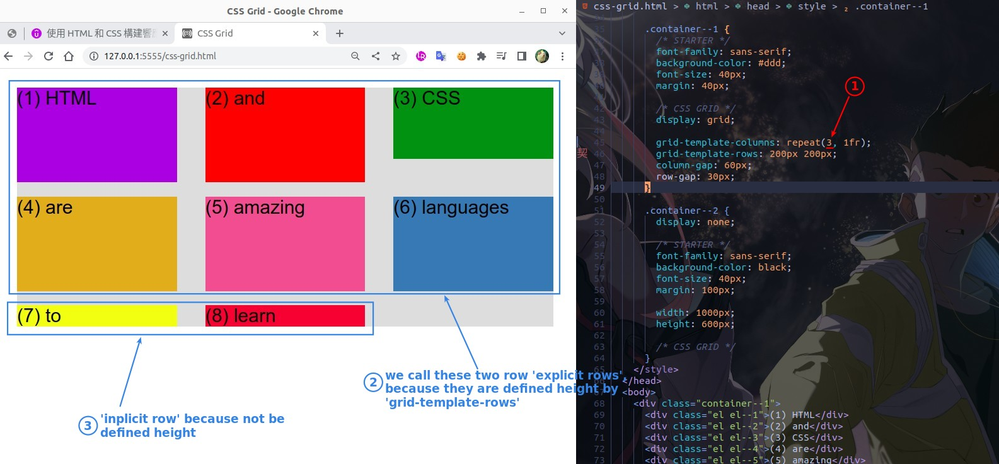
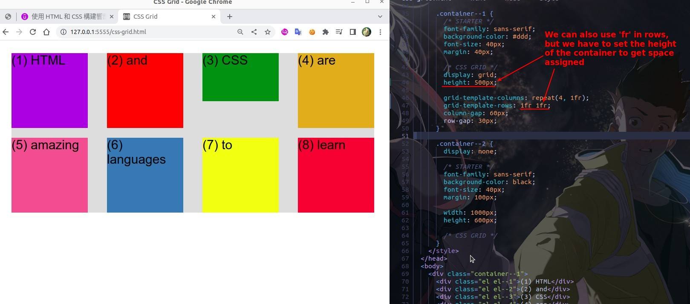
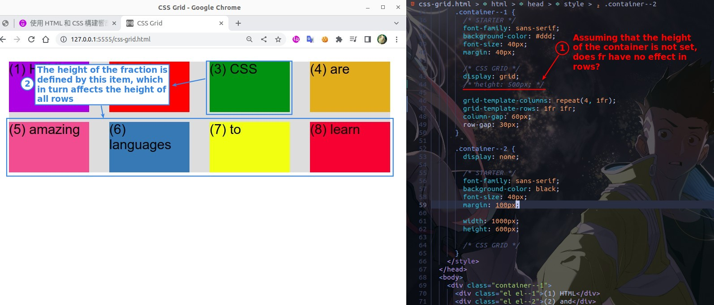
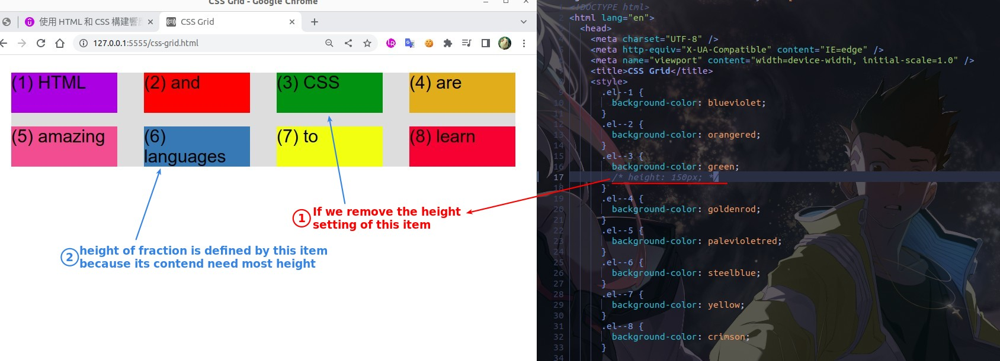
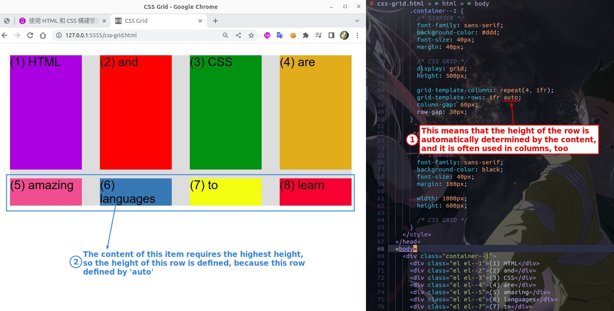

## **Unit: px and fr**

## **fr in columns**

## **repeat()**

> When we have a lot of the same values to write over and over again, we can use this function to make our life easier.

## **explicit/implicit row**

> Because the number of rows is automatically increased according to the number of items, these two definitions of rows are generated.

- There are actually ways to define the style of implicit rows, but this is beyond the scope of this course.

## **fr in rows**

- So even if the height of the container is not defined, 'fr' will still be useful and helpful.

## **auto**

- Sometimes auto is just what we need.
