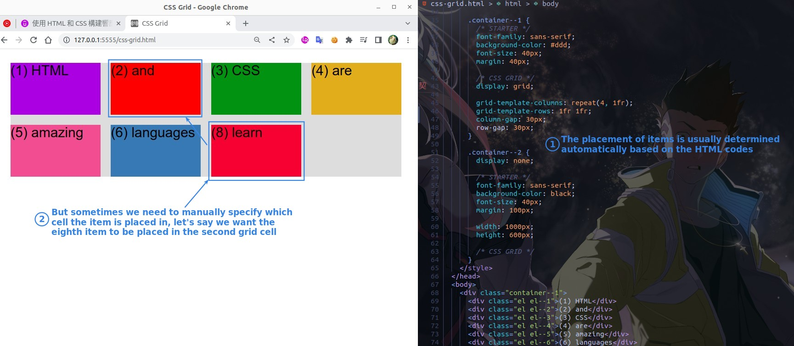
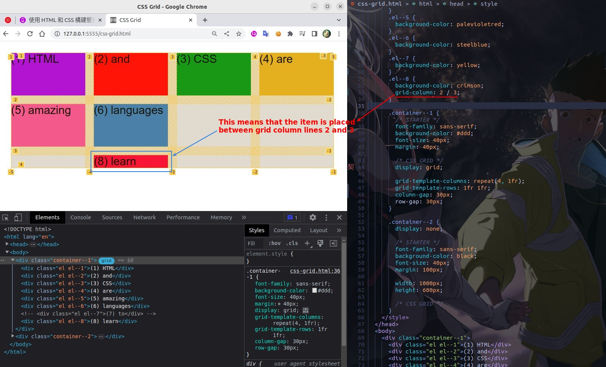

## **Default Placement way**

## **Show grid lines**

## **grid-column & grid-row**

## **omit second value**

## **cross more than one columns**

### _span_

> Sometimes it's a pain to check the grid line number later, but luckily we can just use 'span'.

### _nagetive number of grid line_

> Especially useful when you need to extend the item to the end of the grid container.

## **cross more than one rows**

