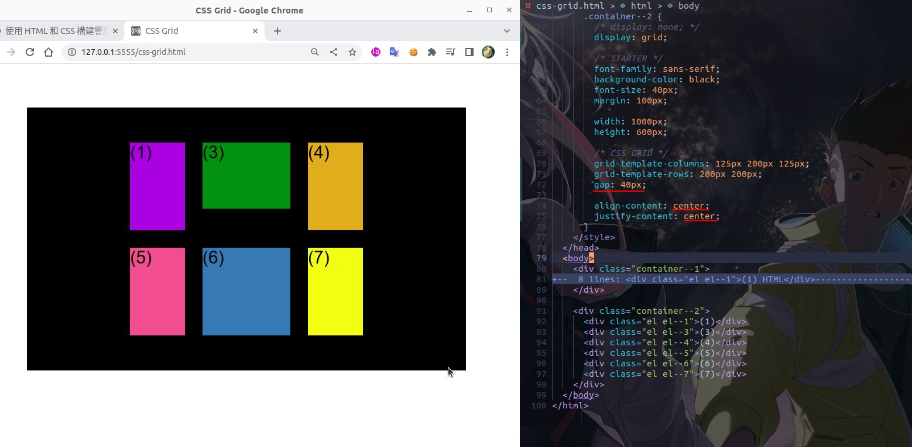

## **Prepare**

## **Align to grid tracks**

- Just adjust back to one of the most common grid layout formats for the subsequent illustration.

## **Align to grid items**

## **Align to specific item**

