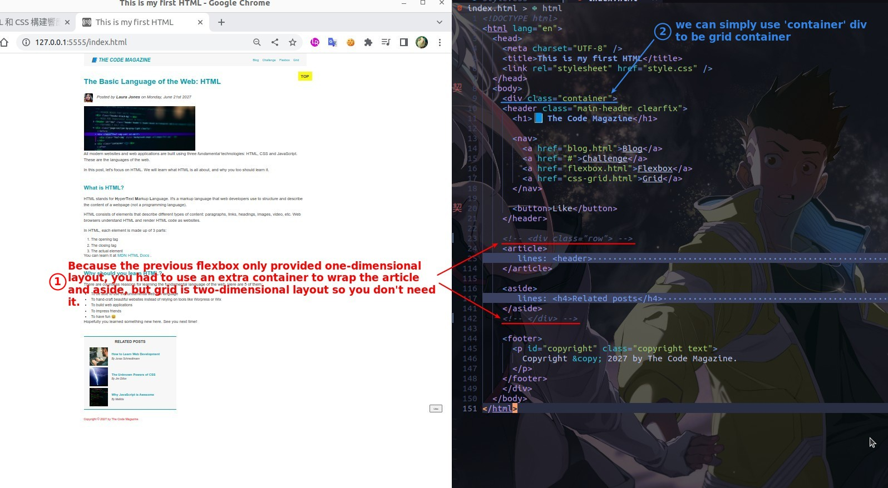

## **Goal and prepare**

- grid layout is two-dimensional, so we can include all blocks in it, so there is no need to generate additional containers.

## **Set Grid**

## **Remove unwanted margin-bottoms**

> Because the previous flexbox layout only provides one dimension, it cannot contain all blocks, so you still need to rely on margin to create the space between the flexbox container and the neighboring blocks.

## **Remove unwanted stretch of Aside**

- Because it adjusts the position of the grid item in the grid cell, align-item is used instead of align-content.

## **Final result**

- Previously we used flexbox to do the layout, so the space between the flexbox container and the header and footer still relied on margin-bottom to create space.
  - This time we use grid layout which contains all blocks at once, so we don't need to rely on margin to generate space.
