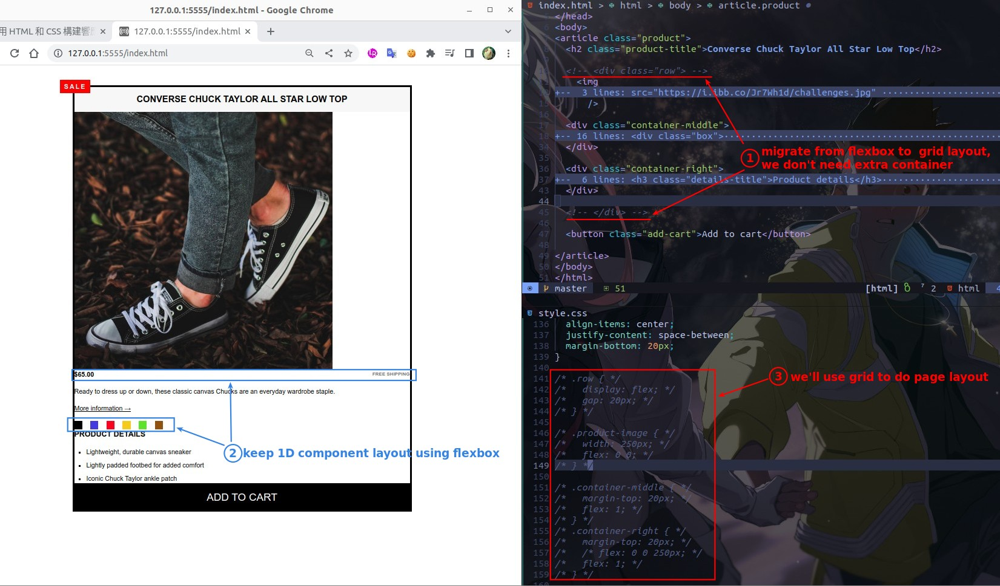
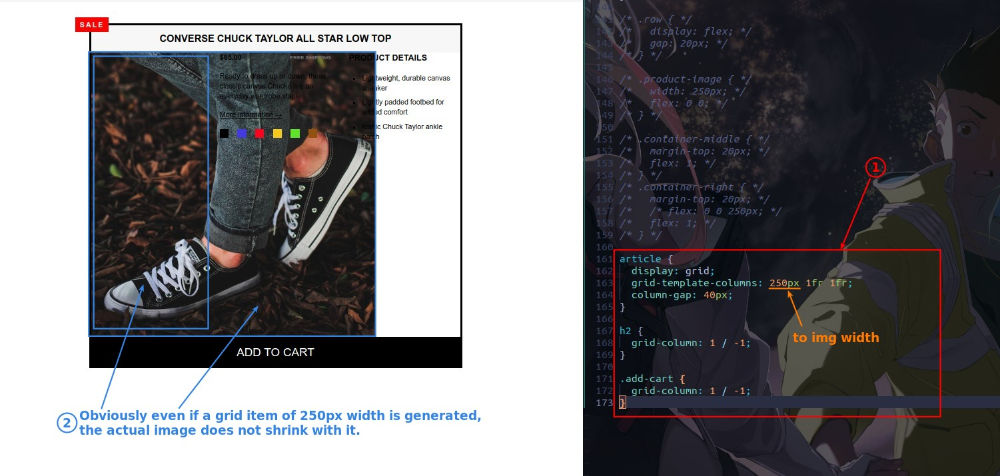
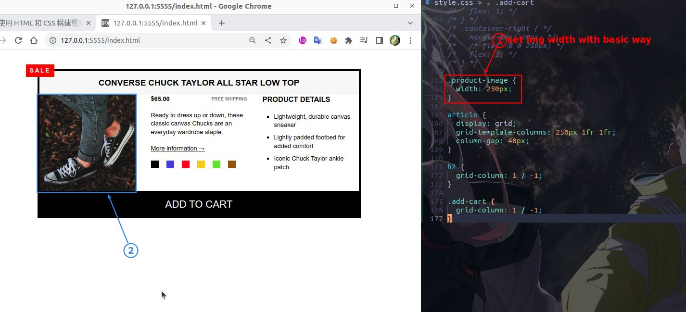
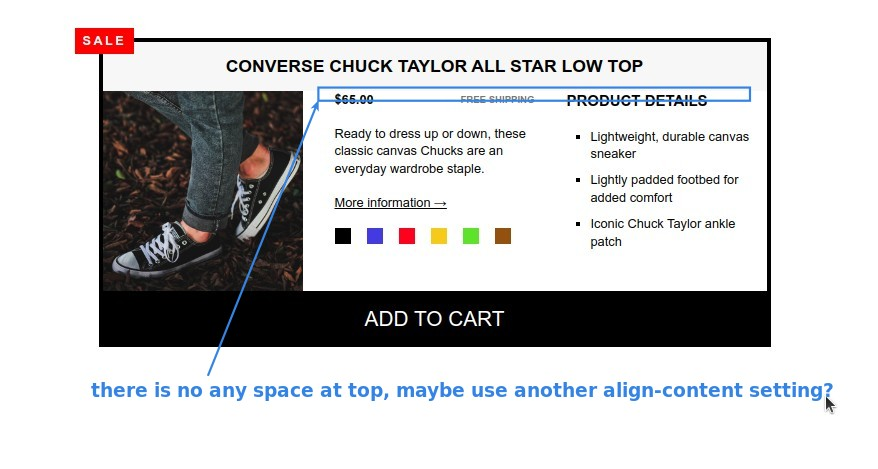
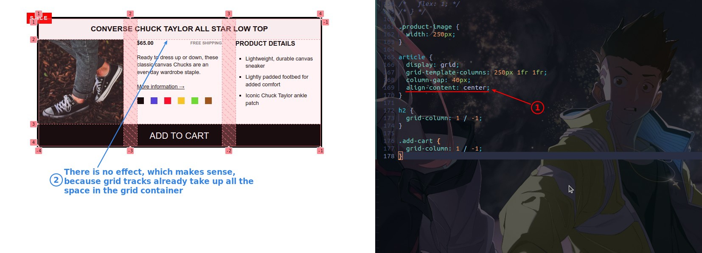
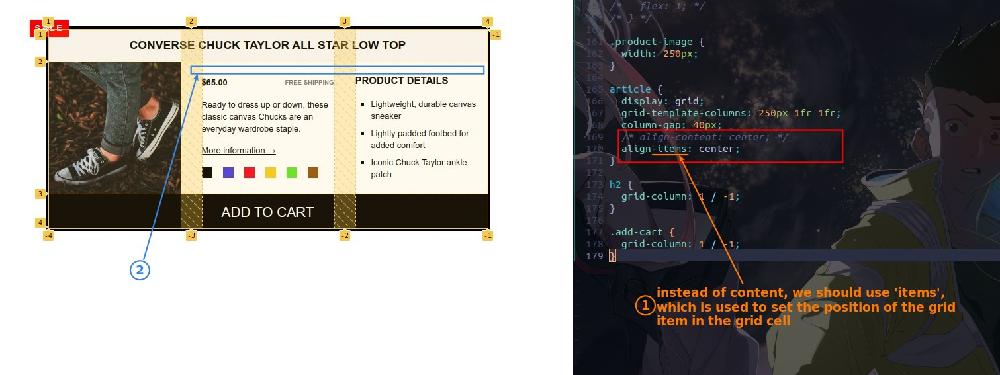

## **Migrate from flexbox to grid**

- Grid don't need extra container like flexbox.
- Keep using flexbox to 1D component layout.

## **Set to grid layout**

- Set grid page layout, but we meet a img problem...

## **fix img problem**

> Simply set img size with old simple way to fix it.

## **Need: top space**

- I often get the timing of '-content' and '-items' wrong in grid container, need more practice on this .\_.
