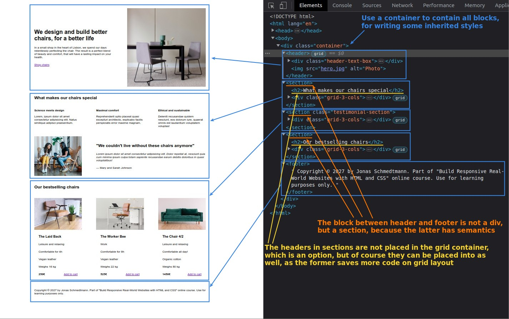
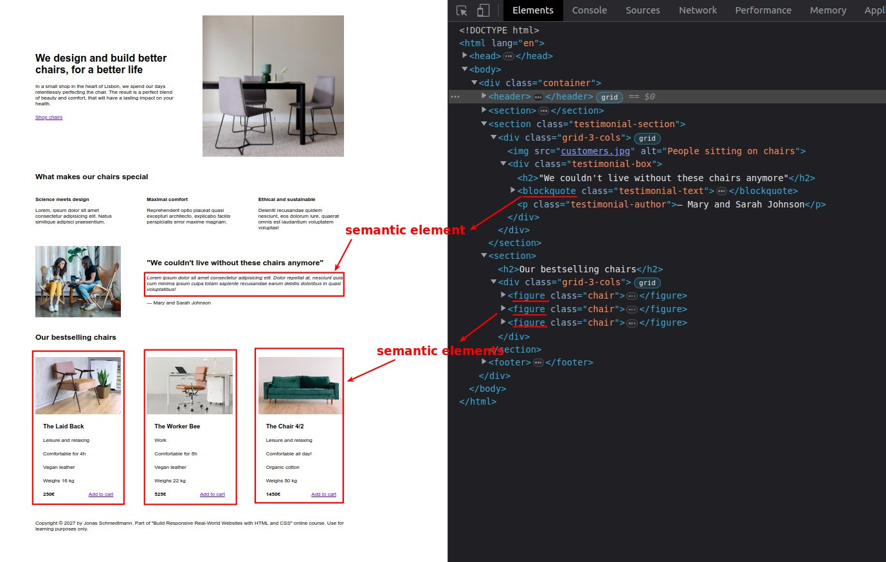
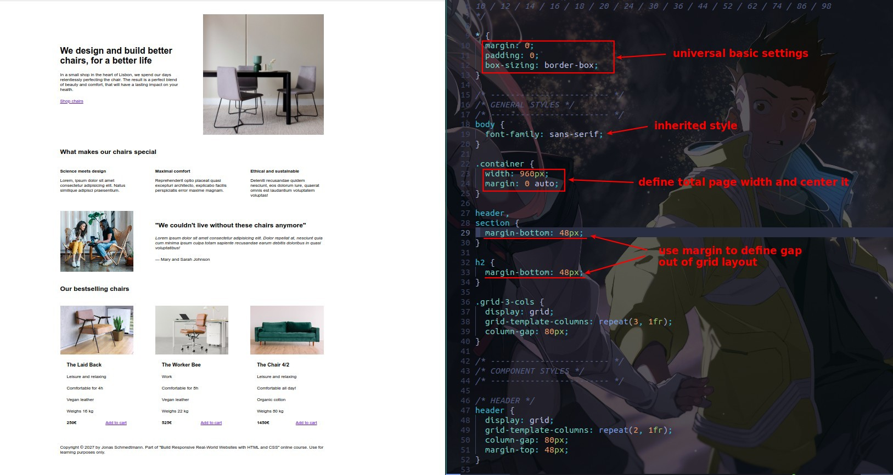

# **_Project Overviews_**

> In fact, this chapter does not focus on the codes part, but on the design principles and guidelines, but we must first understand the basic structure of HTML and CSS of this project in order to introduce the design concepts.

## **Analyze HTML**

- If the content between header and footer is divided into several sections, you can use section element instead of div, because section has semantics.

## **Use more semantic elements**

> Using elements that have not been used before, only because they have semantics, are better than just using div.

## **Analyze CSS**

- Unlike the previous guesses, the container div block is used to define the overall page width and centering, while the successor styles section is defined directly using the body.
