## **Serif vs Sans-serif**

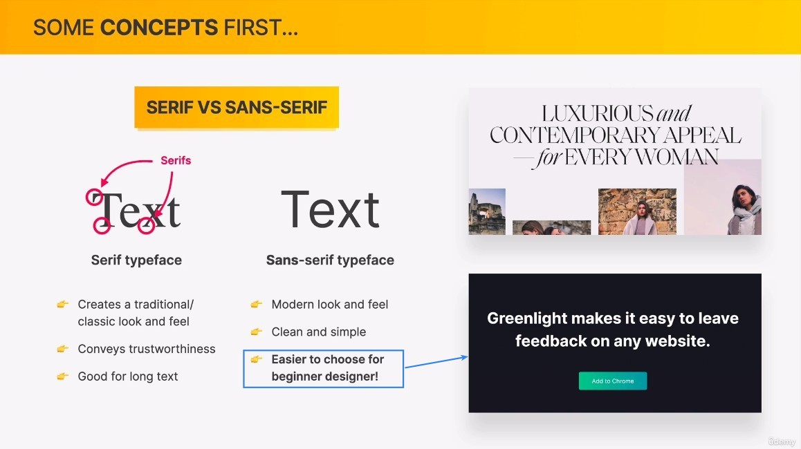

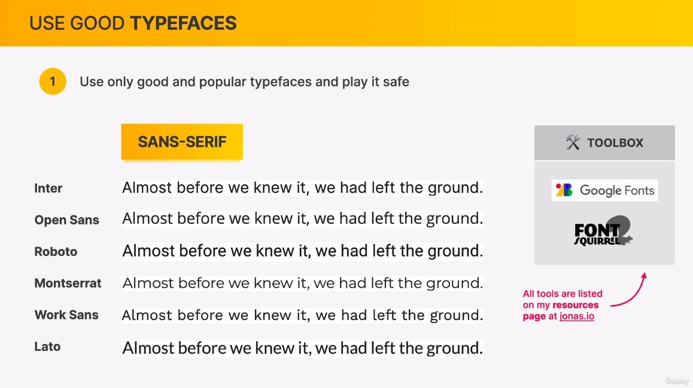

- To the untrained eye, the above six fonts may appear identical, but in fact the style of their use on the page is completely different.

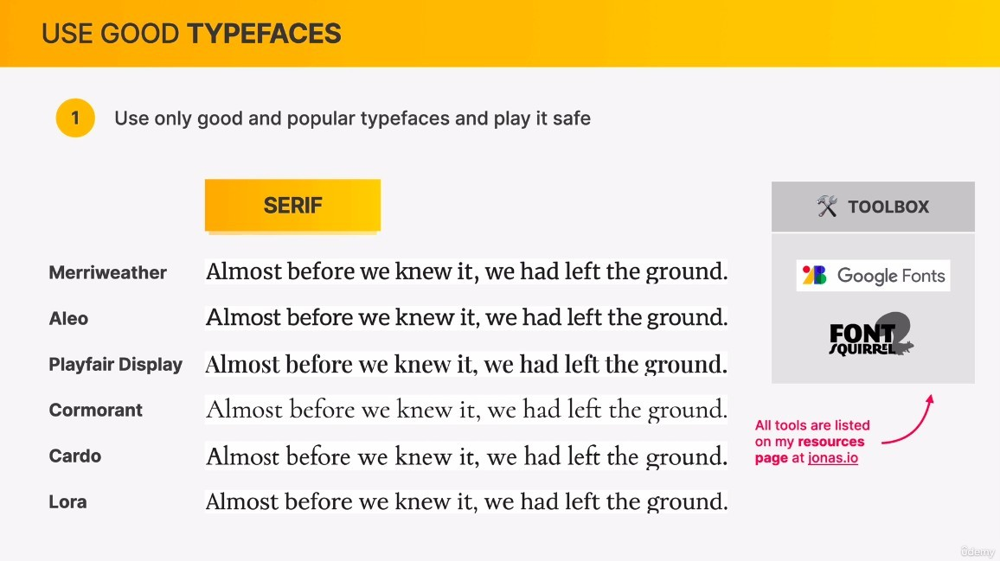

## **Use good typefaces**

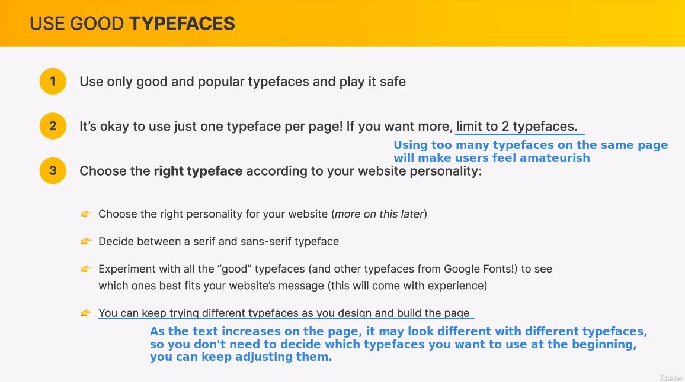

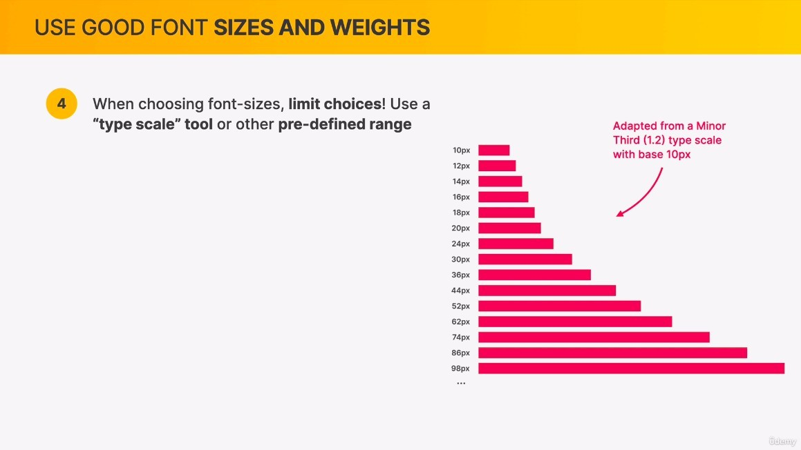

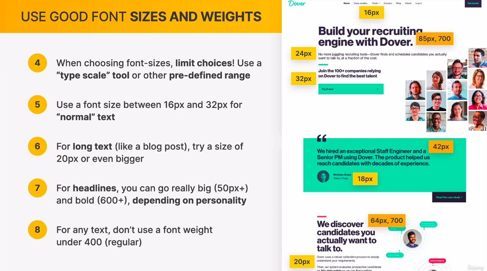

## **Create a good reading experiences**

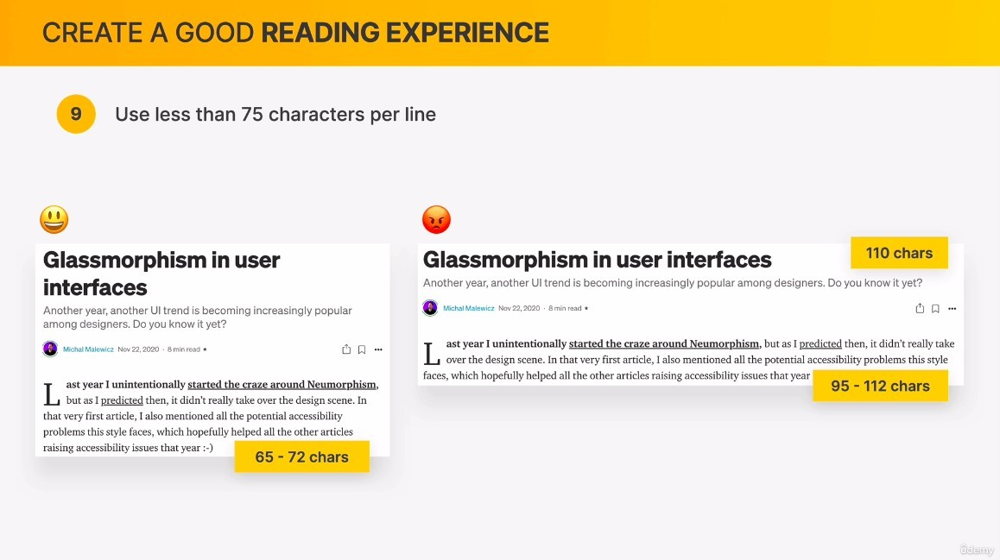

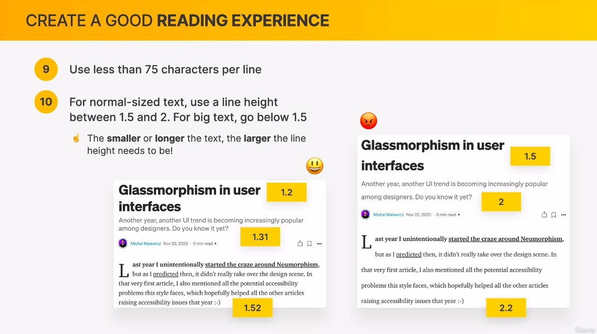

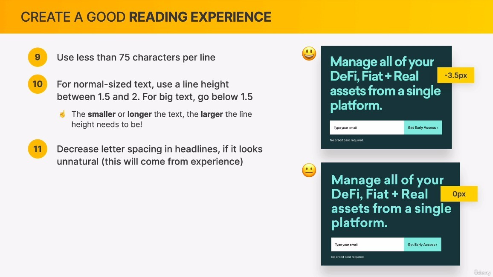

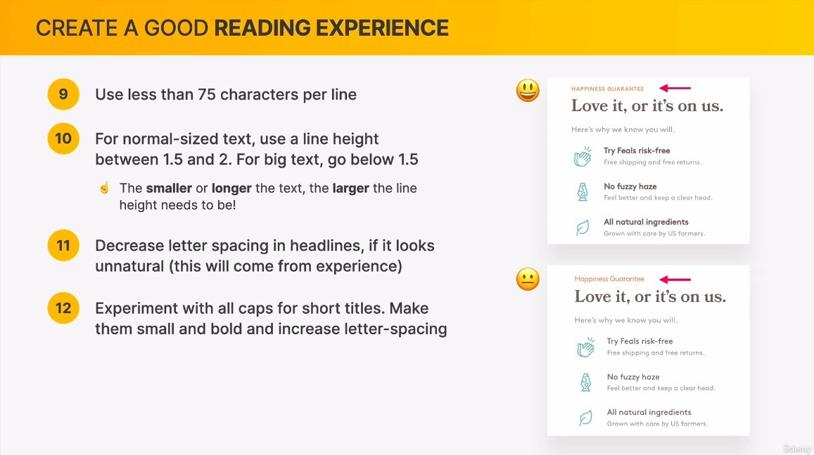

- This small subtitle is very popular among designers.

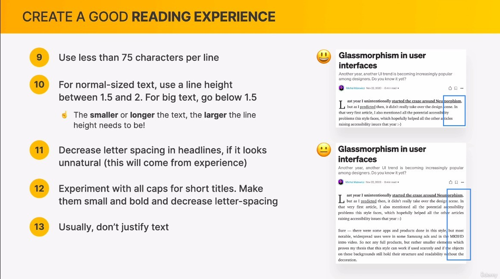

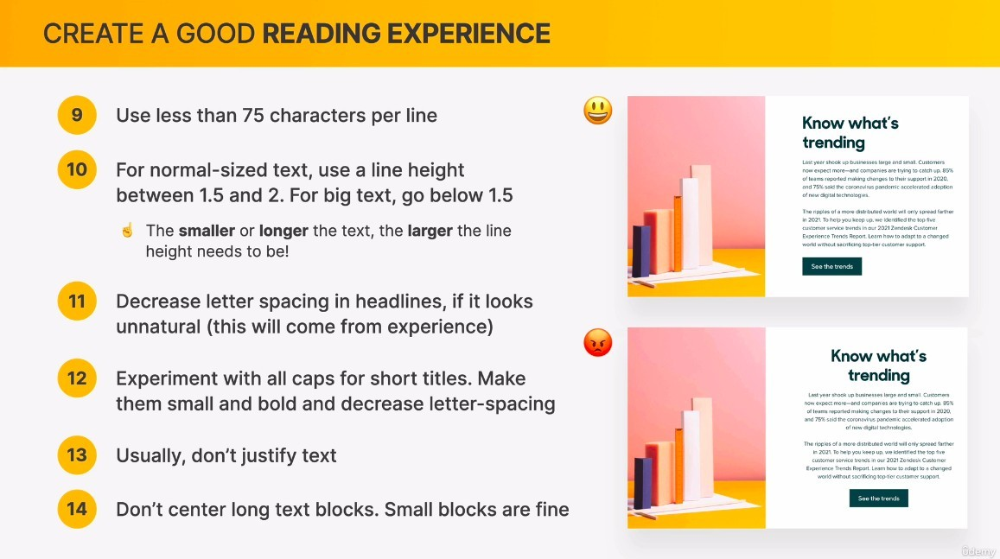
