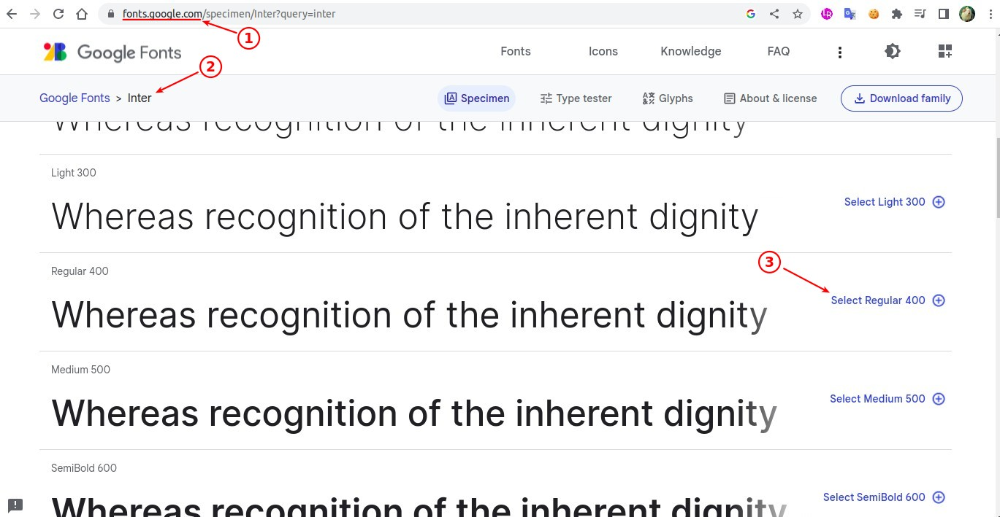
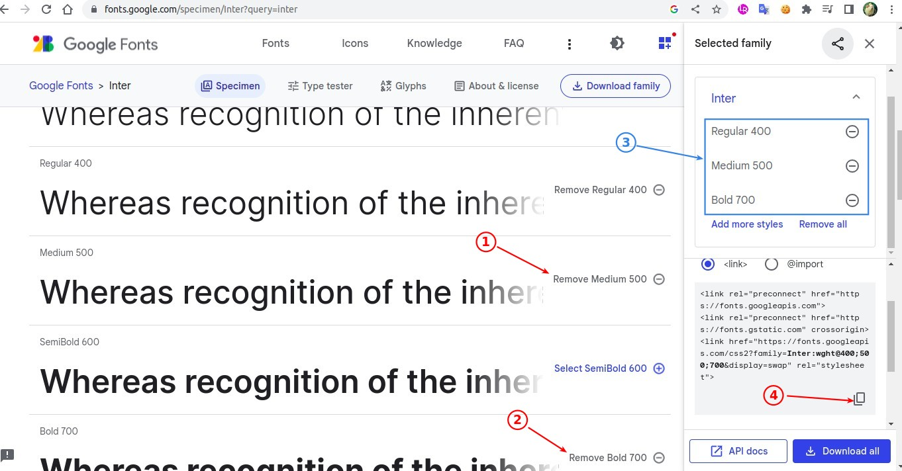
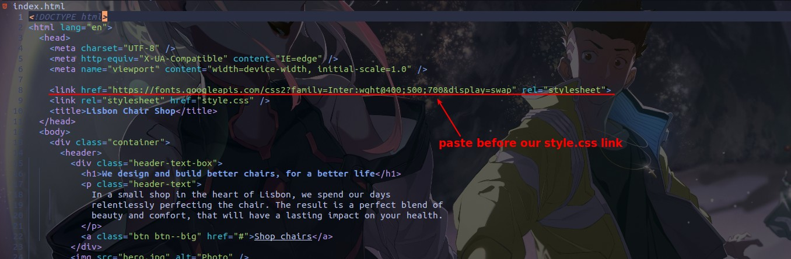
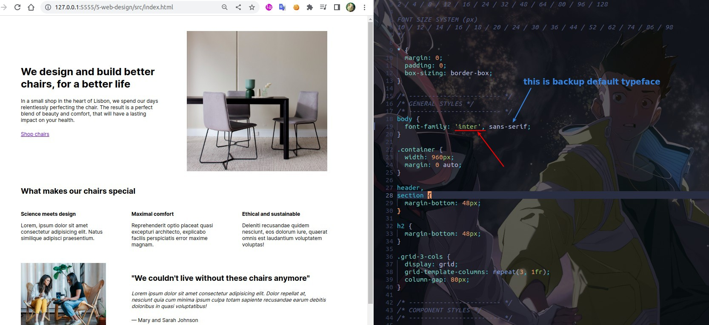
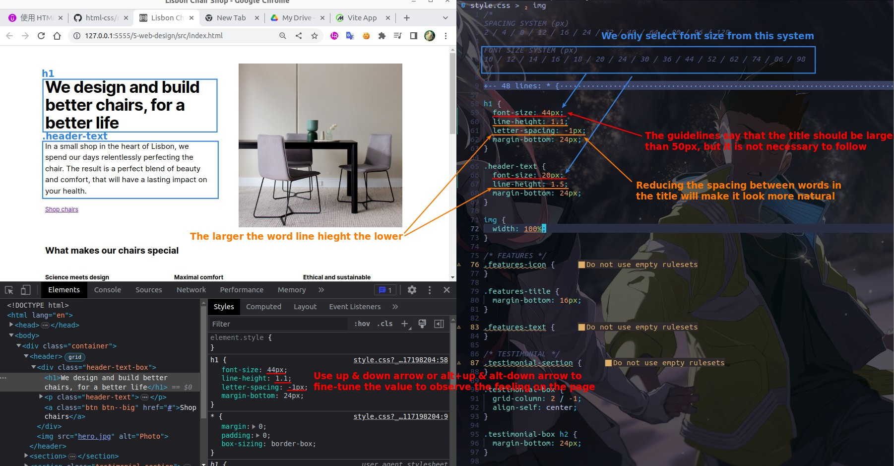
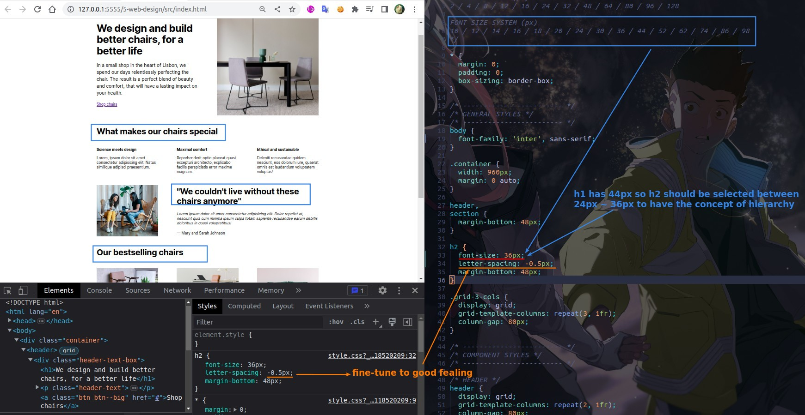
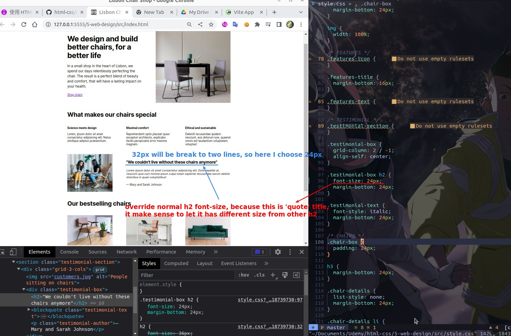
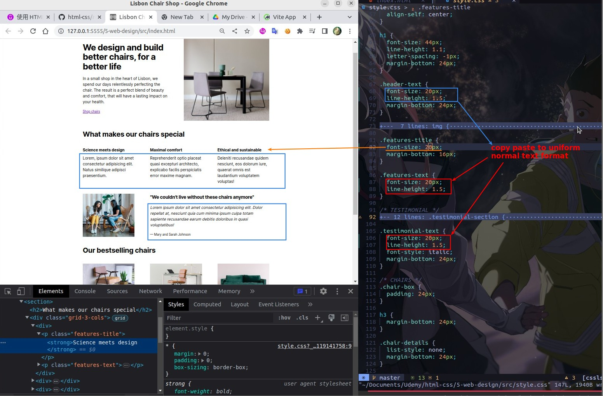
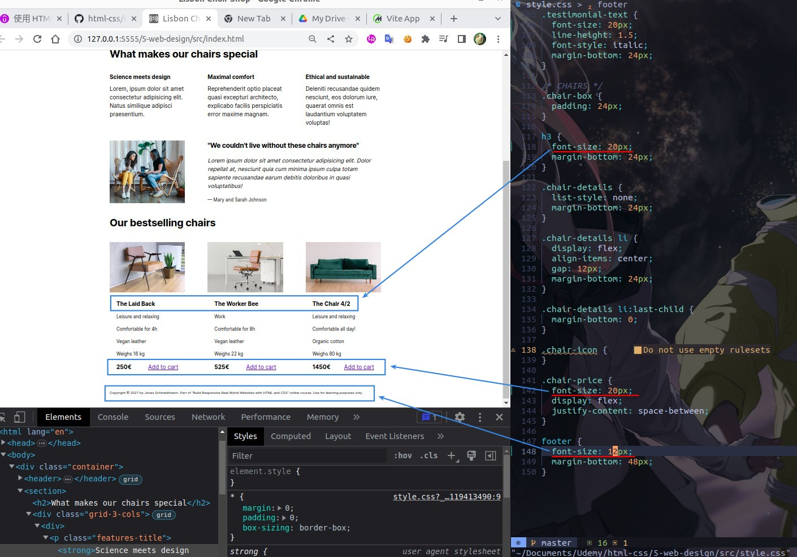

## **Implement Google font**

## **H1 and .header-text**

## **h2**

## **quote h2**

## **normal text**

## **h3, price and footer**

## **Conclusion**

- It is not necessary to follow the rules, for example, the font-size of h1, but note that it will affect the size design of h2, h3, because to reflect the hierarchy.
- Choose the font size from the system instead of using the fine-tuned one, the latter will waste too much time.
  - https://type-scale.com
  - In addition to the system provided by the instructor, you can also choose to create your own system by going to the above page.
- Use DevTool to fine tune the values while observing the feeling of page changes.
- It is recommended to choose a uniform font size and line height for general text.
- Footer is not important no one will go to see all even if the violation of a line more than 75 words of the guidelines does not matter.
