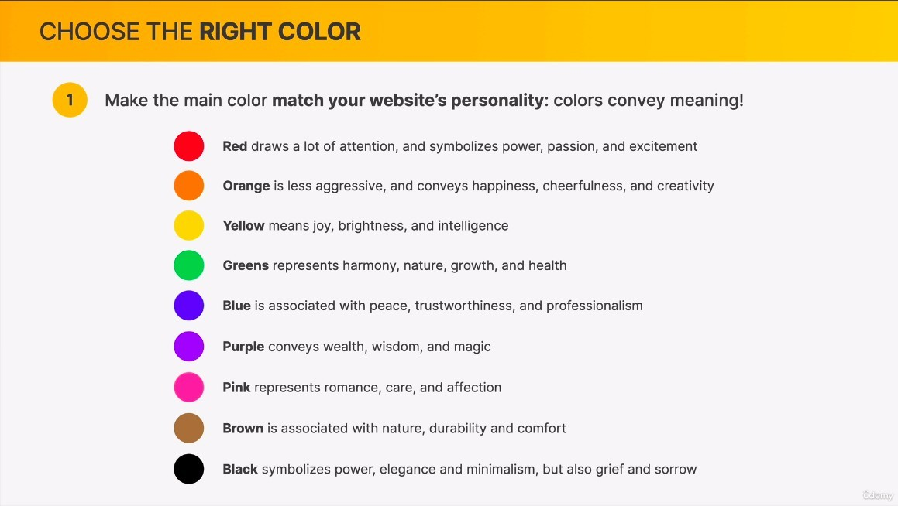
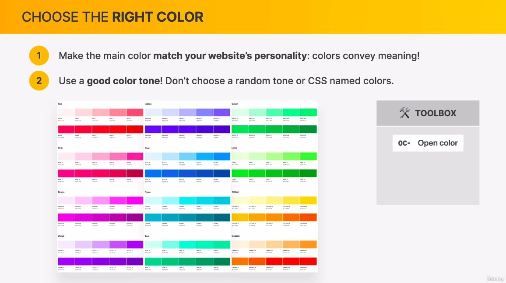
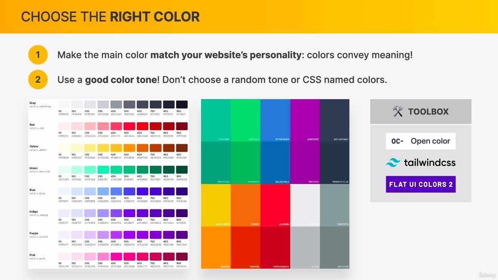
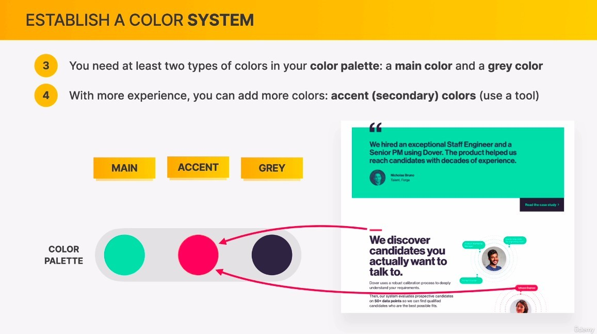
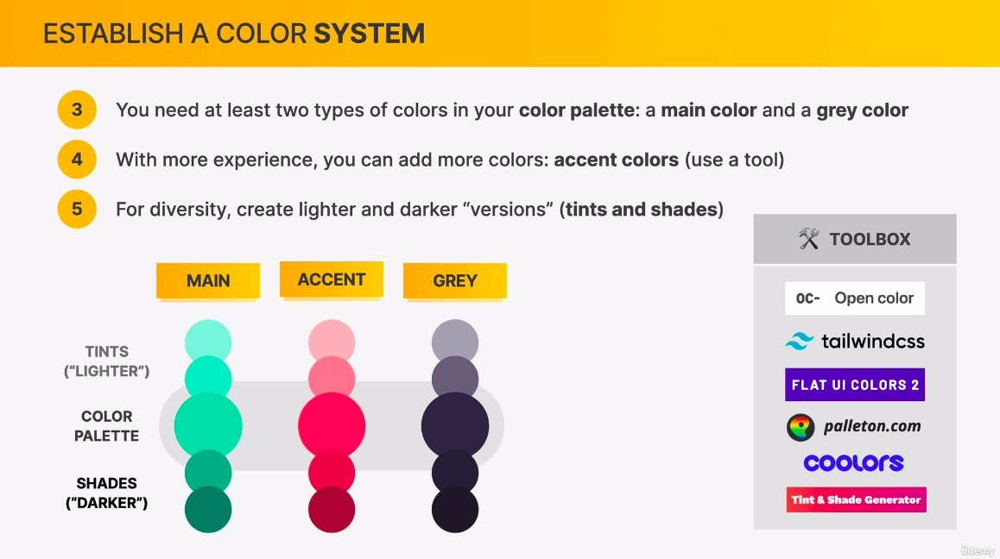
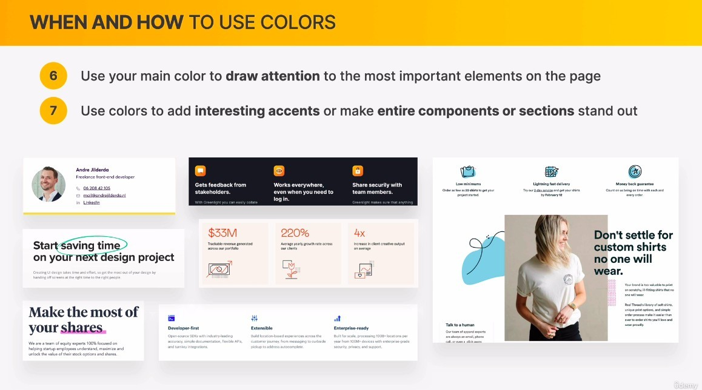
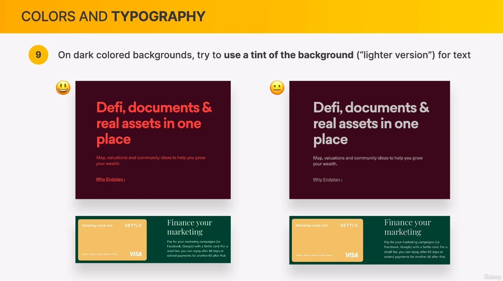
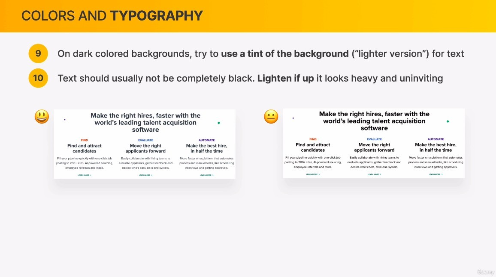
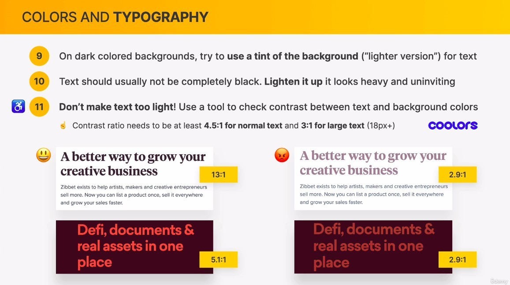

## **Choose the right color**

- Black is the most difficult color to use.

- Although Tailwind CSS is a complete CSS framework, many people only use its color.

## **Establish a color system**

- Usually two main colors are enough for a web page: MAIN and GREY, ACCENT is additional and must have enough experience to use.
- Note that the GREY above is actually a very dark blue, not black.
- ACCENT must be related to MAIN and GREY, so it must be selected by the tool, not randomly.

## **When and how to use colors**

- Often the areas that require the most user attention are those where the user is expected to interact with them, such as buttons.

## **Colors and typography**

