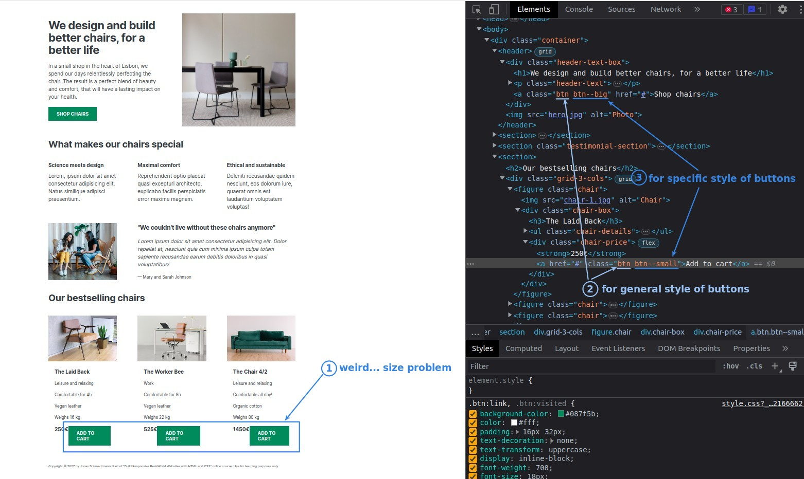

## **Choose MAIN and GHREY colors**

- Green represents health in line with the needs of this product content, and there are already a lot of green in the picture, so choose a color close to green as the main color.

- GHREY color does not have much idea, mainly used in text, as long as it is not black then it will be fine, 'open color' only provides a GRAY color we can also use directly.
  - The GREY provided by 'open color' is not really gray, as we can find it from the color code.

## **Use GHREY color to all text**

## **Use MAIN color to the anchor/button**

## **Generic/Specific class**

## **Use tint of MAIN for hovering anchors/buttons**

## **Use MAIN backcolor to emphasize a section**

## **Footer color & Color contract test**

## **Bottom Line**

