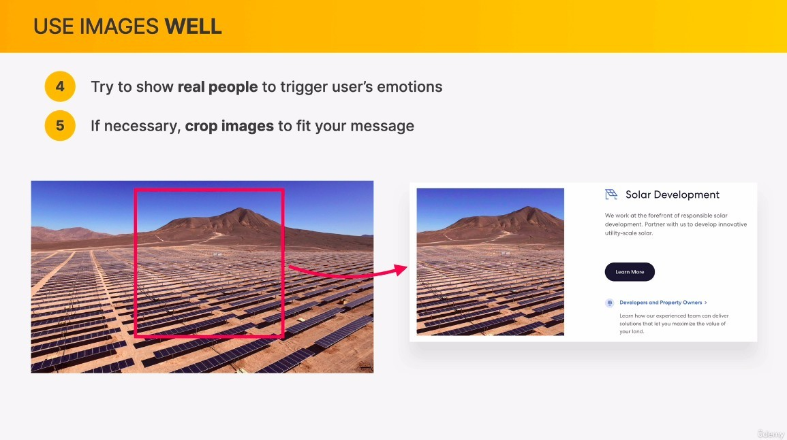

## **Use good image**

### _four types of images_

- Probably the most important type of images.

- The above is a 2D example, but there are also 3D ones and they are becoming more and more popular in recent years.

- Often used in the background, so that the whole page does not feel too boring, but the point is not to overuse it.

### _only use relevant images_

### _prefer original images_

## **Use images well**

- Modern people are more concerned about the emotional connection between people, so do not need too fake model, but real characters better.

## **Handling text on images**

- You don't have to use darken for the whole picture, you can use a gradient to make only the bottom half of the picture darker.

- Be careful with this approach on screens of different sizes, such as cell phones, where other parts of the image may override the text.

## **Some technical details**

> Our original images are usually twice the size of the page, because of the high resolution screen.

## **Handling text on images**

