## **Use good icons**

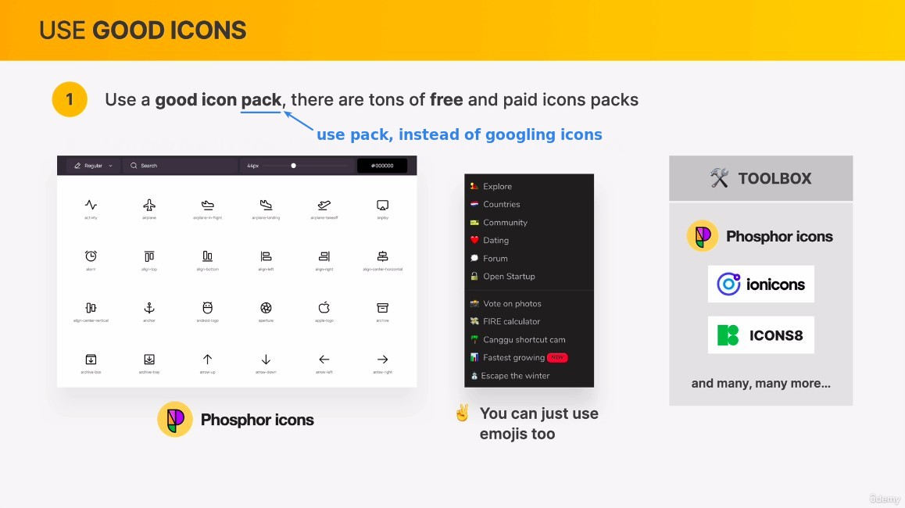

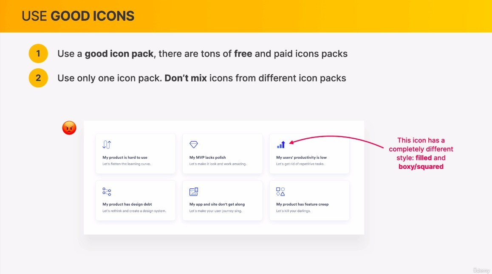

- This way the user's attention will be drawn away from the product or text by the prominent icon.

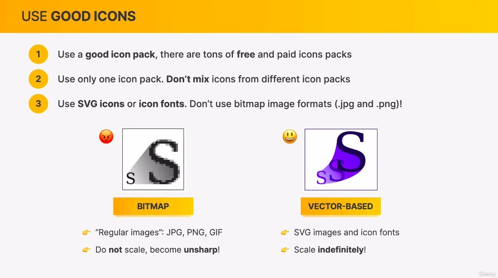

- Non-svg icons become blurred in high resolution screens.

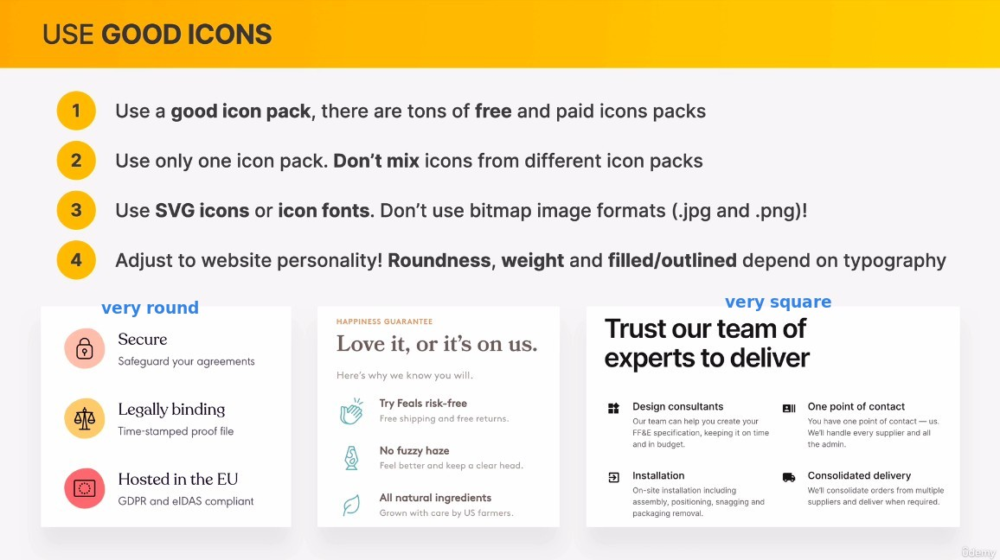

## **When to use icons**

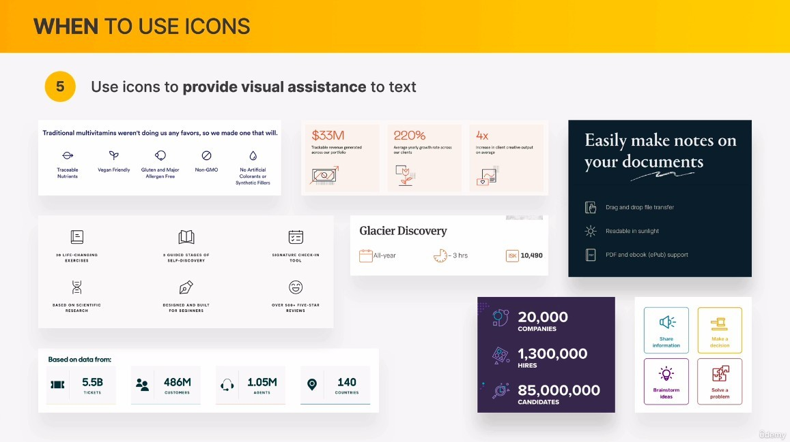

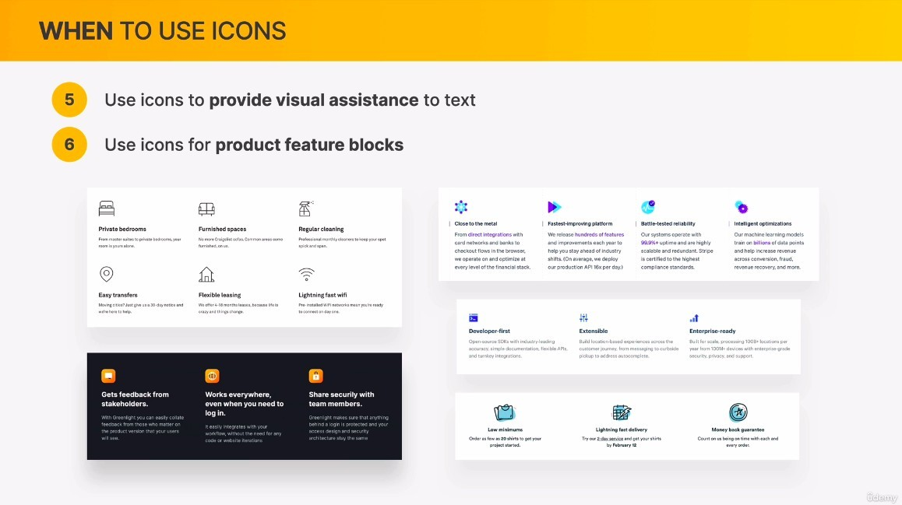

- feature block is a common structure for displaying product features, consisting of icon, title, and text.

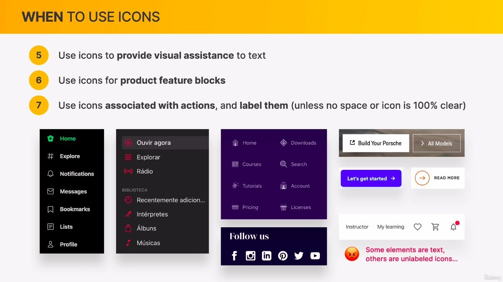

- It's better to have label tips for each icons, because not everyone can fully know what the icons stand for.
- You can use only icons in places where there is less space, but you are not allowed to have part of the label and part without.

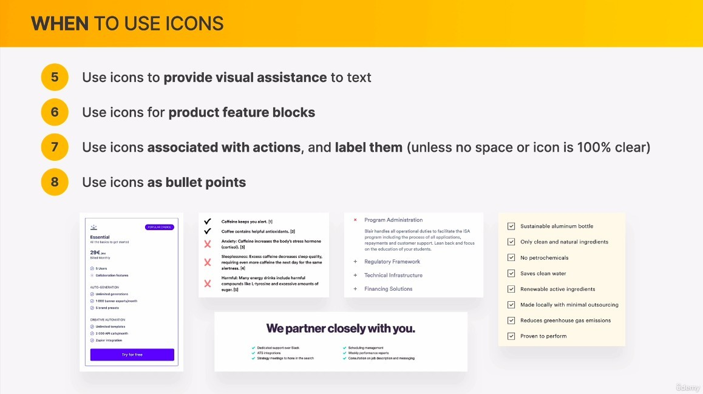

- It is safe to choose an icon pack that is similar to the typeface style.

## **Use icons well**

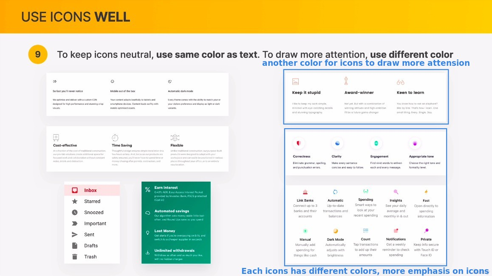

- Usually we let the icons have the same color text so that they don't attract too much attention, but in some cases we can use different colors if we need to attract users' attention to the icons.

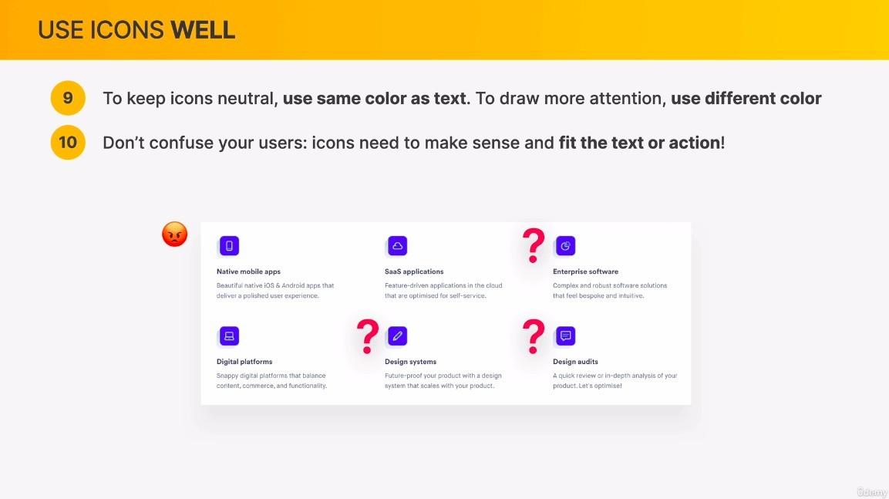

- If you can't find a suitable icon, you should consider changing the icon pack, or adjusting the text so that a suitable icon can be used.

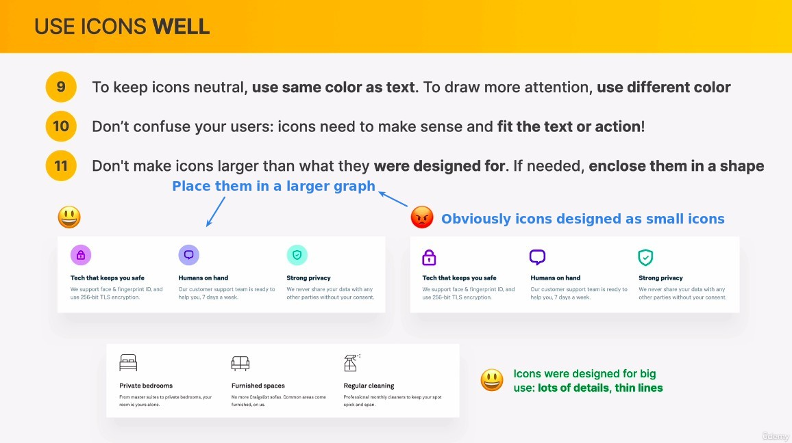
