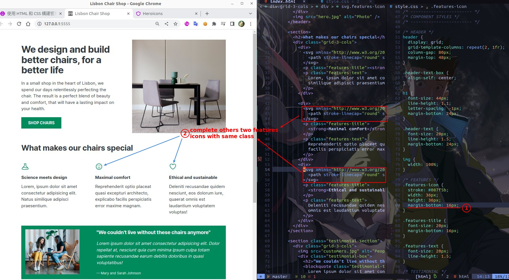

## **Choose icon pack**

- SVG icons, meet the guidelines.
- The icon of this pack is very round, obviously not suitable for our project, but because it is very convenient, so use it for teaching.

## **Search fit icon**

### _features_

- It is often not searched for the desired image, it is normal to go through all icons to find the right icon.

- In the svg element, there is a path element with the coordinates of the icon, which we usually don't touch.

- The outline svg uses the stroke property to set the color, while the other types of svg icons use fill.

### _list_

