## **Come concept first**

### _history_

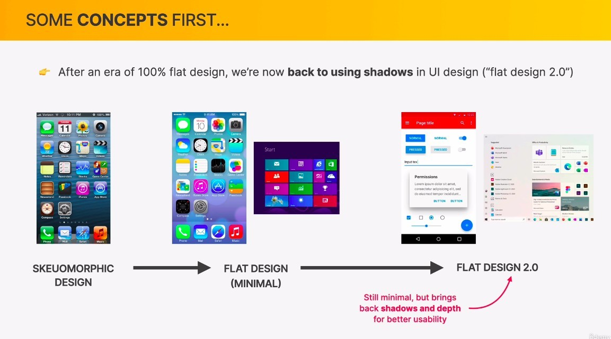

### _shadow represent 3D_

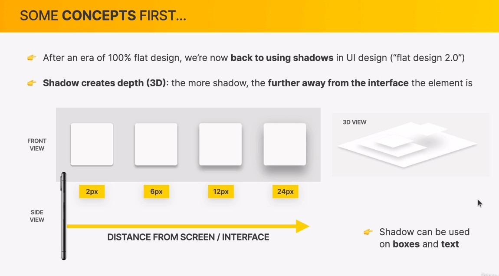

## **Use shadows well**

### _you don't have to use it_

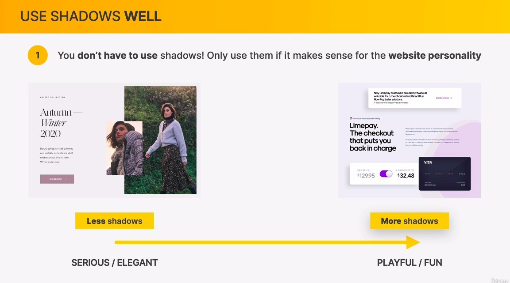

### _don't use it everyhwere_

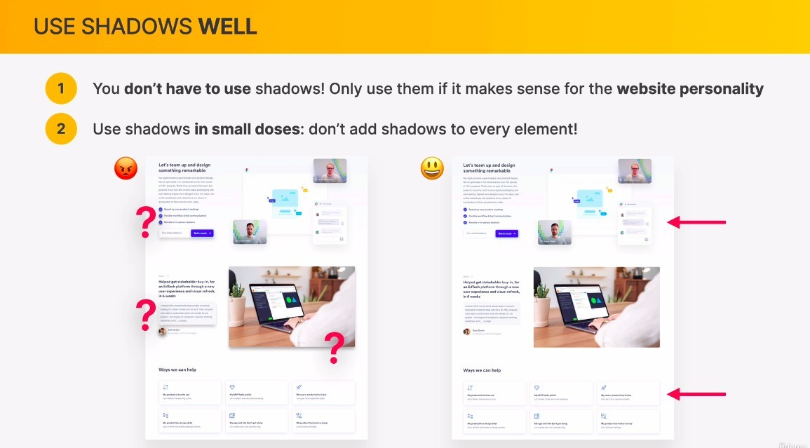

- Use shadow everywhere is the same as not using, shadow is used to emphasize.

### _don't make it too dark_

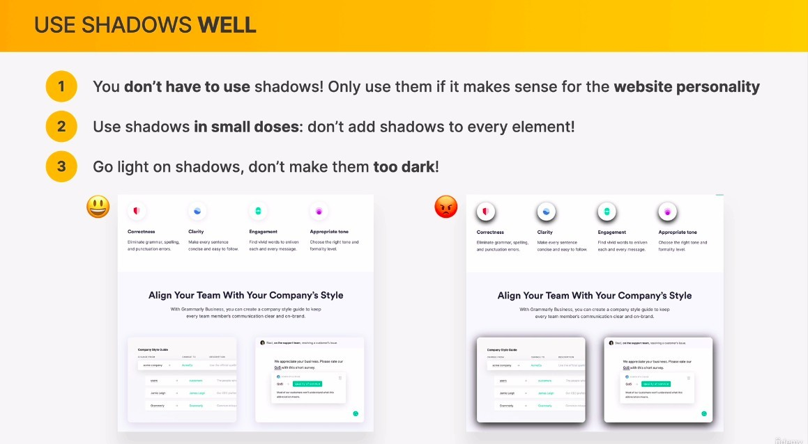

## **Use shadows in the right situation**

### _small_

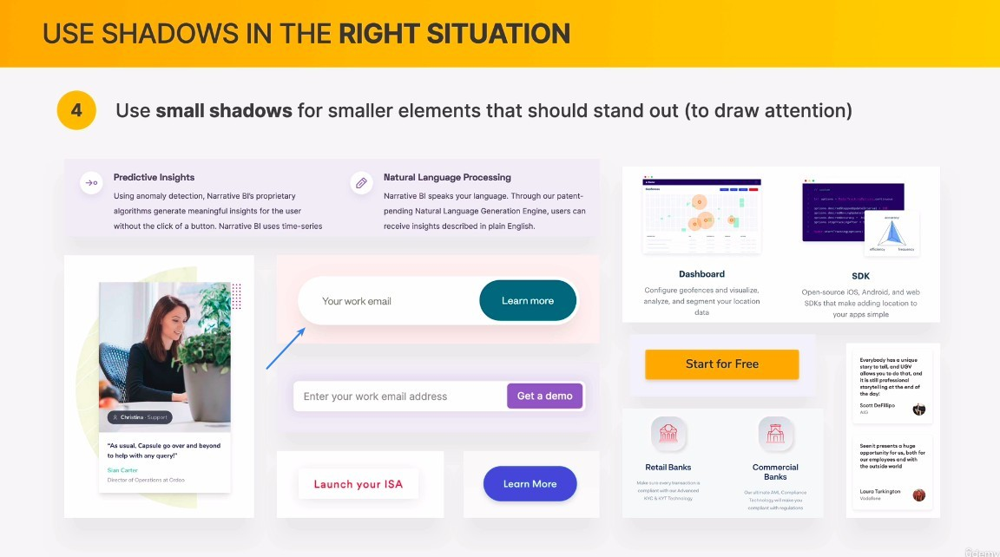

### _medium_

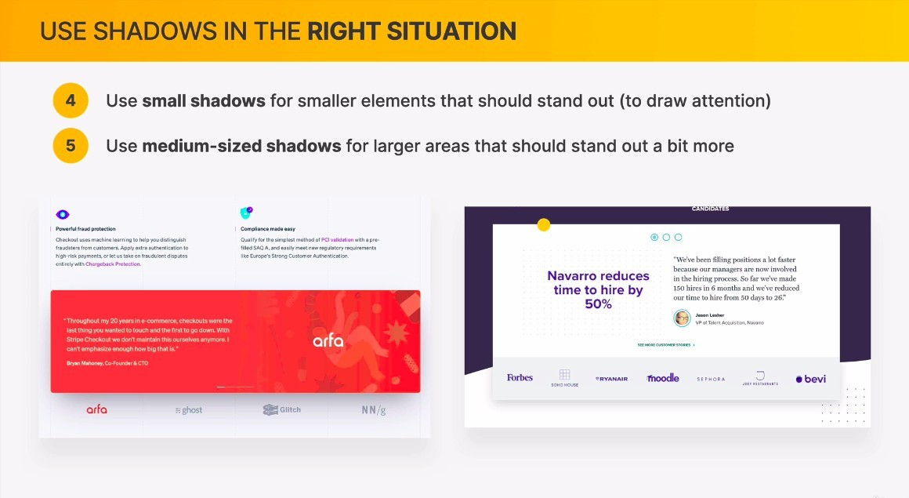

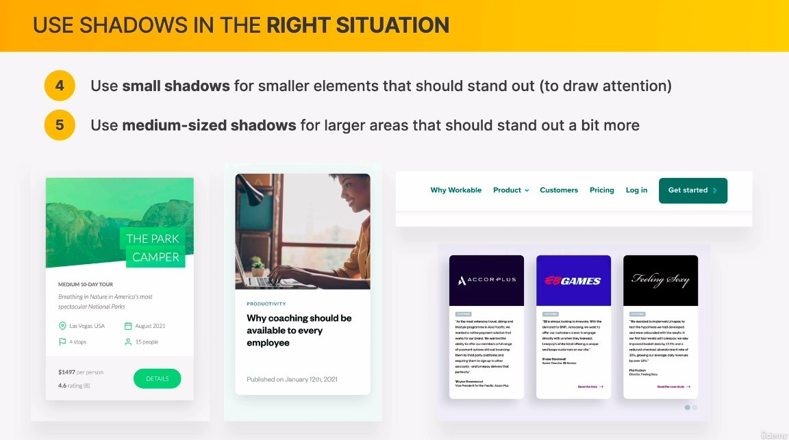

### _large_

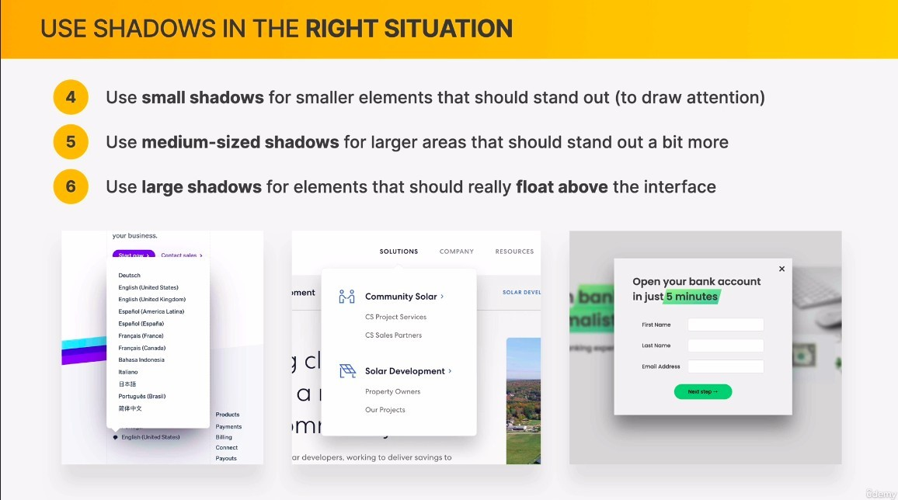

### _use it in the interactive element_

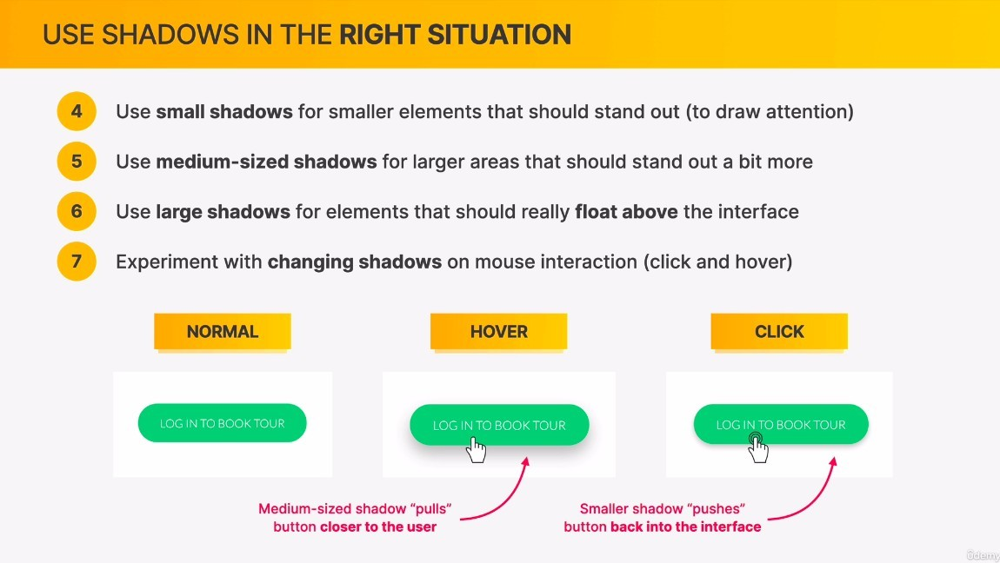

- It will make the user feel the buttons close and far away when interacting with it, which will give your page a new look.

### _Shadow can use colors other than black_

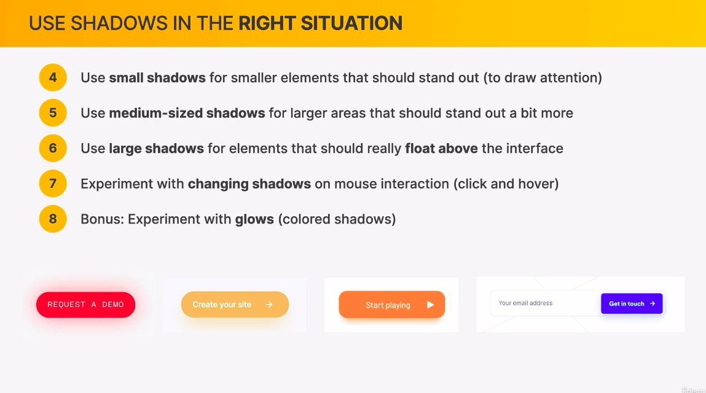

- For example, using a shadow with the same color as the button will create the illusion that the button is glowing.
