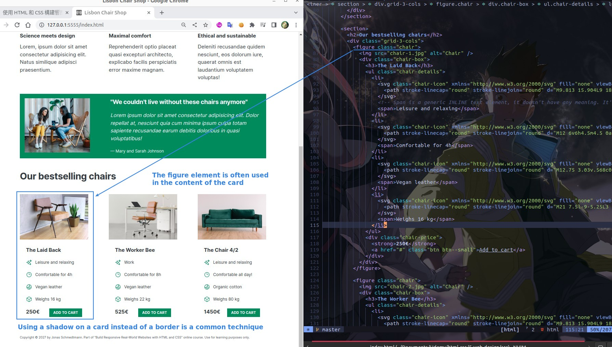
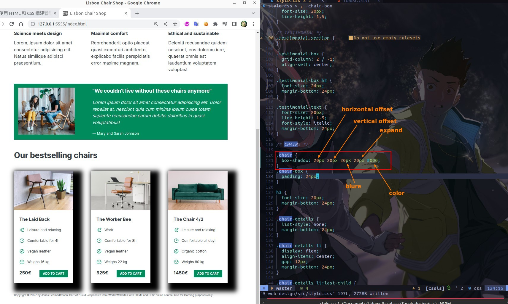
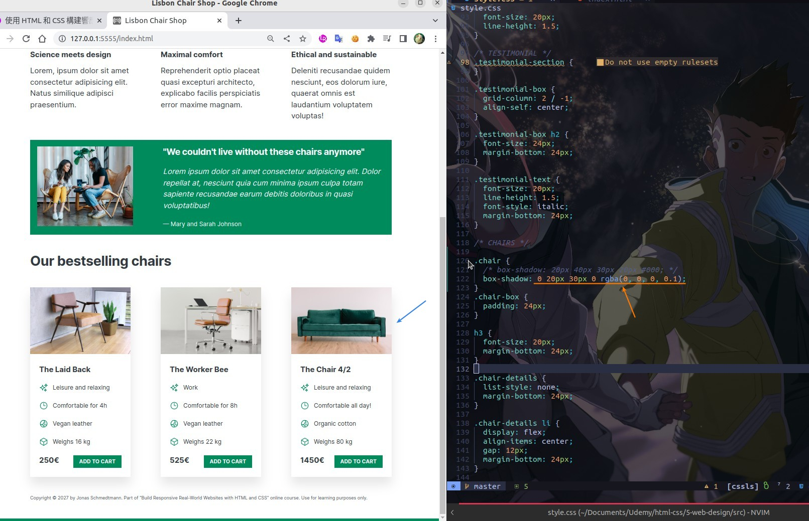
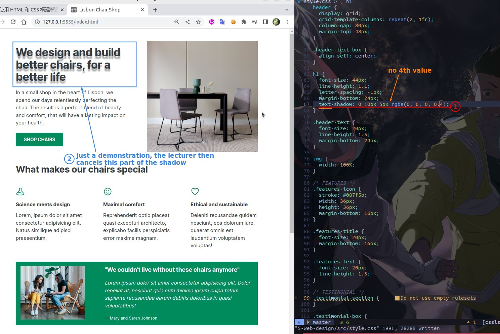

## **Figure and Card**

- You can also use the article element to the card.

## **box-shadow**

### _box-shadow is shorthand property which has 4 values_

### _common setting_

- It is usually assumed that the light source is coming from directly above, so the first value is 0.
- Usually the fourth value (expand) is also 0.
- We will use the last value of 'rgba' to adjust the opacity of the shadow, which is usually very low.

## **text-shadow**

- Note that the prefix is 'text-' instead of 'box-'.
