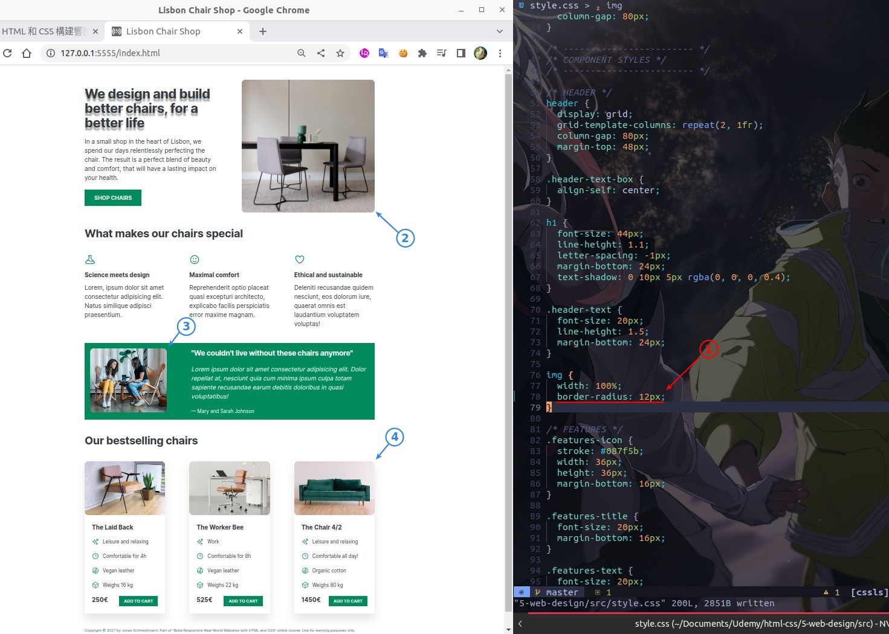
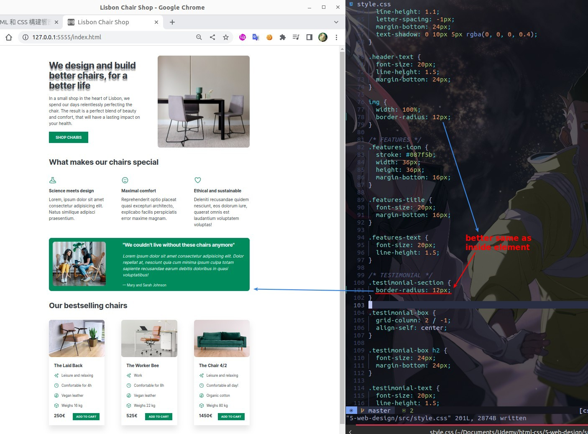
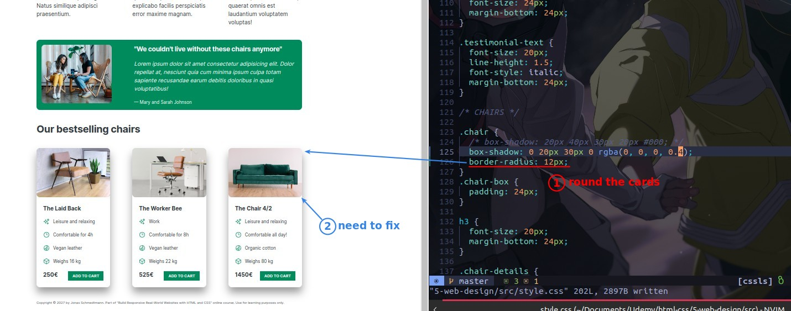
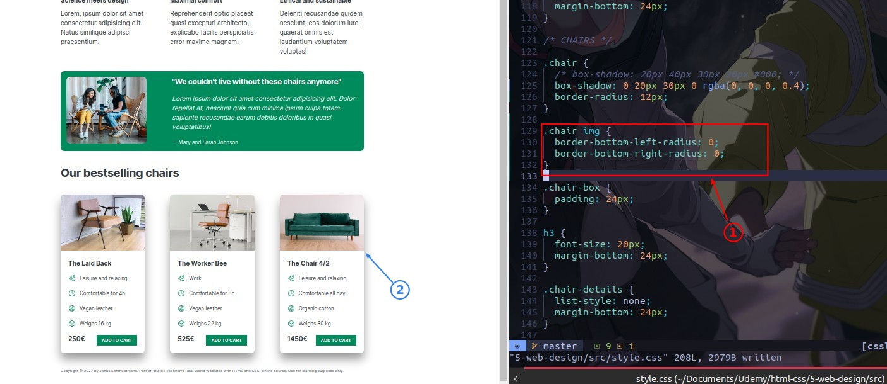
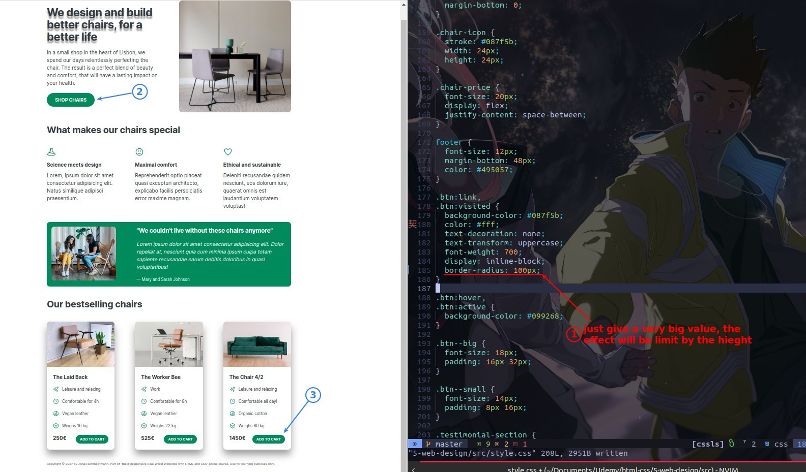

## **Images**

- Because our typeface is very square, we don't need to use too many rounds.
  - You can even skip border-radius in this case, but still use it for educational purposes.

## **Section**

## **Cards**

- We can also use this method to create some creative buttons.

## **Button**

- If the button is square, you can use the value 50% to make it round.
  - If the button is rectangular in shape, use a very large value such as 100px.
