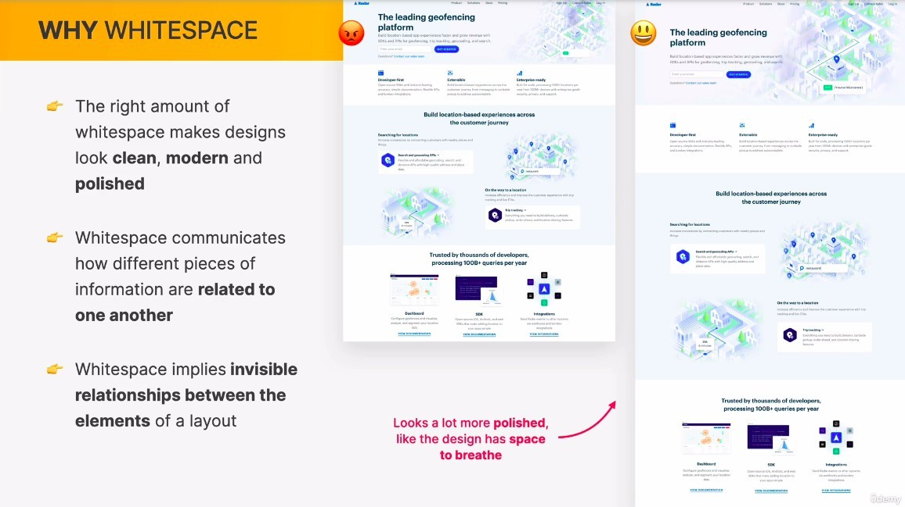
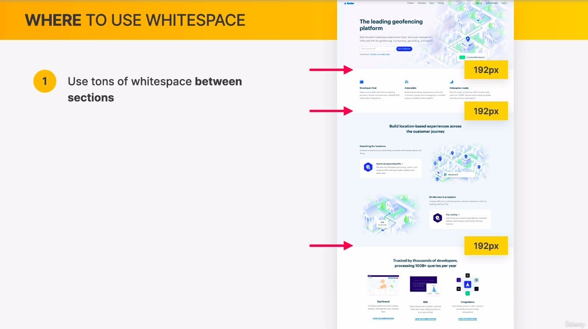
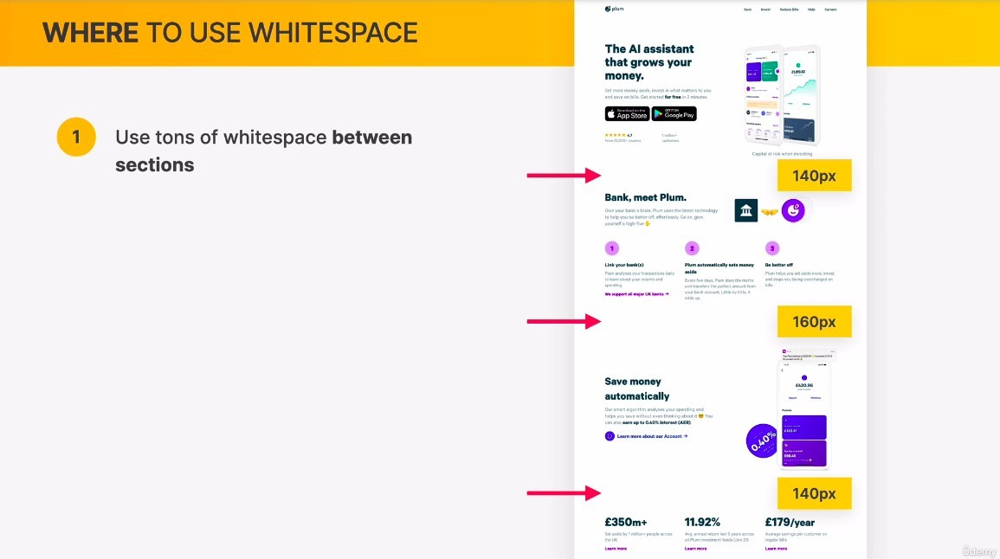
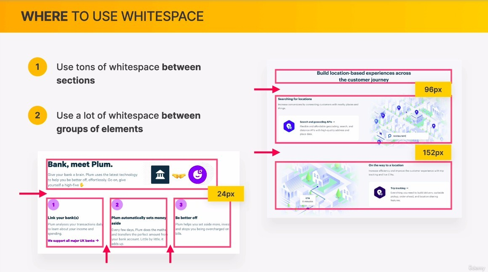
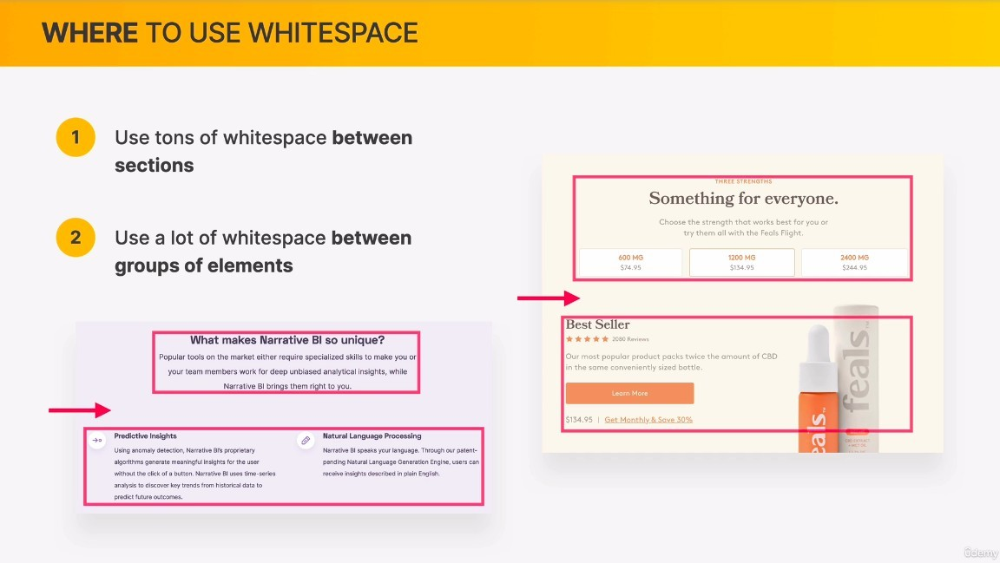
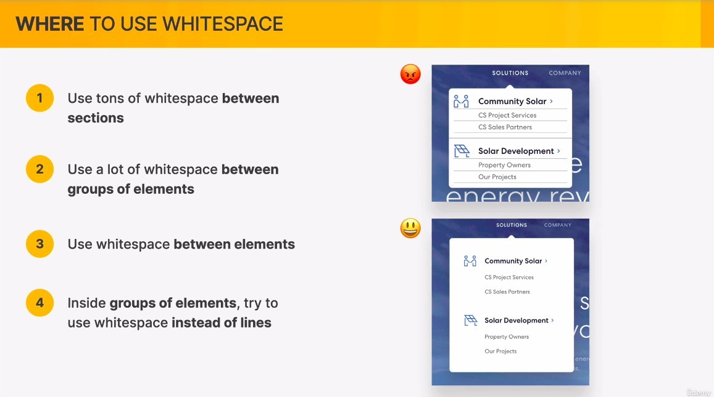
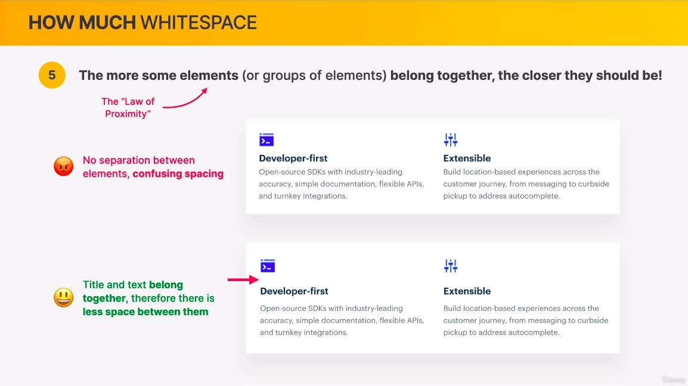
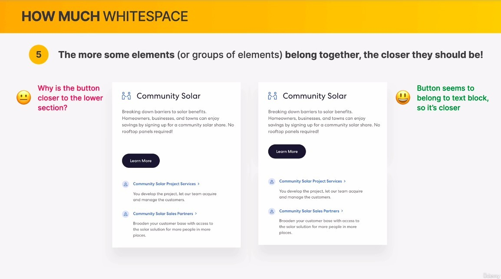
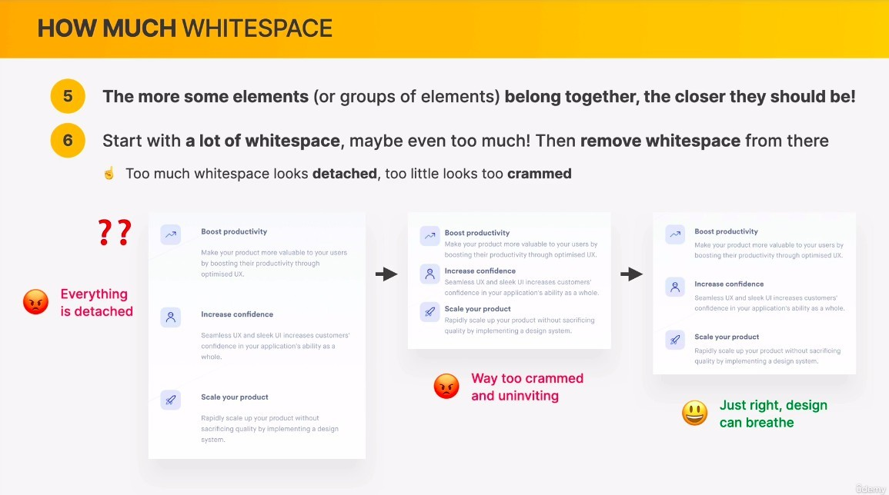
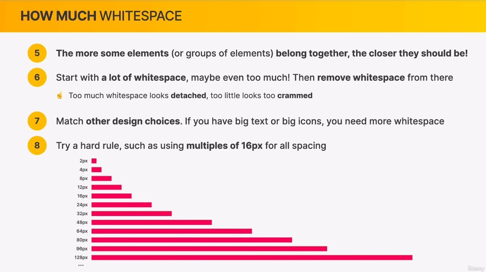

## **Why whitespace**

## **Where to use whitespace**

### _between sections_

### _between groups of elements_

### _between elements_

## **How much whitespace**

### _more elements belong together, the closer they should be_

### _too detached / too crumbed_

### _match other design choices_

### _use rule_

- Different from the text size pattern.
